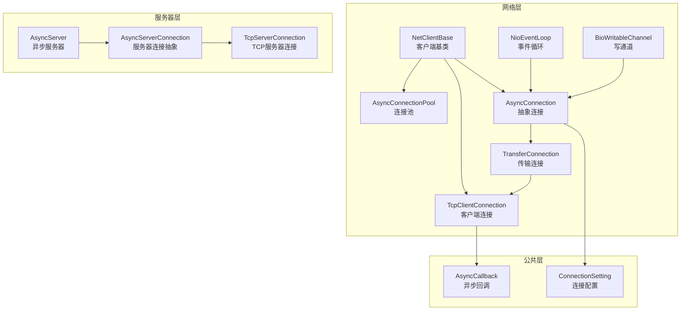
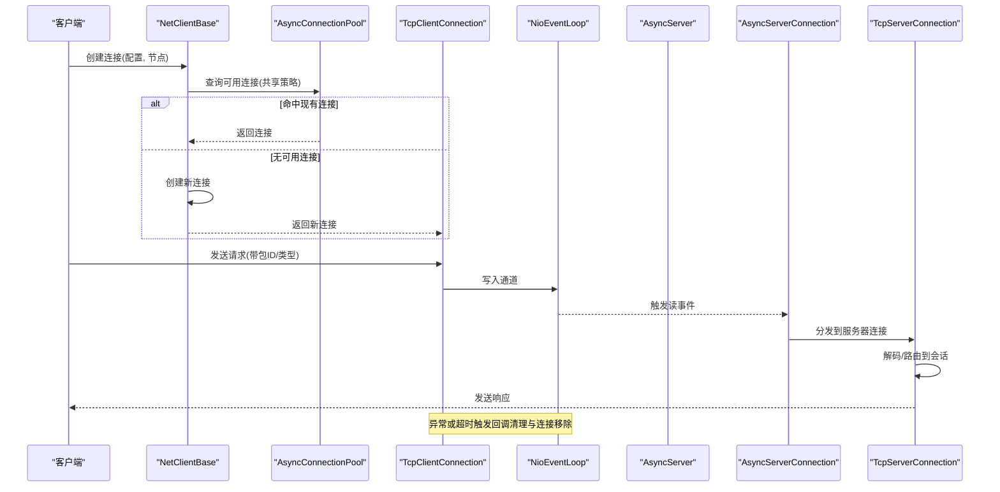
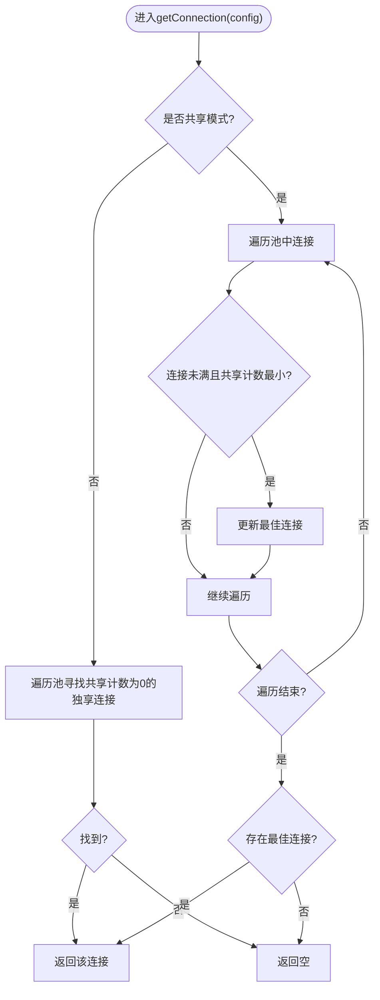
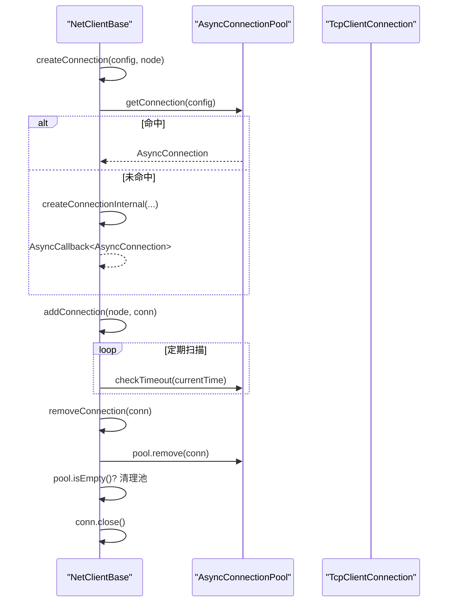
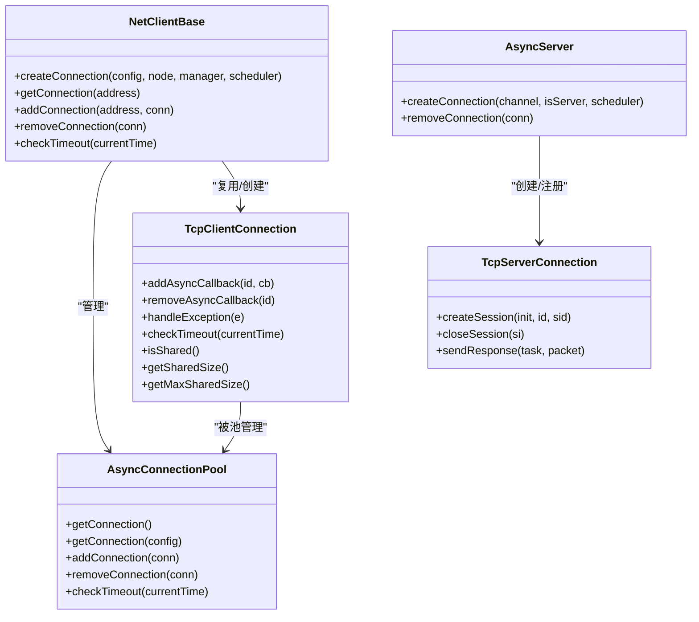

# 连接管理

**本文引用的文件列表**
- [AsyncConnectionPool.java](https://github.com/lealone/Lealone/blob/master/lealone-net/src/main/java/com/lealone/net/AsyncConnectionPool.java)
- [AsyncConnectionManager.java](https://github.com/lealone/Lealone/blob/master/lealone-net/src/main/java/com/lealone/net/AsyncConnectionManager.java)
- [AsyncConnection.java](https://github.com/lealone/Lealone/blob/master/lealone-net/src/main/java/com/lealone/net/AsyncConnection.java)
- [TransferConnection.java](https://github.com/lealone/Lealone/blob/master/lealone-net/src/main/java/com/lealone/net/TransferConnection.java)
- [TcpClientConnection.java](https://github.com/lealone/Lealone/blob/master/lealone-net/src/main/java/com/lealone/net/TcpClientConnection.java)
- [NetClientBase.java](https://github.com/lealone/Lealone/blob/master/lealone-net/src/main/java/com/lealone/net/NetClientBase.java)
- [AsyncServer.java](https://github.com/lealone/Lealone/blob/master/lealone-server/src/main/java/com/lealone/server/AsyncServer.java)
- [AsyncServerConnection.java](https://github.com/lealone/Lealone/blob/master/lealone-server/src/main/java/com/lealone/server/AsyncServerConnection.java)
- [TcpServerConnection.java](https://github.com/lealone/Lealone/blob/master/lealone-server/src/main/java/com/lealone/server/TcpServerConnection.java)
- [ConnectionSetting.java](https://github.com/lealone/Lealone/blob/master/lealone-common/src/main/java/com/lealone/db/ConnectionSetting.java)
- [AsyncCallback.java](https://github.com/lealone/Lealone/blob/master/lealone-common/src/main/java/com/lealone/db/async/AsyncCallback.java)
- [NioEventLoop.java](https://github.com/lealone/Lealone/blob/master/lealone-net/src/main/java/com/lealone/net/nio/NioEventLoop.java)
- [BioWritableChannel.java](https://github.com/lealone/Lealone/blob/master/lealone-net/src/main/java/com/lealone/net/bio/BioWritableChannel.java)
- [SharedConnectionTest.java](https://github.com/lealone/Lealone/blob/master/lealone-test/src/test/java/com/lealone/test/client/SharedConnectionTest.java)

## 目录
1. [引言](#引言)
2. [项目结构](#项目结构)
3. [核心组件](#核心组件)
4. [架构总览](#架构总览)
5. [详细组件分析](#详细组件分析)
6. [依赖关系分析](#依赖关系分析)
7. [性能考量](#性能考量)
8. [故障排查指南](#故障排查指南)
9. [结论](#结论)
10. [附录](#附录)

## 引言
本文件围绕Lealone的连接管理进行系统化技术文档整理，重点覆盖：
- AsyncConnectionPool连接池的实现机制：连接创建、复用与回收策略
- AsyncConnectionManager对客户端连接生命周期的管理职责
- AsyncServerConnection对服务器端会话状态的处理方式
- 连接超时、心跳检测与异常断开的处理机制
- 连接池参数配置的最佳实践与性能监控指标建议

目标是帮助读者快速理解各组件职责、交互流程与关键实现细节，并提供可操作的优化与排障建议。

## 项目结构
Lealone的连接管理横跨网络层、服务器层与公共配置层，主要涉及以下模块：
- 网络层（lealone-net）：抽象连接、传输连接、客户端连接、连接池、客户端基类、事件循环与写通道
- 服务器层（lealone-server）：异步服务器、服务器连接抽象与TCP服务器连接
- 公共层（lealone-common）：连接配置项、异步回调与异常体系

图表来源
- [AsyncConnection.java](https://github.com/lealone/Lealone/blob/master/lealone-net/src/main/java/com/lealone/net/AsyncConnection.java#L1-L96)
- [TransferConnection.java](https://github.com/lealone/Lealone/blob/master/lealone-net/src/main/java/com/lealone/net/TransferConnection.java#L1-L153)
- [TcpClientConnection.java](https://github.com/lealone/Lealone/blob/master/lealone-net/src/main/java/com/lealone/net/TcpClientConnection.java#L1-L191)
- [AsyncConnectionPool.java](https://github.com/lealone/Lealone/blob/master/lealone-net/src/main/java/com/lealone/net/AsyncConnectionPool.java#L1-L94)
- [NetClientBase.java](https://github.com/lealone/Lealone/blob/master/lealone-net/src/main/java/com/lealone/net/NetClientBase.java#L1-L143)
- [NioEventLoop.java](https://github.com/lealone/Lealone/blob/master/lealone-net/src/main/java/com/lealone/net/nio/NioEventLoop.java#L527-L568)
- [BioWritableChannel.java](https://github.com/lealone/Lealone/blob/master/lealone-net/src/main/java/com/lealone/net/bio/BioWritableChannel.java#L125-L159)
- [AsyncServerConnection.java](https://github.com/lealone/Lealone/blob/master/lealone-server/src/main/java/com/lealone/server/AsyncServerConnection.java#L1-L28)
- [TcpServerConnection.java](https://github.com/lealone/Lealone/blob/master/lealone-server/src/main/java/com/lealone/server/TcpServerConnection.java#L1-L249)
- [AsyncServer.java](https://github.com/lealone/Lealone/blob/master/lealone-server/src/main/java/com/lealone/server/AsyncServer.java#L1-L169)
- [ConnectionSetting.java](https://github.com/lealone/Lealone/blob/master/lealone-common/src/main/java/com/lealone/db/ConnectionSetting.java#L1-L28)
- [AsyncCallback.java](https://github.com/lealone/Lealone/blob/master/lealone-common/src/main/java/com/lealone/db/async/AsyncCallback.java#L52-L100)

章节来源
- [AsyncConnectionPool.java](https://github.com/lealone/Lealone/blob/master/lealone-net/src/main/java/com/lealone/net/AsyncConnectionPool.java#L1-L94)
- [NetClientBase.java](https://github.com/lealone/Lealone/blob/master/lealone-net/src/main/java/com/lealone/net/NetClientBase.java#L1-L143)
- [AsyncServer.java](https://github.com/lealone/Lealone/blob/master/lealone-server/src/main/java/com/lealone/server/AsyncServer.java#L1-L169)

## 核心组件
- AsyncConnection：抽象连接基类，定义连接的基本属性与通用能力（如包头长度、关闭、超时检查、共享属性查询）
- TransferConnection：传输连接抽象，封装输入输出流、请求/响应分发、错误发送与包处理框架
- TcpClientConnection：客户端TCP连接实现，维护会话映射、回调映射、异常处理与超时检查
- AsyncConnectionPool：连接池，按共享策略选择可用连接，支持超时检查与批量回收
- NetClientBase：客户端基类，负责连接池的创建、复用、移除与超时扫描
- AsyncServerConnection：服务器端连接抽象，基于调度器的内部调度器实例化
- TcpServerConnection：TCP服务器连接实现，管理多会话映射、会话初始化、会话关闭与响应发送
- AsyncServer：异步服务器，负责连接创建、注册、移除与接受者注册
- ConnectionSetting：连接配置枚举，提供共享连接、最大共享数、网络超时、缓冲区大小等配置项
- AsyncCallback：异步回调，携带请求开始时间与网络超时，用于ACK超时检测

章节来源
- [AsyncConnection.java](https://github.com/lealone/Lealone/blob/master/lealone-net/src/main/java/com/lealone/net/AsyncConnection.java#L1-L96)
- [TransferConnection.java](https://github.com/lealone/Lealone/blob/master/lealone-net/src/main/java/com/lealone/net/TransferConnection.java#L1-L153)
- [TcpClientConnection.java](https://github.com/lealone/Lealone/blob/master/lealone-net/src/main/java/com/lealone/net/TcpClientConnection.java#L1-L191)
- [AsyncConnectionPool.java](https://github.com/lealone/Lealone/blob/master/lealone-net/src/main/java/com/lealone/net/AsyncConnectionPool.java#L1-L94)
- [NetClientBase.java](https://github.com/lealone/Lealone/blob/master/lealone-net/src/main/java/com/lealone/net/NetClientBase.java#L1-L143)
- [AsyncServerConnection.java](https://github.com/lealone/Lealone/blob/master/lealone-server/src/main/java/com/lealone/server/AsyncServerConnection.java#L1-L28)
- [TcpServerConnection.java](https://github.com/lealone/Lealone/blob/master/lealone-server/src/main/java/com/lealone/server/TcpServerConnection.java#L1-L249)
- [AsyncServer.java](https://github.com/lealone/Lealone/blob/master/lealone-server/src/main/java/com/lealone/server/AsyncServer.java#L1-L169)
- [ConnectionSetting.java](https://github.com/lealone/Lealone/blob/master/lealone-common/src/main/java/com/lealone/db/ConnectionSetting.java#L1-L28)
- [AsyncCallback.java](https://github.com/lealone/Lealone/blob/master/lealone-common/src/main/java/com/lealone/db/async/AsyncCallback.java#L52-L100)

## 架构总览
Lealone采用“网络层抽象 + 服务器层抽象”的双层架构：
- 网络层负责底层传输、连接生命周期与事件循环
- 服务器层负责会话管理、任务调度与协议处理
- 客户端通过NetClientBase统一管理连接池，按共享策略复用连接
- 服务器通过AsyncServer统一创建与注册连接，交由调度器驱动

图表来源
- [NetClientBase.java](https://github.com/lealone/Lealone/blob/master/lealone-net/src/main/java/com/lealone/net/NetClientBase.java#L39-L51)
- [AsyncConnectionPool.java](https://github.com/lealone/Lealone/blob/master/lealone-net/src/main/java/com/lealone/net/AsyncConnectionPool.java#L28-L52)
- [TcpClientConnection.java](https://github.com/lealone/Lealone/blob/master/lealone-net/src/main/java/com/lealone/net/TcpClientConnection.java#L106-L145)
- [NioEventLoop.java](https://github.com/lealone/Lealone/blob/master/lealone-net/src/main/java/com/lealone/net/nio/NioEventLoop.java#L527-L568)
- [AsyncServer.java](https://github.com/lealone/Lealone/blob/master/lealone-server/src/main/java/com/lealone/server/AsyncServer.java#L115-L134)
- [TcpServerConnection.java](https://github.com/lealone/Lealone/blob/master/lealone-server/src/main/java/com/lealone/server/TcpServerConnection.java#L68-L96)

## 详细组件分析

### AsyncConnectionPool：连接池实现与复用策略
- 复用策略
  - 非共享模式：仅当独享连接空闲时（共享计数为0）才复用
  - 共享模式：在满足最大共享数限制的前提下，选择共享计数最小的连接
- 超时检查：遍历池内连接，逐个调用其超时检查逻辑
- 回收策略：关闭池内所有连接并清空池
- 关键接口
  - 获取连接：按配置选择连接
  - 添加/移除连接：维护池内集合
  - 判断空池与关闭：用于资源回收

图表来源
- [AsyncConnectionPool.java](https://github.com/lealone/Lealone/blob/master/lealone-net/src/main/java/com/lealone/net/AsyncConnectionPool.java#L28-L52)

章节来源
- [AsyncConnectionPool.java](https://github.com/lealone/Lealone/blob/master/lealone-net/src/main/java/com/lealone/net/AsyncConnectionPool.java#L1-L94)

### NetClientBase：客户端连接生命周期管理
- 连接创建
  - 若池中已有可用连接则直接返回；否则异步创建新连接并通过回调返回
- 连接复用
  - 通过AsyncConnectionPool按共享策略选择连接
- 连接移除
  - 从池中移除连接，若池为空则移除池；最后关闭连接
- 超时扫描
  - 遍历所有池，调用池内连接的超时检查
- Socket初始化
  - 设置接收/发送缓冲区、TCP_NODELAY、KeepAlive、地址复用等

图表来源
- [NetClientBase.java](https://github.com/lealone/Lealone/blob/master/lealone-net/src/main/java/com/lealone/net/NetClientBase.java#L39-L51)
- [NetClientBase.java](https://github.com/lealone/Lealone/blob/master/lealone-net/src/main/java/com/lealone/net/NetClientBase.java#L66-L86)
- [NetClientBase.java](https://github.com/lealone/Lealone/blob/master/lealone-net/src/main/java/com/lealone/net/NetClientBase.java#L123-L129)
- [NetClientBase.java](https://github.com/lealone/Lealone/blob/master/lealone-net/src/main/java/com/lealone/net/NetClientBase.java#L131-L141)

章节来源
- [NetClientBase.java](https://github.com/lealone/Lealone/blob/master/lealone-net/src/main/java/com/lealone/net/NetClientBase.java#L1-L143)

### AsyncConnectionManager：连接管理接口
- 职责
  - 创建连接（传入可写通道、是否服务器端、调度器）
  - 移除连接
  - 可选扩展：注册接受者、延迟添加连接
- 服务器端实现
  - AsyncServer实现该接口，负责连接创建、注册与移除

章节来源
- [AsyncConnectionManager.java](https://github.com/lealone/Lealone/blob/master/lealone-net/src/main/java/com/lealone/net/AsyncConnectionManager.java#L1-L26)
- [AsyncServer.java](https://github.com/lealone/Lealone/blob/master/lealone-server/src/main/java/com/lealone/server/AsyncServer.java#L115-L134)

### AsyncConnection：抽象连接与通用能力
- 属性
  - 可写通道、是否服务器端、远端地址、关闭标志
- 能力
  - 包头长度与读取
  - 关闭、检查关闭、异常处理、超时检查、共享属性查询
- 子类
  - TransferConnection：传输层抽象
  - TcpClientConnection：客户端连接
  - TcpServerConnection：服务器连接

章节来源
- [AsyncConnection.java](https://github.com/lealone/Lealone/blob/master/lealone-net/src/main/java/com/lealone/net/AsyncConnection.java#L1-L96)

### TransferConnection：传输层框架
- 输入/输出流封装
  - 支持从全局缓冲区切片到本地输入流
  - 输出流创建与错误输出
- 请求/响应分发
  - 识别请求/响应类型，调用子类实现的处理方法
- 错误处理
  - 统一解析错误包并转换为SQLException，必要时关闭会话或通道
- 异常传播
  - 服务器端记录错误日志，客户端抛出异常

章节来源
- [TransferConnection.java](https://github.com/lealone/Lealone/blob/master/lealone-net/src/main/java/com/lealone/net/TransferConnection.java#L1-L153)

### TcpClientConnection：客户端连接实现
- 会话与回调管理
  - 维护会话映射与回调映射，按包ID匹配回调
  - 关闭时清理回调并设置异常，避免等待线程阻塞
- 异常处理
  - 记录待处理异常并通知客户端移除连接
- 超时检查
  - 遍历回调并检查网络超时
- 共享属性
  - 标记为共享连接，共享计数为当前会话数量，最大共享数来自配置

章节来源
- [TcpClientConnection.java](https://github.com/lealone/Lealone/blob/master/lealone-net/src/main/java/com/lealone/net/TcpClientConnection.java#L1-L191)

### AsyncServerConnection/TcpServerConnection：服务器端会话管理
- 会话映射
  - 每个TcpServerConnection维护客户端会话ID到ServerSessionInfo的映射
- 会话初始化
  - 首次收到SESSION_INIT时创建ServerSession并注册到调度器
- 会话关闭
  - 支持按会话ID关闭，回滚并关闭会话，清理缓存
- 响应发送
  - 根据会话状态发送OK或错误响应
- 异常处理
  - 服务器端异常时移除连接

章节来源
- [AsyncServerConnection.java](https://github.com/lealone/Lealone/blob/master/lealone-server/src/main/java/com/lealone/server/AsyncServerConnection.java#L1-L28)
- [TcpServerConnection.java](https://github.com/lealone/Lealone/blob/master/lealone-server/src/main/java/com/lealone/server/TcpServerConnection.java#L1-L249)

### AsyncServer：服务器连接创建与注册
- 连接创建
  - 校验主机白名单，创建连接并注册到事件循环
- 连接移除
  - 减少连接计数并关闭连接
- 接受者注册
  - 选择调度器注册Accept事件，支持轮询接受

章节来源
- [AsyncServer.java](https://github.com/lealone/Lealone/blob/master/lealone-server/src/main/java/com/lealone/server/AsyncServer.java#L115-L134)
- [AsyncServer.java](https://github.com/lealone/Lealone/blob/master/lealone-server/src/main/java/com/lealone/server/AsyncServer.java#L136-L148)

### 连接超时、心跳与异常断开
- 网络超时
  - AsyncCallback持有请求开始时间与网络超时，定期检查超时并触发异常
- 事件循环异常
  - NioEventLoop捕获读/写异常，记录日志并调用连接的异常处理，随后关闭通道
- 客户端异常处理
  - TcpClientConnection在写通道异常时标记待处理异常并通知客户端移除连接
- 心跳检测
  - 代码库未发现显式的心跳检测实现；可通过应用层或外部机制保障长连接存活

章节来源
- [AsyncCallback.java](https://github.com/lealone/Lealone/blob/master/lealone-common/src/main/java/com/lealone/db/async/AsyncCallback.java#L52-L100)
- [NioEventLoop.java](https://github.com/lealone/Lealone/blob/master/lealone-net/src/main/java/com/lealone/net/nio/NioEventLoop.java#L527-L568)
- [TcpClientConnection.java](https://github.com/lealone/Lealone/blob/master/lealone-net/src/main/java/com/lealone/net/TcpClientConnection.java#L159-L168)
- [BioWritableChannel.java](https://github.com/lealone/Lealone/blob/master/lealone-net/src/main/java/com/lealone/net/bio/BioWritableChannel.java#L125-L159)

## 依赖关系分析
- 组件耦合
  - NetClientBase与AsyncConnectionPool强耦合，负责连接池的创建、复用与回收
  - TcpClientConnection依赖AsyncCallback进行超时检测与回调清理
  - TcpServerConnection依赖调度器与ServerSessionInfo管理会话
  - AsyncServer通过AsyncConnectionManager接口解耦具体连接实现
- 外部依赖
  - ConnectionSetting提供配置项，影响连接行为（共享、缓冲区、超时等）
  - NioEventLoop/BioWritableChannel负责底层I/O与异常传播

图表来源
- [NetClientBase.java](https://github.com/lealone/Lealone/blob/master/lealone-net/src/main/java/com/lealone/net/NetClientBase.java#L39-L51)
- [AsyncConnectionPool.java](https://github.com/lealone/Lealone/blob/master/lealone-net/src/main/java/com/lealone/net/AsyncConnectionPool.java#L28-L52)
- [TcpClientConnection.java](https://github.com/lealone/Lealone/blob/master/lealone-net/src/main/java/com/lealone/net/TcpClientConnection.java#L106-L145)
- [TcpServerConnection.java](https://github.com/lealone/Lealone/blob/master/lealone-server/src/main/java/com/lealone/server/TcpServerConnection.java#L119-L141)
- [AsyncServer.java](https://github.com/lealone/Lealone/blob/master/lealone-server/src/main/java/com/lealone/server/AsyncServer.java#L115-L134)

## 性能考量
- 连接池参数配置最佳实践
  - IS_SHARED：默认共享模式有利于高并发复用；若业务需要严格隔离可设为false
  - MAX_SHARED_SIZE：共享连接的最大共享数，建议结合业务并发与会话数量评估
  - SOCKET_RECV_BUFFER_SIZE/SOCKET_SEND_BUFFER_SIZE：根据网络环境与吞吐需求调整
  - MAX_PACKET_SIZE：控制单包大小，避免过大导致内存压力
  - NETWORK_TIMEOUT：设置合理的网络超时，平衡可靠性与资源占用
- 资源回收
  - 定期调用NetClientBase.checkTimeout进行超时扫描
  - 连接池空闲时及时移除并关闭，避免资源泄漏
- I/O路径优化
  - TCP_NODELAY与合适的缓冲区有助于降低延迟
  - 事件循环异常快速关闭通道，避免脏状态传播

章节来源
- [ConnectionSetting.java](https://github.com/lealone/Lealone/blob/master/lealone-common/src/main/java/com/lealone/db/ConnectionSetting.java#L1-L28)
- [NetClientBase.java](https://github.com/lealone/Lealone/blob/master/lealone-net/src/main/java/com/lealone/net/NetClientBase.java#L131-L141)
- [AsyncConnectionPool.java](https://github.com/lealone/Lealone/blob/master/lealone-net/src/main/java/com/lealone/net/AsyncConnectionPool.java#L76-L80)

## 故障排查指南
- 常见问题定位
  - 连接频繁断开：检查NioEventLoop异常处理日志，确认是否因读/写异常触发
  - 回调未返回：确认TcpClientConnection的回调映射是否正确清理，避免悬挂等待
  - 会话找不到：服务器端TcpServerConnection在会话不存在时会记录警告并发送错误
- 排查步骤
  - 启用日志：观察NioEventLoop与TcpServerConnection的日志
  - 检查超时：确认AsyncCallback的网络超时设置与定时扫描
  - 核对配置：验证IS_SHARED、MAX_SHARED_SIZE、NETWORK_TIMEOUT等配置
- 测试参考
  - 使用SharedConnectionTest验证共享连接行为与最大共享数效果

章节来源
- [NioEventLoop.java](https://github.com/lealone/Lealone/blob/master/lealone-net/src/main/java/com/lealone/net/nio/NioEventLoop.java#L527-L568)
- [TcpServerConnection.java](https://github.com/lealone/Lealone/blob/master/lealone-server/src/main/java/com/lealone/server/TcpServerConnection.java#L177-L184)
- [TcpClientConnection.java](https://github.com/lealone/Lealone/blob/master/lealone-net/src/main/java/com/lealone/net/TcpClientConnection.java#L106-L145)
- [SharedConnectionTest.java](https://github.com/lealone/Lealone/blob/master/lealone-test/src/test/java/com/lealone/test/client/SharedConnectionTest.java#L1-L38)

## 结论
Lealone的连接管理通过抽象连接、传输连接与连接池实现了清晰的分层设计。客户端侧以NetClientBase为核心，结合AsyncConnectionPool实现连接复用与回收；服务器侧以AsyncServer与TcpServerConnection实现多会话管理与任务调度。超时与异常处理通过AsyncCallback与事件循环异常捕获形成闭环。合理配置连接参数与定期超时扫描是保障稳定性的关键。

## 附录
- 关键配置项
  - IS_SHARED：是否共享连接
  - MAX_SHARED_SIZE：共享连接最大共享数
  - SOCKET_RECV_BUFFER_SIZE/SOCKET_SEND_BUFFER_SIZE：Socket缓冲区大小
  - MAX_PACKET_SIZE：最大包大小
  - NETWORK_TIMEOUT：网络超时
- 相关实现位置
  - 连接池与复用策略：[AsyncConnectionPool.java](https://github.com/lealone/Lealone/blob/master/lealone-net/src/main/java/com/lealone/net/AsyncConnectionPool.java#L28-L52)
  - 客户端生命周期管理：[NetClientBase.java](https://github.com/lealone/Lealone/blob/master/lealone-net/src/main/java/com/lealone/net/NetClientBase.java#L39-L51)
  - 服务器连接创建与注册：[AsyncServer.java](https://github.com/lealone/Lealone/blob/master/lealone-server/src/main/java/com/lealone/server/AsyncServer.java#L115-L134)
  - 服务器会话管理：[TcpServerConnection.java](https://github.com/lealone/Lealone/blob/master/lealone-server/src/main/java/com/lealone/server/TcpServerConnection.java#L68-L96)
  - 客户端异常与超时：[TcpClientConnection.java](https://github.com/lealone/Lealone/blob/master/lealone-net/src/main/java/com/lealone/net/TcpClientConnection.java#L159-L168), [AsyncCallback.java](https://github.com/lealone/Lealone/blob/master/lealone-common/src/main/java/com/lealone/db/async/AsyncCallback.java#L52-L100)
  - 事件循环异常处理：[NioEventLoop.java](https://github.com/lealone/Lealone/blob/master/lealone-net/src/main/java/com/lealone/net/nio/NioEventLoop.java#L527-L568)