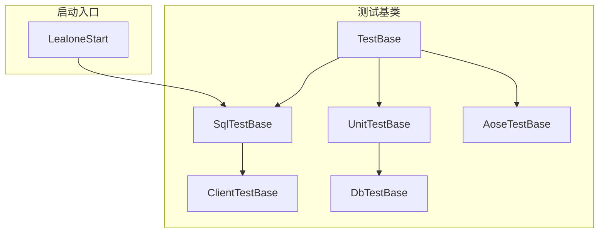
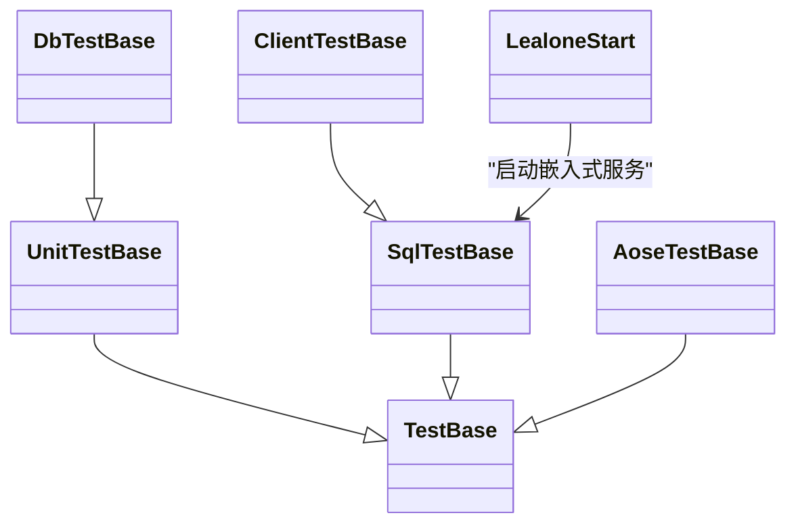
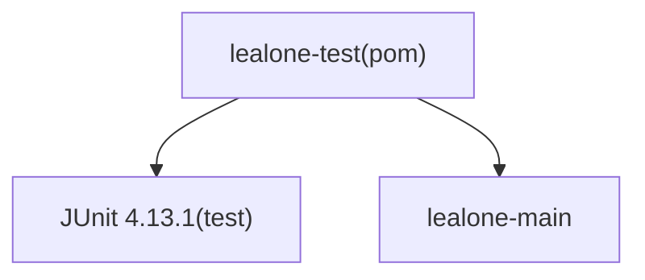

# 测试指南

<cite>
**本文引用的文件列表**
- [LealoneStart.java](file://lealone-test/src/test/java/com/lealone/test/LealoneStart.java)
- [AoseTestBase.java](file://lealone-test/src/test/java/com/lealone/test/aose/AoseTestBase.java)
- [TestBase.java](file://lealone-test/src/test/java/com/lealone/test/TestBase.java)
- [UnitTestBase.java](file://lealone-test/src/test/java/com/lealone/test/UnitTestBase.java)
- [SqlTestBase.java](file://lealone-test/src/test/java/com/lealone/test/sql/SqlTestBase.java)
- [AOStorageEngineTest.java](file://lealone-test/src/test/java/com/lealone/test/aose/AOStorageEngineTest.java)
- [BTreeMapTest.java](file://lealone-test/src/test/java/com/lealone/test/aose/BTreeMapTest.java)
- [InsertTest.java](file://lealone-test/src/test/java/com/lealone/test/sql/dml/InsertTest.java)
- [ClientTestBase.java](file://lealone-test/src/test/java/com/lealone/test/client/ClientTestBase.java)
- [DbTestBase.java](file://lealone-test/src/test/java/com/lealone/test/db/DbTestBase.java)
- [pom.xml（测试模块）](file://lealone-test/pom.xml)
- [pom.xml（根项目）](file://pom.xml)
</cite>

## 目录
1. [简介](#简介)
2. [项目结构](#项目结构)
3. [核心组件](#核心组件)
4. [架构总览](#架构总览)
5. [详细组件分析](#详细组件分析)
6. [依赖关系分析](#依赖关系分析)
7. [性能考量](#性能考量)
8. [故障排查指南](#故障排查指南)
9. [结论](#结论)
10. [附录](#附录)

## 简介
本指南面向开发者，系统性介绍 Lealone 的测试框架结构与最佳实践，重点围绕以下目标展开：
- 基于 LealoneStart.java 和 AoseTestBase.java，说明如何编写单元测试与集成测试；
- 解释测试基类提供的工具与方法，以及如何启动嵌入式数据库进行测试；
- 提供确保代码质量与功能正确的系统化方法论。

## 项目结构
Lealone 的测试代码集中在 lealone-test 模块中，采用按功能域分层的组织方式：
- 单元测试基类：UnitTestBase（继承自 TestBase）
- SQL 集成测试基类：SqlTestBase（继承自 TestBase，标记为 ClientServerTest）
- 存储引擎测试基类：AoseTestBase（继承自 TestBase，标记为 EmbeddedTest）
- 客户端测试基类：ClientTestBase（继承自 SqlTestBase）
- 数据库会话测试基类：DbTestBase（继承自 UnitTestBase）

此外，LealoneStart 提供了便捷入口以启动嵌入式数据库用于测试。

图表来源
- [TestBase.java](file://lealone-test/src/test/java/com/lealone/test/TestBase.java#L1-L342)
- [UnitTestBase.java](file://lealone-test/src/test/java/com/lealone/test/unit/UnitTestBase.java#L1-L91)
- [SqlTestBase.java](file://lealone-test/src/test/java/com/lealone/test/sql/SqlTestBase.java#L1-L319)
- [AoseTestBase.java](file://lealone-test/src/test/java/com/lealone/test/aose/AoseTestBase.java#L1-L86)
- [ClientTestBase.java](file://lealone-test/src/test/java/com/lealone/test/client/ClientTestBase.java#L1-L19)
- [DbTestBase.java](file://lealone-test/src/test/java/com/lealone/test/db/DbTestBase.java#L1-L18)
- [LealoneStart.java](file://lealone-test/src/test/java/com/lealone/test/LealoneStart.java#L1-L20)

章节来源
- [TestBase.java](file://lealone-test/src/test/java/com/lealone/test/TestBase.java#L1-L342)
- [UnitTestBase.java](file://lealone-test/src/test/java/com/lealone/test/UnitTestBase.java#L1-L91)
- [SqlTestBase.java](file://lealone-test/src/test/java/com/lealone/test/sql/SqlTestBase.java#L1-L319)
- [AoseTestBase.java](file://lealone-test/src/test/java/com/lealone/test/aose/AoseTestBase.java#L1-L86)
- [ClientTestBase.java](file://lealone-test/src/test/java/com/lealone/test/client/ClientTestBase.java#L1-L19)
- [DbTestBase.java](file://lealone-test/src/test/java/com/lealone/test/db/DbTestBase.java#L1-L18)
- [LealoneStart.java](file://lealone-test/src/test/java/com/lealone/test/LealoneStart.java#L1-L20)

## 核心组件
- TestBase：所有测试的基础类，负责统一的连接参数、URL 构造、日志与跟踪开关、文件清理等通用能力；提供标记接口以区分 Embedded、Client-Server、Main、Todo 等测试类型。
- UnitTestBase：面向单元测试，强制使用嵌入式内存模式，简化 JDBC 连接与资源管理，提供基本的 SQL 执行与计数、EXPLAIN 输出等辅助方法。
- SqlTestBase：面向 SQL 集成测试，支持嵌入式与 TCP 客户端-服务器两种模式；自动创建测试数据库、管理连接生命周期；提供丰富的断言与查询辅助方法。
- AoseTestBase：面向 AOSE 存储引擎的单元测试，提供 AOStorage 与 BTreeMap 的快速初始化、常用断言封装、存储路径拼接等。
- ClientTestBase：客户端测试基类，继承 SqlTestBase，便于在 TCP 模式下进行客户端驱动测试。
- DbTestBase：数据库会话测试基类，提供创建 ServerSession 的便捷方法，便于深入到会话层测试。
- LealoneStart：提供 main 入口与 run 方法，用于在测试中启动嵌入式数据库服务。

章节来源
- [TestBase.java](file://lealone-test/src/test/java/com/lealone/test/TestBase.java#L1-L342)
- [UnitTestBase.java](file://lealone-test/src/test/java/com/lealone/test/UnitTestBase.java#L1-L91)
- [SqlTestBase.java](file://lealone-test/src/test/java/com/lealone/test/sql/SqlTestBase.java#L1-L319)
- [AoseTestBase.java](file://lealone-test/src/test/java/com/lealone/test/aose/AoseTestBase.java#L1-L86)
- [ClientTestBase.java](file://lealone-test/src/test/java/com/lealone/test/client/ClientTestBase.java#L1-L19)
- [DbTestBase.java](file://lealone-test/src/test/java/com/lealone/test/db/DbTestBase.java#L1-L18)
- [LealoneStart.java](file://lealone-test/src/test/java/com/lealone/test/LealoneStart.java#L1-L20)

## 架构总览
测试体系通过“基类分层 + 启动入口”的方式，形成清晰的职责边界：
- 嵌入式单元测试：UnitTestBase → TestBase
- SQL 集成测试：SqlTestBase → TestBase（可选 TCP 模式）
- 存储引擎测试：AoseTestBase → TestBase（嵌入式）
- 客户端测试：ClientTestBase → SqlTestBase
- 会话层测试：DbTestBase → UnitTestBase

图表来源
- [TestBase.java](file://lealone-test/src/test/java/com/lealone/test/TestBase.java#L1-L342)
- [UnitTestBase.java](file://lealone-test/src/test/java/com/lealone/test/UnitTestBase.java#L1-L91)
- [SqlTestBase.java](file://lealone-test/src/test/java/com/lealone/test/sql/SqlTestBase.java#L1-L319)
- [AoseTestBase.java](file://lealone-test/src/test/java/com/lealone/test/aose/AoseTestBase.java#L1-L86)
- [ClientTestBase.java](file://lealone-test/src/test/java/com/lealone/test/client/ClientTestBase.java#L1-L19)
- [DbTestBase.java](file://lealone-test/src/test/java/com/lealone/test/db/DbTestBase.java#L1-L18)
- [LealoneStart.java](file://lealone-test/src/test/java/com/lealone/test/LealoneStart.java#L1-L20)

## 详细组件分析

### TestBase：测试基础设施
- 统一的连接参数与 URL 构造逻辑，支持嵌入式与 TCP 模式、SSL、网络工厂名等配置项。
- 提供日志与跟踪开关、打印 JDBC URL、删除测试目录等工具方法。
- 提供标记接口：EmbeddedTest、ClientServerTest、MainTest、TodoTest，便于分类与筛选测试。
- 提供静态工具：joinDirs、deleteFileRecursive、printResultSet 等。

最佳实践要点
- 在 setUp 中通过 setEmbedded(true)、setInMemory(true) 快速进入嵌入式内存模式；
- 使用 addConnectionParameter 添加特定参数，如 TRACE_LEVEL_*；
- 使用 deleteFileRecursive 清理测试数据目录，确保测试隔离性。

章节来源
- [TestBase.java](file://lealone-test/src/test/java/com/lealone/test/TestBase.java#L1-L342)

### UnitTestBase：单元测试基类
- 强制嵌入式内存模式，简化 JDBC 连接；
- 提供 execute、count、explain 等常用 SQL 辅助方法；
- runTest 支持切换嵌入式/内存模式，并将 JDBC URL 写入系统属性以便被底层组件读取。

最佳实践要点
- 在 @Before 中调用 setUpBefore 设置嵌入式+内存模式；
- 使用 runTest(true) 或 runTest(false) 切换模式；
- 将测试逻辑放在受保护的 test() 抽象方法中，由 runTest 调用。

章节来源
- [UnitTestBase.java](file://lealone-test/src/test/java/com/lealone/test/UnitTestBase.java#L1-L91)

### SqlTestBase：SQL 集成测试基类
- 支持嵌入式与 TCP 模式，自动创建测试数据库；
- 自动管理 Connection、Statement、ResultSet 生命周期；
- 提供 executeUpdate、executeQuery、断言错误码等方法；
- 可通过重写 autoStartTcpServer 控制是否自动启动 TCP 服务。

最佳实践要点
- 在 setUpBefore 中根据需要启动 TCP 服务；
- 使用 createTable 快速建表；
- 使用 runTest 手工运行测试逻辑，便于调试；
- 对异常场景使用 executeUpdateThanAssertErrorCode 或 executeQueryThanAssertErrorCode。

章节来源
- [SqlTestBase.java](file://lealone-test/src/test/java/com/lealone/test/sql/SqlTestBase.java#L1-L319)

### AoseTestBase：AOSE 存储引擎测试基类
- 提供 AOStorage 与 BTreeMap 的快速初始化方法；
- 提供 openStorage 多种重载，支持设置 pageSize、cacheSize、压缩策略等；
- 提供 equals(StorageMapCursor, expectedSize) 等断言辅助；
- 实现 TestBase.EmbeddedTest 接口，强调嵌入式测试定位。

最佳实践要点
- 使用 init() 或 init(mapName, clearMap) 初始化存储与映射；
- 使用 openStorage(int pageSize) 或 openStorage(int pageSize, int cacheSize) 精细控制存储参数；
- 使用 openMap() 重新打开映射，验证持久化状态。

章节来源
- [AoseTestBase.java](file://lealone-test/src/test/java/com/lealone/test/aose/AoseTestBase.java#L1-L86)

### ClientTestBase 与 DbTestBase
- ClientTestBase：继承 SqlTestBase，便于在 TCP 模式下进行客户端驱动测试；
- DbTestBase：提供创建 ServerSession 的便捷方法，便于深入到会话层测试。

章节来源
- [ClientTestBase.java](file://lealone-test/src/test/java/com/lealone/test/client/ClientTestBase.java#L1-L19)
- [DbTestBase.java](file://lealone-test/src/test/java/com/lealone/test/db/DbTestBase.java#L1-L18)

### LealoneStart：嵌入式数据库启动入口
- 提供 main 与 run 方法，直接调用主程序入口；
- 在 SqlTestBase 中通过 LealoneStart.run() 启动嵌入式服务，供客户端测试使用。

章节来源
- [LealoneStart.java](file://lealone-test/src/test/java/com/lealone/test/LealoneStart.java#L1-L20)

### 示例测试：AOStorageEngineTest
- 展示如何通过插件机制获取存储引擎与构建器；
- 验证存储路径、LOB 存储类型等行为。

章节来源
- [AOStorageEngineTest.java](file://lealone-test/src/test/java/com/lealone/test/aose/AOStorageEngineTest.java#L1-L46)

### 示例测试：BTreeMapTest
- 展示同步与异步操作、分片、删除、保存与恢复等完整流程；
- 使用 openMap() 验证持久化后状态一致性。

章节来源
- [BTreeMapTest.java](file://lealone-test/src/test/java/com/lealone/test/aose/BTreeMapTest.java#L1-L279)

### 示例测试：InsertTest
- 展示并发插入、唯一约束、主键冲突等场景；
- 使用多线程模拟并发写入，验证约束与一致性。

章节来源
- [InsertTest.java](file://lealone-test/src/test/java/com/lealone/test/sql/dml/InsertTest.java#L1-L157)

## 依赖关系分析
- 测试模块依赖 JUnit 4.13.1；
- 测试模块依赖 lealone-main，以便访问核心组件；
- Maven Surefire 插件用于执行测试。

图表来源
- [pom.xml（测试模块）](file://lealone-test/pom.xml#L1-L135)
- [pom.xml（根项目）](file://pom.xml#L133-L156)

章节来源
- [pom.xml（测试模块）](file://lealone-test/pom.xml#L1-L135)
- [pom.xml（根项目）](file://pom.xml#L133-L156)

## 性能考量
- 嵌入式内存模式：UnitTestBase 默认启用嵌入式+内存模式，适合快速单元测试，减少 IO 开销；
- 存储参数调优：AoseTestBase 提供 pageSize 与 cacheSize 参数，可根据测试场景调整；
- 并发测试：BTreeMapTest 使用 CountDownLatch 等并发工具，建议在高并发场景下评估线程池与锁竞争；
- 日志与跟踪：开启 TRACE_LEVEL_* 有助于定位问题，但会增加开销，建议仅在调试阶段使用。

## 故障排查指南
- URL 构造问题：检查 getURL() 生成的 JDBC URL 是否符合预期，可通过 printURL() 输出调试；
- 连接失败：确认是否处于嵌入式或 TCP 模式，必要时调用 LealoneStart.run() 启动服务；
- 文件清理：使用 deleteFileRecursive 清理测试目录，避免残留影响后续测试；
- 断言错误码：使用 assertErrorCode 或 SqlTestBase 的断言方法，快速定位 SQL 错误；
- 资源泄漏：确保在 tearDownAfter 中关闭 Connection、Statement、ResultSet。

章节来源
- [TestBase.java](file://lealone-test/src/test/java/com/lealone/test/TestBase.java#L1-L342)
- [SqlTestBase.java](file://lealone-test/src/test/java/com/lealone/test/sql/SqlTestBase.java#L1-L319)

## 结论
Lealone 的测试框架通过清晰的基类分层与启动入口，为单元测试与集成测试提供了统一且可扩展的基础设施。开发者应优先使用 UnitTestBase 进行嵌入式单元测试，使用 SqlTestBase 进行 SQL 集成测试，并在需要时借助 AoseTestBase 进行存储引擎专项测试。通过合理使用标记接口、URL 构造与资源管理工具，能够显著提升测试效率与稳定性。

## 附录

### 编写单元测试的最佳实践（基于 UnitTestBase）
- 在 @Before 中调用 setUpBefore 设置嵌入式+内存模式；
- 将测试逻辑放入受保护的 test() 方法，使用 runTest() 执行；
- 使用 execute、count、explain 等辅助方法简化 SQL 操作；
- 使用断言工具验证结果，避免手动资源管理。

章节来源
- [UnitTestBase.java](file://lealone-test/src/test/java/com/lealone/test/UnitTestBase.java#L1-L91)

### 编写集成测试的最佳实践（基于 SqlTestBase）
- 在 setUpBefore 中根据需要启动 TCP 服务；
- 使用 createTable 快速建表，使用 runTest 手工运行测试；
- 使用 executeUpdate、executeQuery、断言错误码等方法；
- 对并发场景使用多线程与同步工具，验证约束与一致性。

章节来源
- [SqlTestBase.java](file://lealone-test/src/test/java/com/lealone/test/sql/SqlTestBase.java#L1-L319)

### 编写存储引擎测试的最佳实践（基于 AoseTestBase）
- 使用 init() 或 init(mapName, clearMap) 初始化存储与映射；
- 使用 openStorage(int pageSize) 或 openStorage(int pageSize, int cacheSize) 调整存储参数；
- 使用 openMap() 验证持久化后状态一致性；
- 使用 equals(StorageMapCursor, expectedSize) 等断言辅助。

章节来源
- [AoseTestBase.java](file://lealone-test/src/test/java/com/lealone/test/aose/AoseTestBase.java#L1-L86)

### 启动嵌入式数据库进行测试（基于 LealoneStart）
- 在 SqlTestBase 中通过 LealoneStart.run() 启动嵌入式服务；
- 确保在客户端测试前完成服务启动；
- 如需自定义启动参数，可在 main 中传入相应参数。

章节来源
- [LealoneStart.java](file://lealone-test/src/test/java/com/lealone/test/LealoneStart.java#L1-L20)