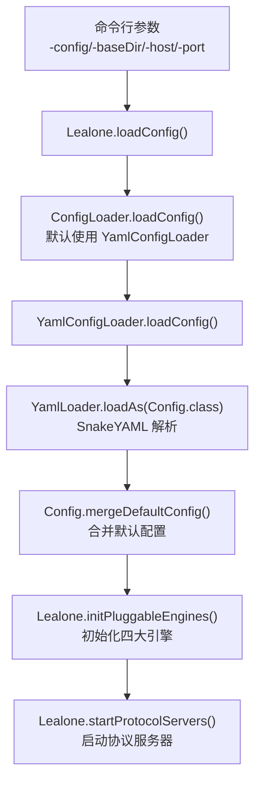
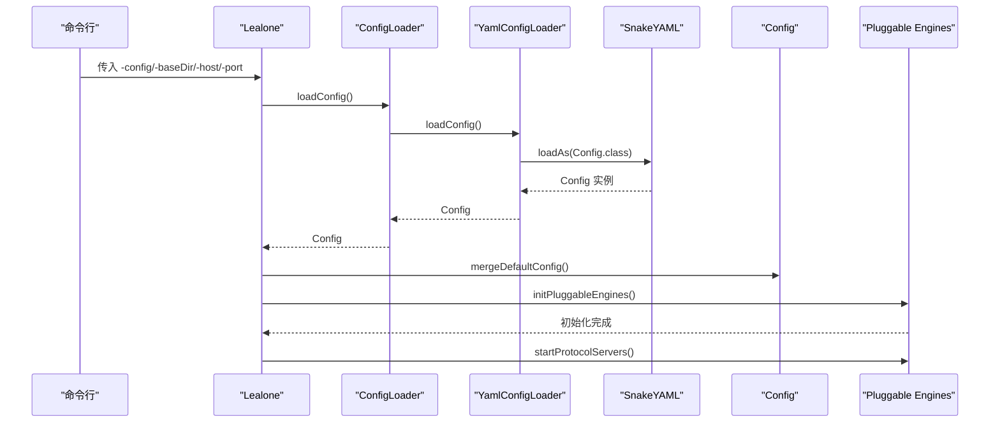
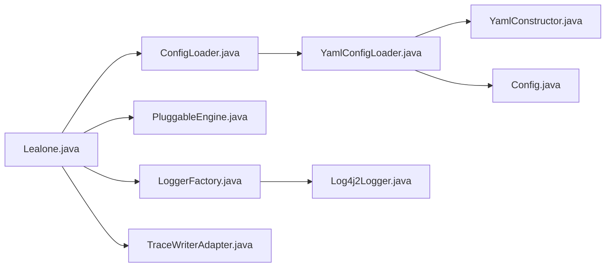

# 配置管理

<cite>
**本文引用的文件列表**
- [Config.java](file://lealone-main/src/main/java/com/lealone/main/config/Config.java)
- [YamlConfigLoader.java](file://lealone-main/src/main/java/com/lealone/main/config/YamlConfigLoader.java)
- [ConfigLoader.java](file://lealone-main/src/main/java/com/lealone/main/config/ConfigLoader.java)
- [YamlConstructor.java](file://lealone-main/src/main/java/com/lealone/main/config/YamlConstructor.java)
- [lealone.yaml（示例）](file://lealone-main/dist/conf/lealone.yaml)
- [lealone-test.yaml（示例）](file://lealone-test/src/test/resources/lealone-test.yaml)
- [Lealone.java](file://lealone-main/src/main/java/com/lealone/main/Lealone.java)
- [DbSetting.java](file://lealone-common/src/main/java/com/lealone/db/DbSetting.java)
- [StorageBuilder.java](file://lealone-sci/src/main/java/com/lealone/storage/StorageBuilder.java)
- [StorageSetting.java](file://lealone-sci/src/main/java/com/lealone/storage/StorageSetting.java)
- [StorageBase.java](file://lealone-sci/src/main/java/com/lealone/storage/StorageBase.java)
- [PluggableEngine.java](file://lealone-sci/src/main/java/com/lealone/db/plugin/PluggableEngine.java)
- [LoggerFactory.java](file://lealone-common/src/main/java/com/lealone/common/logging/LoggerFactory.java)
- [Log4j2Logger.java](file://lealone-common/src/main/java/com/lealone/common/logging/impl/Log4j2Logger.java)
- [TraceWriterAdapter.java](file://lealone-common/src/main/java/com/lealone/common/trace/TraceWriterAdapter.java)
- [MemoryManager.java](file://lealone-sci/src/main/java/com/lealone/db/MemoryManager.java)
</cite>

## 目录
1. [简介](#简介)
2. [项目结构与入口](#项目结构与入口)
3. [核心组件](#核心组件)
4. [架构总览](#架构总览)
5. [详细组件分析](#详细组件分析)
6. [依赖关系分析](#依赖关系分析)
7. [性能与调优建议](#性能与调优建议)
8. [故障排查指南](#故障排查指南)
9. [结论](#结论)
10. [附录：完整配置示例与参数说明](#附录完整配置示例与参数说明)

## 简介
本指南面向系统管理员与开发者，系统性讲解 Lealone 的配置管理机制，重点围绕基于 YAML 的配置文件格式、配置加载与解析流程、关键配置参数及其作用与推荐值，并提供完整的配置示例与动态修改配置的方法说明。读者可据此完成从零开始的部署配置、日常运维与性能调优。

## 项目结构与入口
- 配置加载入口位于主程序入口类中，负责解析命令行参数、加载配置、初始化调度器与四大可插拔引擎（存储、事务、SQL、协议服务器），并在启动完成后启动协议服务器。
- 配置文件默认优先从类路径下的 lealone.yaml 加载；若未找到，则回退到 lealone-test.yaml；如未找到 SnakeYAML 依赖，则使用默认配置。

图表来源
- [Lealone.java](file://lealone-main/src/main/java/com/lealone/main/Lealone.java#L209-L329)
- [YamlConfigLoader.java](file://lealone-main/src/main/java/com/lealone/main/config/YamlConfigLoader.java#L56-L105)

章节来源
- [Lealone.java](file://lealone-main/src/main/java/com/lealone/main/Lealone.java#L100-L188)
- [YamlConfigLoader.java](file://lealone-main/src/main/java/com/lealone/main/config/YamlConfigLoader.java#L34-L105)

## 核心组件
- Config：定义配置模型，包含基础目录、监听地址、四大引擎列表、调度器参数、加密选项以及系统属性读写方法。
- YamlConfigLoader：实现 ConfigLoader 接口，负责从 YAML 文件加载配置，支持环境变量占位符扩展与缺失属性检查。
- YamlConstructor：自定义 SnakeYAML 构造器，支持 ${VAR} 与 ${VAR:default}、${VAR-default}、${VAR?error} 等格式的环境变量解析。
- ConfigLoader：配置加载器接口，定义 loadConfig 与 applyConfig 两个方法，便于替换为其他加载策略。

章节来源
- [Config.java](file://lealone-main/src/main/java/com/lealone/main/config/Config.java#L19-L184)
- [YamlConfigLoader.java](file://lealone-main/src/main/java/com/lealone/main/config/YamlConfigLoader.java#L30-L138)
- [YamlConstructor.java](file://lealone-main/src/main/java/com/lealone/main/config/YamlConstructor.java#L18-L44)
- [ConfigLoader.java](file://lealone-main/src/main/java/com/lealone/main/config/ConfigLoader.java#L8-L22)

## 架构总览
下图展示配置从文件到运行时生效的关键流程：命令行参数影响最终配置，YAML 解析后与默认配置合并，再注入到四大引擎初始化阶段。

图表来源
- [Lealone.java](file://lealone-main/src/main/java/com/lealone/main/Lealone.java#L209-L329)
- [YamlConfigLoader.java](file://lealone-main/src/main/java/com/lealone/main/config/YamlConfigLoader.java#L56-L105)
- [Config.java](file://lealone-main/src/main/java/com/lealone/main/config/Config.java#L111-L160)

## 详细组件分析

### 配置模型与默认行为（Config）
- 基础字段
  - base_dir：数据库基础目录，默认指向项目名_data 目录。
  - listen_address：协议服务器监听地址，默认 127.0.0.1。
  - storage_engines/transaction_engines/sql_engines/protocol_server_engines：四大引擎定义列表。
  - scheduler：调度器参数集合，包含线程数、批处理偏好等。
  - server_encryption_options/client_encryption_options：服务端/客户端加密选项。
- 默认配置生成
  - 构造函数在 isDefault=true 时填充默认引擎与调度器参数，并将调度器参数合并到协议服务器与事务引擎参数中。
- 动态参数合并
  - mergeProtocolServerParameters：根据命令行 host/port 覆盖协议服务器参数。
  - getProtocolServerParameters：按引擎名获取参数映射。
- 系统属性访问
  - 提供 getProperty/setProperty 方法，统一通过常量前缀访问系统属性，便于外部覆盖。

章节来源
- [Config.java](file://lealone-main/src/main/java/com/lealone/main/config/Config.java#L21-L110)
- [Config.java](file://lealone-main/src/main/java/com/lealone/main/config/Config.java#L111-L184)

### YAML 加载与解析（YamlConfigLoader）
- 配置文件定位
  - 优先读取系统属性中的 config 路径；若为空，尝试 lealone.yaml；再尝试 lealone-test.yaml；若均不可用且未引入 SnakeYAML，则使用默认配置。
- 解析流程
  - 使用自定义构造器 YamlConstructor，启用环境变量解析与缺失属性检查。
  - 通过 SnakeYAML 的 loadAs 将 YAML 映射为 Config 对象。
- 缺失属性检查
  - 自定义 PropertyUtils 记录缺失属性并在解析后统一抛出异常，避免静默失败。

章节来源
- [YamlConfigLoader.java](file://lealone-main/src/main/java/com/lealone/main/config/YamlConfigLoader.java#L34-L138)

### 环境变量解析（YamlConstructor）
- 支持格式
  - ${VAR}、${VAR:default}、${VAR-default}、${VAR?error} 以及尾随非空白字符拼接。
- 行为说明
  - 当 VAR 不存在时，按冒号或连字符规则回退默认值；当使用问号时，缺失将导致错误。
  - 适配 ${LEALONE_HOME}/data 这类复合路径表达式。

章节来源
- [YamlConstructor.java](file://lealone-main/src/main/java/com/lealone/main/config/YamlConstructor.java#L18-L44)

### 配置加载器接口（ConfigLoader）
- 规范
  - 定义 loadConfig 与 applyConfig 两个方法，允许替换为其他加载策略（如 JSON、XML、远程配置中心）。
- 扩展点
  - Lealone 默认使用 YamlConfigLoader；可通过系统属性指定自定义实现类。

章节来源
- [ConfigLoader.java](file://lealone-main/src/main/java/com/lealone/main/config/ConfigLoader.java#L8-L22)
- [Lealone.java](file://lealone-main/src/main/java/com/lealone/main/Lealone.java#L209-L226)

### 引擎初始化与参数注入（Pluggable Engines）
- 初始化顺序
  - 存储引擎 → 事务引擎 → SQL 引擎 → 协议服务器引擎。
- 参数注入要点
  - 若协议服务器未显式设置 host，则自动继承 listen_address。
  - 所有引擎参数统一转为不区分大小写的 CaseInsensitiveMap。
  - 若引擎未设置 base_dir，则注入全局 base_dir。
  - 若某引擎被标记为 is_default 且系统属性未设置默认引擎键，则写入默认引擎名。

章节来源
- [Lealone.java](file://lealone-main/src/main/java/com/lealone/main/Lealone.java#L253-L309)
- [PluggableEngine.java](file://lealone-sci/src/main/java/com/lealone/db/plugin/PluggableEngine.java#L1-L45)

## 依赖关系分析
- 组件耦合
  - Lealone 依赖 ConfigLoader 接口，具体实现由 YamlConfigLoader 提供。
  - Config 作为数据载体，被 YamlLoader 解析并合并默认配置后传递给 Lealone。
  - 四大引擎通过 PluginManager 注册与初始化，参数来自 Config 中的各引擎定义列表。
- 外部依赖
  - SnakeYAML：用于 YAML 解析与环境变量扩展。
  - 日志系统：优先 Log4j2，其次控制台输出，trace 写入映射到对应日志级别。

图表来源
- [Lealone.java](file://lealone-main/src/main/java/com/lealone/main/Lealone.java#L209-L329)
- [ConfigLoader.java](file://lealone-main/src/main/java/com/lealone/main/config/ConfigLoader.java#L8-L22)
- [YamlConfigLoader.java](file://lealone-main/src/main/java/com/lealone/main/config/YamlConfigLoader.java#L56-L105)
- [YamlConstructor.java](file://lealone-main/src/main/java/com/lealone/main/config/YamlConstructor.java#L18-L44)
- [Config.java](file://lealone-main/src/main/java/com/lealone/main/config/Config.java#L111-L184)
- [PluggableEngine.java](file://lealone-sci/src/main/java/com/lealone/db/plugin/PluggableEngine.java#L1-L45)
- [LoggerFactory.java](file://lealone-common/src/main/java/com/lealone/common/logging/LoggerFactory.java#L33-L67)
- [Log4j2Logger.java](file://lealone-common/src/main/java/com/lealone/common/logging/impl/Log4j2Logger.java#L47-L101)
- [TraceWriterAdapter.java](file://lealone-common/src/main/java/com/lealone/common/trace/TraceWriterAdapter.java#L42-L70)

## 性能与调优建议
- 调度器与并发
  - scheduler_count：建议与 CPU 核数一致或略小于核数，避免过度上下文切换。
  - prefer_batch_write：批量写入在高吞吐场景下可提升吞吐，但需权衡延迟。
  - max_packet_count_per_loop：限制每次事件循环处理的数据包数量，防止“饿死”其他连接。
- 存储层
  - page_size：默认 16KB，可根据数据特征调整；过大降低页分裂频率，过小增加碎片与元数据开销。
  - compress：可选 no/lzf/deflate 或 0/1/2，压缩比与 CPU 开销递增；写多读少场景建议开启。
  - cache_size：页面缓存大小，适当增大可减少磁盘 IO，但需考虑内存占用。
- 事务层
  - dirty_page_cache_size_in_mb：脏页缓存大小，写密集场景建议增大以减少刷盘频率。
  - redo_log_dir：重做日志目录，建议与数据目录分离至不同磁盘。
  - log_sync_type：instant/no_sync/periodic，默认 periodic；追求一致性时可设为 instant。
- 协议服务器
  - port：默认 9210，生产环境建议固定端口并配合防火墙白名单。
  - allow_others：仅在开发/测试环境开启，生产务必关闭。
  - ssl：生产环境必须开启 TLS。
  - session_timeout：-1 表示永不过期，建议设置合理超时时间。
- 日志与跟踪
  - 日志级别由日志框架决定；Lealone 的 trace 级别映射到日志框架的 debug/info/error 等级别。
  - 建议在生产环境将 trace 级别限制在 info 或更高，避免过多 I/O。

章节来源
- [lealone-test.yaml（示例）](file://lealone-test/src/test/resources/lealone-test.yaml#L9-L52)
- [lealone.yaml（示例）](file://lealone-main/dist/conf/lealone.yaml#L1-L40)
- [StorageBuilder.java](file://lealone-sci/src/main/java/com/lealone/storage/StorageBuilder.java#L81-L148)
- [DbSetting.java](file://lealone-common/src/main/java/com/lealone/db/DbSetting.java#L54-L97)
- [LoggerFactory.java](file://lealone-common/src/main/java/com/lealone/common/logging/LoggerFactory.java#L33-L67)
- [Log4j2Logger.java](file://lealone-common/src/main/java/com/lealone/common/logging/impl/Log4j2Logger.java#L47-L101)
- [TraceWriterAdapter.java](file://lealone-common/src/main/java/com/lealone/common/trace/TraceWriterAdapter.java#L42-L70)

## 故障排查指南
- 配置文件无效
  - 症状：YAML 解析报错或属性缺失。
  - 排查：确认属性名拼写正确；使用缺失属性检查工具定位问题；确保 SnakeYAML 依赖存在。
- 环境变量未生效
  - 症状：${VAR} 未替换。
  - 排查：确认环境变量名与格式；检查 YamlConstructor 支持的格式；确认变量存在且无多余空格。
- 引擎初始化失败
  - 症状：启动时报“Failed to init … engine”。
  - 排查：检查引擎名称、参数合法性；确认 base_dir 存在且可写；查看日志堆栈定位具体异常。
- 协议服务器无法绑定端口
  - 症状：端口占用或权限不足。
  - 排查：更换端口；以管理员权限启动；检查 allow_others 与白名单配置。
- 日志级别与输出
  - 症状：日志过多或过少。
  - 排查：调整日志框架配置；确认 trace 级别映射；必要时降低 trace 级别。

章节来源
- [YamlConfigLoader.java](file://lealone-main/src/main/java/com/lealone/main/config/YamlConfigLoader.java#L114-L138)
- [Lealone.java](file://lealone-main/src/main/java/com/lealone/main/Lealone.java#L253-L309)
- [LoggerFactory.java](file://lealone-common/src/main/java/com/lealone/common/logging/LoggerFactory.java#L33-L67)

## 结论
Lealone 的配置体系以 YAML 为核心，结合 SnakeYAML 的强大能力与自定义构造器，实现了灵活、可扩展的配置加载与解析。通过 Config 与 ConfigLoader 的清晰分层，系统既支持默认配置，又允许用户通过命令行与 YAML 文件进行精细控制。四大引擎的初始化流程保证了参数注入的一致性与可维护性。遵循本文提供的参数说明与调优建议，可帮助系统管理员与开发者快速完成生产级部署与持续优化。

## 附录：完整配置示例与参数说明

### 完整配置示例
- 生产示例（基于 dist 配置）
  - [lealone.yaml（示例）](file://lealone-main/dist/conf/lealone.yaml#L1-L40)
- 测试示例（包含常见参数注释）
  - [lealone-test.yaml（示例）](file://lealone-test/src/test/resources/lealone-test.yaml#L1-L52)

### 关键参数说明与推荐值
- 基础参数
  - base_dir：数据库基础目录，建议使用绝对路径或 ${LEALONE_HOME}/data 形式的环境变量。
  - listen_address：协议服务器监听地址，生产环境建议固定内网地址。
- 调度器（scheduler）
  - scheduler_count：CPU 核数或略小于核数；高并发场景可微调。
  - prefer_batch_write：写多读少场景建议关闭；读多写少场景可开启。
  - max_packet_count_per_loop：默认 10~20，可根据网络与业务负载调整。
- 存储引擎（storage_engines）
  - page_size：默认 16KB；大记录场景可适当增大。
  - compress：no/lzf/deflate；写多读少建议开启压缩。
  - cache_size：页面缓存大小，按内存预算与 IO 压力调整。
- 事务引擎（transaction_engines）
  - dirty_page_cache_size_in_mb：写密集场景建议 32MB 起步。
  - redo_log_dir：建议独立磁盘或分区。
  - log_sync_type：生产环境建议 instant。
- SQL 引擎（sql_engines）
  - 常规无需额外参数；如需扩展可在此处添加。
- 协议服务器引擎（protocol_server_engines）
  - name：TCP。
  - port：9210（示例），生产固定端口。
  - allow_others：开发/测试可用，生产务必关闭。
  - ssl：生产必须开启。
  - session_timeout：-1 表示永不过期，建议设置合理值。
  - host：未设置时自动继承 listen_address。
- 系统属性覆盖
  - 可通过系统属性覆盖配置项，键名以项目前缀开头；例如 -Dlealone.config.loader=自定义实现类。

### 动态修改配置（编程方式）
- 运行时修改
  - 通过 Config.getProperty/setProperty 读写系统属性，随后调用 Config.mergeDefaultConfig 合并得到最新配置。
  - 注意：已初始化的引擎参数通常不会自动刷新，需要重启或在引擎层面支持热更新。
- 启动时覆盖
  - 使用命令行参数 -config/-baseDir/-host/-port 覆盖默认配置。
  - 通过 -Dlealone.config.loader 指定自定义 ConfigLoader 实现。

章节来源
- [Config.java](file://lealone-main/src/main/java/com/lealone/main/config/Config.java#L99-L110)
- [Lealone.java](file://lealone-main/src/main/java/com/lealone/main/Lealone.java#L209-L226)
- [lealone-test.yaml（示例）](file://lealone-test/src/test/resources/lealone-test.yaml#L1-L52)
- [lealone.yaml（示例）](file://lealone-main/dist/conf/lealone.yaml#L1-L40)