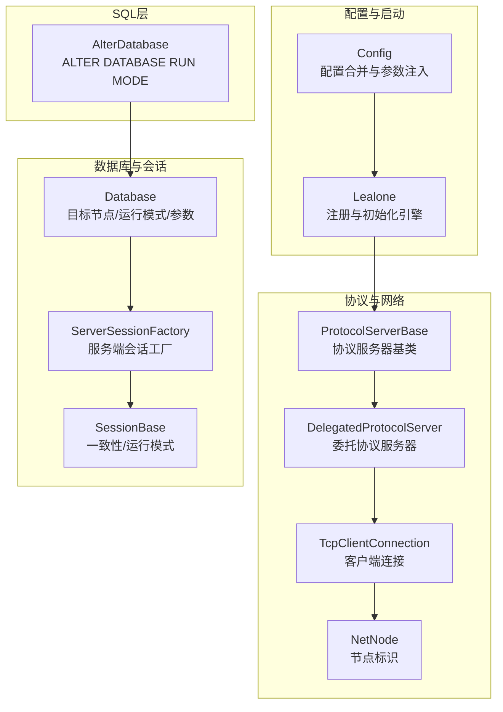
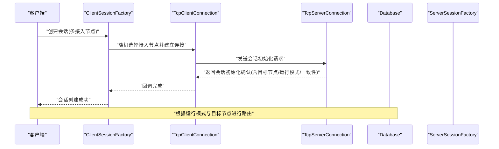
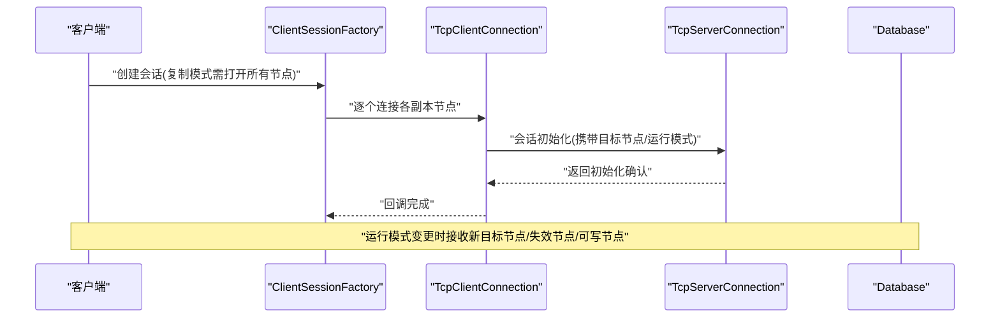
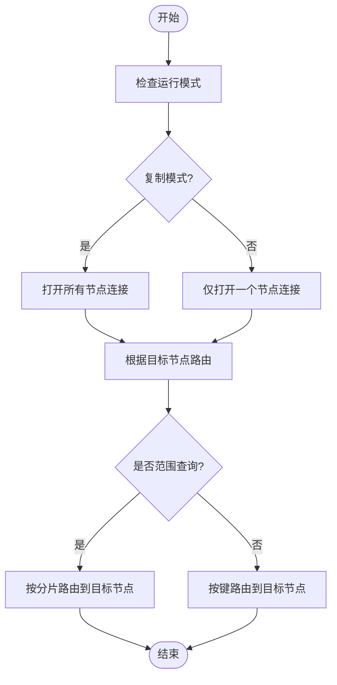
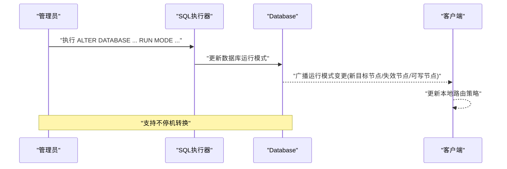
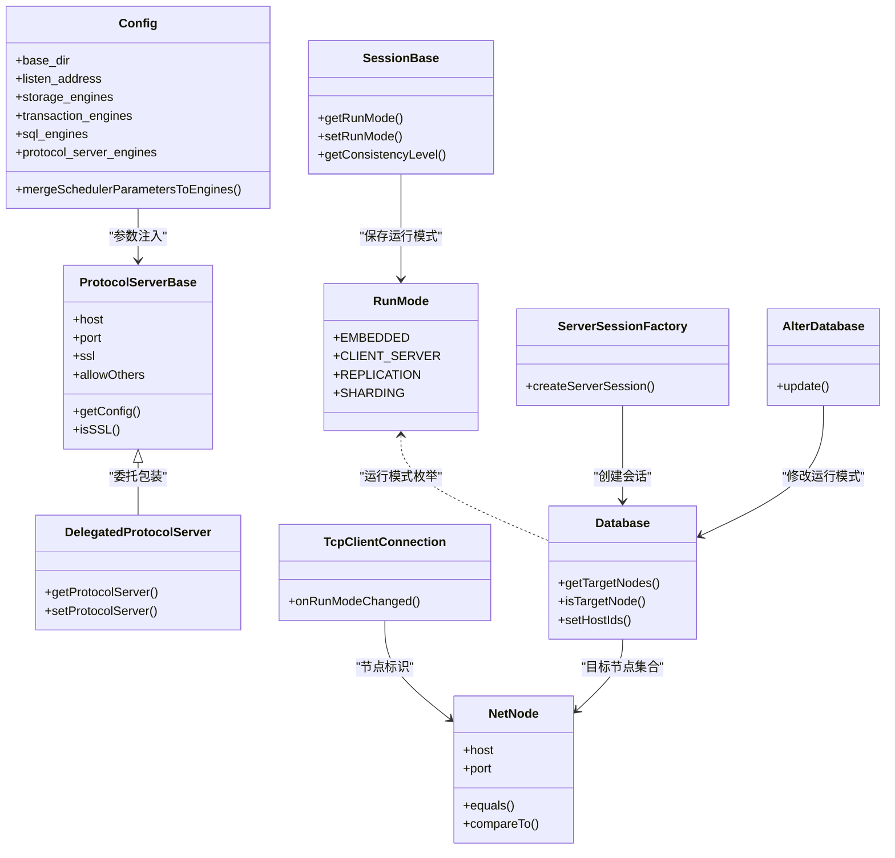

# 集群模式

<cite>
**本文引用的文件列表**
- [README.md](https://github.com/lealone/Lealone/blob/master/README.md)
- [lealone-main/dist/conf/lealone.yaml](https://github.com/lealone/Lealone/blob/master/lealone-main/dist/conf/lealone.yaml)
- [lealone-main/src/main/java/com/lealone/main/config/Config.java](https://github.com/lealone/Lealone/blob/master/lealone-main/src/main/java/com/lealone/main/config/Config.java)
- [lealone-main/src/main/java/com/lealone/main/Lealone.java](https://github.com/lealone/Lealone/blob/master/lealone-main/src/main/java/com/lealone/main/Lealone.java)
- [lealone-common/src/main/java/com/lealone/db/RunMode.java](https://github.com/lealone/Lealone/blob/master/lealone-common/src/main/java/com/lealone/db/RunMode.java)
- [lealone-common/src/main/java/com/lealone/common/util/MapUtils.java](https://github.com/lealone/Lealone/blob/master/lealone-common/src/main/java/com/lealone/common/util/MapUtils.java)
- [lealone-common/src/main/java/com/lealone/db/session/SessionBase.java](https://github.com/lealone/Lealone/blob/master/lealone-common/src/main/java/com/lealone/db/session/SessionBase.java)
- [lealone-common/src/main/java/com/lealone/server/ProtocolServerBase.java](https://github.com/lealone/Lealone/blob/master/lealone-common/src/main/java/com/lealone/server/ProtocolServerBase.java)
- [lealone-common/src/main/java/com/lealone/server/ProtocolServer.java](https://github.com/lealone/Lealone/blob/master/lealone-common/src/main/java/com/lealone/server/ProtocolServer.java)
- [lealone-sci/src/main/java/com/lealone/server/DelegatedProtocolServer.java](https://github.com/lealone/Lealone/blob/master/lealone-sci/src/main/java/com/lealone/server/DelegatedProtocolServer.java)
- [lealone-net/src/main/java/com/lealone/net/TcpClientConnection.java](https://github.com/lealone/Lealone/blob/master/lealone-net/src/main/java/com/lealone/net/TcpClientConnection.java)
- [lealone-net/src/main/java/com/lealone/net/NetNode.java](https://github.com/lealone/Lealone/blob/master/lealone-net/src/main/java/com/lealone/net/NetNode.java)
- [lealone-client/src/main/java/com/lealone/client/session/ClientSessionFactory.java](https://github.com/lealone/Lealone/blob/master/lealone-client/src/main/java/com/lealone/client/session/ClientSessionFactory.java)
- [lealone-server/src/main/java/com/lealone/server/TcpServerConnection.java](https://github.com/lealone/Lealone/blob/master/lealone-server/src/main/java/com/lealone/server/TcpServerConnection.java)
- [lealone-db/src/main/java/com/lealone/db/Database.java](https://github.com/lealone/Lealone/blob/master/lealone-db/src/main/java/com/lealone/db/Database.java)
- [lealone-db/src/main/java/com/lealone/db/session/ServerSessionFactory.java](https://github.com/lealone/Lealone/blob/master/lealone-db/src/main/java/com/lealone/db/session/ServerSessionFactory.java)
- [lealone-sql/src/main/java/com/lealone/sql/ddl/AlterDatabase.java](https://github.com/lealone/Lealone/blob/master/lealone-sql/src/main/java/com/lealone/sql/ddl/AlterDatabase.java)
- [lealone-aose/src/main/java/com/lealone/storage/aose/btree/page/NodePage.java](https://github.com/lealone/Lealone/blob/master/lealone-aose/src/main/java/com/lealone/storage/aose/btree/page/NodePage.java)
</cite>

## 目录
1. [简介](#简介)
2. [项目结构](#项目结构)
3. [核心组件](#核心组件)
4. [架构总览](#架构总览)
5. [详细组件分析](#详细组件分析)
6. [依赖关系分析](#依赖关系分析)
7. [性能考量](#性能考量)
8. [故障排查指南](#故障排查指南)
9. [结论](#结论)
10. [附录](#附录)

## 简介
本指南围绕 Lealone 的集群模式展开，结合仓库中关于“混合运行模式”的描述，系统性地阐述其支持的四种运行模式：嵌入式、Client/Server 模式、复制模式、分片模式（Sharding）。文档重点解释各模式的架构、配置方法、适用场景，并说明在集群环境下如何实现数据一致性、故障转移与负载均衡，为构建高可用、可扩展数据库系统提供部署参考。

## 项目结构
Lealone 采用模块化设计，核心与网络、协议、客户端、配置等模块协同工作，形成统一的运行模式体系：
- 配置与启动：主程序负责加载配置、注册与初始化协议服务器引擎。
- 协议与网络：提供 TCP 协议服务器、客户端连接管理、节点标识与路由。
- 数据库与会话：数据库对象维护目标节点集合、运行模式、一致性级别；会话承载一致性与运行模式状态。
- SQL 层：DDL 语句支持数据库运行模式变更（如复制模式）。

图表来源
- [lealone-main/src/main/java/com/lealone/main/config/Config.java](https://github.com/lealone/Lealone/blob/master/lealone-main/src/main/java/com/lealone/main/config/Config.java#L1-L185)
- [lealone-main/src/main/java/com/lealone/main/Lealone.java](https://github.com/lealone/Lealone/blob/master/lealone-main/src/main/java/com/lealone/main/Lealone.java#L259-L282)
- [lealone-common/src/main/java/com/lealone/server/ProtocolServerBase.java](https://github.com/lealone/Lealone/blob/master/lealone-common/src/main/java/com/lealone/server/ProtocolServerBase.java#L1-L41)
- [lealone-sci/src/main/java/com/lealone/server/DelegatedProtocolServer.java](https://github.com/lealone/Lealone/blob/master/lealone-sci/src/main/java/com/lealone/server/DelegatedProtocolServer.java#L1-L116)
- [lealone-net/src/main/java/com/lealone/net/TcpClientConnection.java](https://github.com/lealone/Lealone/blob/master/lealone-net/src/main/java/com/lealone/net/TcpClientConnection.java#L117-L190)
- [lealone-net/src/main/java/com/lealone/net/NetNode.java](https://github.com/lealone/Lealone/blob/master/lealone-net/src/main/java/com/lealone/net/NetNode.java#L127-L177)
- [lealone-db/src/main/java/com/lealone/db/Database.java](https://github.com/lealone/Lealone/blob/master/lealone-db/src/main/java/com/lealone/db/Database.java#L1888-L1939)
- [lealone-db/src/main/java/com/lealone/db/session/ServerSessionFactory.java](https://github.com/lealone/Lealone/blob/master/lealone-db/src/main/java/com/lealone/db/session/ServerSessionFactory.java#L36-L92)
- [lealone-common/src/main/java/com/lealone/db/session/SessionBase.java](https://github.com/lealone/Lealone/blob/master/lealone-common/src/main/java/com/lealone/db/session/SessionBase.java#L101-L143)
- [lealone-sql/src/main/java/com/lealone/sql/ddl/AlterDatabase.java](https://github.com/lealone/Lealone/blob/master/lealone-sql/src/main/java/com/lealone/sql/ddl/AlterDatabase.java#L1-L46)

章节来源
- [lealone-main/dist/conf/lealone.yaml](https://github.com/lealone/Lealone/blob/master/lealone-main/dist/conf/lealone.yaml#L1-L40)
- [lealone-main/src/main/java/com/lealone/main/config/Config.java](https://github.com/lealone/Lealone/blob/master/lealone-main/src/main/java/com/lealone/main/config/Config.java#L1-L185)
- [lealone-main/src/main/java/com/lealone/main/Lealone.java](https://github.com/lealone/Lealone/blob/master/lealone-main/src/main/java/com/lealone/main/Lealone.java#L259-L282)
- [lealone-common/src/main/java/com/lealone/server/ProtocolServerBase.java](https://github.com/lealone/Lealone/blob/master/lealone-common/src/main/java/com/lealone/server/ProtocolServerBase.java#L1-L41)
- [lealone-sci/src/main/java/com/lealone/server/DelegatedProtocolServer.java](https://github.com/lealone/Lealone/blob/master/lealone-sci/src/main/java/com/lealone/server/DelegatedProtocolServer.java#L1-L116)
- [lealone-net/src/main/java/com/lealone/net/TcpClientConnection.java](https://github.com/lealone/Lealone/blob/master/lealone-net/src/main/java/com/lealone/net/TcpClientConnection.java#L117-L190)
- [lealone-net/src/main/java/com/lealone/net/NetNode.java](https://github.com/lealone/Lealone/blob/master/lealone-net/src/main/java/com/lealone/net/NetNode.java#L127-L177)
- [lealone-db/src/main/java/com/lealone/db/Database.java](https://github.com/lealone/Lealone/blob/master/lealone-db/src/main/java/com/lealone/db/Database.java#L1888-L1939)
- [lealone-db/src/main/java/com/lealone/db/session/ServerSessionFactory.java](https://github.com/lealone/Lealone/blob/master/lealone-db/src/main/java/com/lealone/db/session/ServerSessionFactory.java#L36-L92)
- [lealone-common/src/main/java/com/lealone/db/session/SessionBase.java](https://github.com/lealone/Lealone/blob/master/lealone-common/src/main/java/com/lealone/db/session/SessionBase.java#L101-L143)
- [lealone-sql/src/main/java/com/lealone/sql/ddl/AlterDatabase.java](https://github.com/lealone/Lealone/blob/master/lealone-sql/src/main/java/com/lealone/sql/ddl/AlterDatabase.java#L1-L46)

## 核心组件
- 运行模式枚举：定义嵌入式、Client/Server、复制、分片四种模式，用于控制数据库实例的运行形态与路由策略。
- 配置与启动：默认配置包含存储引擎、事务引擎、SQL 引擎与协议服务器引擎；启动时注册并初始化协议服务器引擎，合并调度器参数。
- 协议服务器：提供主机、端口、SSL、白名单等配置能力，支持委托包装。
- 客户端连接：支持多接入节点随机选择，复制模式需打开所有节点，其他模式仅需打开一个；支持运行模式变更通知。
- 数据库与会话：数据库维护目标节点集合与运行模式；会话保存一致性级别与运行模式；服务端会话工厂根据目标节点与运行模式创建会话。
- SQL 变更：ALTER DATABASE RUN MODE 支持在管理员权限下修改数据库运行模式。

章节来源
- [lealone-common/src/main/java/com/lealone/db/RunMode.java](https://github.com/lealone/Lealone/blob/master/lealone-common/src/main/java/com/lealone/db/RunMode.java#L1-L24)
- [lealone-main/src/main/java/com/lealone/main/config/Config.java](https://github.com/lealone/Lealone/blob/master/lealone-main/src/main/java/com/lealone/main/config/Config.java#L1-L185)
- [lealone-main/src/main/java/com/lealone/main/Lealone.java](https://github.com/lealone/Lealone/blob/master/lealone-main/src/main/java/com/lealone/main/Lealone.java#L259-L282)
- [lealone-common/src/main/java/com/lealone/server/ProtocolServerBase.java](https://github.com/lealone/Lealone/blob/master/lealone-common/src/main/java/com/lealone/server/ProtocolServerBase.java#L1-L41)
- [lealone-sci/src/main/java/com/lealone/server/DelegatedProtocolServer.java](https://github.com/lealone/Lealone/blob/master/lealone-sci/src/main/java/com/lealone/server/DelegatedProtocolServer.java#L1-L116)
- [lealone-net/src/main/java/com/lealone/net/TcpClientConnection.java](https://github.com/lealone/Lealone/blob/master/lealone-net/src/main/java/com/lealone/net/TcpClientConnection.java#L117-L190)
- [lealone-db/src/main/java/com/lealone/db/Database.java](https://github.com/lealone/Lealone/blob/master/lealone-db/src/main/java/com/lealone/db/Database.java#L1888-L1939)
- [lealone-db/src/main/java/com/lealone/db/session/ServerSessionFactory.java](https://github.com/lealone/Lealone/blob/master/lealone-db/src/main/java/com/lealone/db/session/ServerSessionFactory.java#L36-L92)
- [lealone-common/src/main/java/com/lealone/db/session/SessionBase.java](https://github.com/lealone/Lealone/blob/master/lealone-common/src/main/java/com/lealone/db/session/SessionBase.java#L101-L143)
- [lealone-sql/src/main/java/com/lealone/sql/ddl/AlterDatabase.java](https://github.com/lealone/Lealone/blob/master/lealone-sql/src/main/java/com/lealone/sql/ddl/AlterDatabase.java#L1-L46)

## 架构总览
Lealone 的集群模式通过“运行模式 + 目标节点 + 一致性级别”三要素实现：
- 运行模式：决定数据分布与路由策略（复制/分片）。
- 目标节点：数据库实例的物理定位集合，客户端连接时根据目标节点进行路由。
- 一致性级别：控制事务隔离与可见性，影响读写行为与冲突处理。

图表来源
- [lealone-client/src/main/java/com/lealone/client/session/ClientSessionFactory.java](https://github.com/lealone/Lealone/blob/master/lealone-client/src/main/java/com/lealone/client/session/ClientSessionFactory.java#L63-L158)
- [lealone-net/src/main/java/com/lealone/net/TcpClientConnection.java](https://github.com/lealone/Lealone/blob/master/lealone-net/src/main/java/com/lealone/net/TcpClientConnection.java#L117-L190)
- [lealone-server/src/main/java/com/lealone/server/TcpServerConnection.java](https://github.com/lealone/Lealone/blob/master/lealone-server/src/main/java/com/lealone/server/TcpServerConnection.java#L166-L202)
- [lealone-db/src/main/java/com/lealone/db/Database.java](https://github.com/lealone/Lealone/blob/master/lealone-db/src/main/java/com/lealone/db/Database.java#L1888-L1939)
- [lealone-db/src/main/java/com/lealone/db/session/ServerSessionFactory.java](https://github.com/lealone/Lealone/blob/master/lealone-db/src/main/java/com/lealone/db/session/ServerSessionFactory.java#L36-L92)

## 详细组件分析

### 运行模式与配置
- 四种运行模式：嵌入式、Client/Server、复制、分片。
- 默认配置：包含存储引擎、事务引擎、SQL 引擎与协议服务器引擎；协议服务器参数可通过系统属性覆盖。
- YAML 配置示例：包含基础目录、监听地址、协议服务器端口、SSL 开关等。

章节来源
- [lealone-common/src/main/java/com/lealone/db/RunMode.java](https://github.com/lealone/Lealone/blob/master/lealone-common/src/main/java/com/lealone/db/RunMode.java#L1-L24)
- [lealone-main/src/main/java/com/lealone/main/config/Config.java](https://github.com/lealone/Lealone/blob/master/lealone-main/src/main/java/com/lealone/main/config/Config.java#L1-L185)
- [lealone-main/dist/conf/lealone.yaml](https://github.com/lealone/Lealone/blob/master/lealone-main/dist/conf/lealone.yaml#L1-L40)

### 协议服务器与网络
- 协议服务器基类提供主机、端口、SSL、白名单、会话超时等通用配置。
- 委托协议服务器用于包装具体协议实现，便于扩展。
- 客户端连接支持多接入节点随机选择；复制模式需打开所有节点，其他模式仅需打开一个。
- 节点标识包含主机与端口，用于路由与比较。

章节来源
- [lealone-common/src/main/java/com/lealone/server/ProtocolServerBase.java](https://github.com/lealone/Lealone/blob/master/lealone-common/src/main/java/com/lealone/server/ProtocolServerBase.java#L1-L41)
- [lealone-sci/src/main/java/com/lealone/server/DelegatedProtocolServer.java](https://github.com/lealone/Lealone/blob/master/lealone-sci/src/main/java/com/lealone/server/DelegatedProtocolServer.java#L1-L116)
- [lealone-net/src/main/java/com/lealone/net/TcpClientConnection.java](https://github.com/lealone/Lealone/blob/master/lealone-net/src/main/java/com/lealone/net/TcpClientConnection.java#L117-L190)
- [lealone-net/src/main/java/com/lealone/net/NetNode.java](https://github.com/lealone/Lealone/blob/master/lealone-net/src/main/java/com/lealone/net/NetNode.java#L127-L177)

### 数据库与会话
- 数据库维护目标节点集合与运行模式，支持判断目标节点是否包含本地节点。
- 服务端会话工厂根据连接信息创建会话，设置目标节点与运行模式；若非目标节点则标记无效。
- 会话保存运行模式与一致性级别，供上层逻辑使用。

章节来源
- [lealone-db/src/main/java/com/lealone/db/Database.java](https://github.com/lealone/Lealone/blob/master/lealone-db/src/main/java/com/lealone/db/Database.java#L1888-L1939)
- [lealone-db/src/main/java/com/lealone/db/session/ServerSessionFactory.java](https://github.com/lealone/Lealone/blob/master/lealone-db/src/main/java/com/lealone/db/session/ServerSessionFactory.java#L36-L92)
- [lealone-common/src/main/java/com/lealone/db/session/SessionBase.java](https://github.com/lealone/Lealone/blob/master/lealone-common/src/main/java/com/lealone/db/session/SessionBase.java#L101-L143)

### SQL 变更与运行模式切换
- ALTER DATABASE RUN MODE 支持在管理员权限下修改数据库运行模式。
- README 明确支持“不停机快速手动或自动转换运行模式：Client/Server 模式 -> 复制模式 -> 分片模式”。

章节来源
- [lealone-sql/src/main/java/com/lealone/sql/ddl/AlterDatabase.java](https://github.com/lealone/Lealone/blob/master/lealone-sql/src/main/java/com/lealone/sql/ddl/AlterDatabase.java#L1-L46)
- [README.md](https://github.com/lealone/Lealone/blob/master/README.md#L87-L96)

### 复制模式与分片模式

#### 复制模式（Replication）
- 架构要点
  - 多副本节点：客户端连接时需打开所有节点，确保写入与读取能在副本间协调。
  - 强一致性复制：支持强一致性复制与全局快照隔离，保证跨节点一致性。
  - 故障转移：当某节点不可用时，客户端可切换至其他可用节点；服务器端会通知客户端运行模式变更。
- 配置方法
  - 在 YAML 中配置协议服务器端口与 SSL；通过 ALTER DATABASE RUN MODE 设置为复制模式。
  - 数据库维护目标节点集合，客户端根据目标节点进行路由。
- 适用场景
  - 高可用读写：通过多副本提升可用性与读吞吐。
  - 强一致需求：需要强一致性的事务与查询。

图表来源
- [lealone-client/src/main/java/com/lealone/client/session/ClientSessionFactory.java](https://github.com/lealone/Lealone/blob/master/lealone-client/src/main/java/com/lealone/client/session/ClientSessionFactory.java#L63-L158)
- [lealone-net/src/main/java/com/lealone/net/TcpClientConnection.java](https://github.com/lealone/Lealone/blob/master/lealone-net/src/main/java/com/lealone/net/TcpClientConnection.java#L117-L190)
- [lealone-server/src/main/java/com/lealone/server/TcpServerConnection.java](https://github.com/lealone/Lealone/blob/master/lealone-server/src/main/java/com/lealone/server/TcpServerConnection.java#L166-L202)
- [lealone-db/src/main/java/com/lealone/db/Database.java](https://github.com/lealone/Lealone/blob/master/lealone-db/src/main/java/com/lealone/db/Database.java#L1888-L1939)

#### 分片模式（Sharding）
- 架构要点
  - 自动化分片：用户无需关心分片规则，系统自动进行数据分片与路由。
  - 无热点：分片算法避免热点，支持范围查询。
  - 混合运行：可在复制模式基础上进一步进入分片模式，实现更高扩展性。
- 配置方法
  - 通过 ALTER DATABASE RUN MODE 设置为分片模式；数据库参数中可配置 hostIds 作为目标节点集合。
  - 客户端根据目标节点与运行模式进行路由。
- 适用场景
  - 大规模数据与高并发写入：通过分片水平扩展存储与计算。
  - 范围查询需求：分片后仍支持范围扫描。

图表来源
- [lealone-client/src/main/java/com/lealone/client/session/ClientSessionFactory.java](https://github.com/lealone/Lealone/blob/master/lealone-client/src/main/java/com/lealone/client/session/ClientSessionFactory.java#L63-L158)
- [lealone-db/src/main/java/com/lealone/db/Database.java](https://github.com/lealone/Lealone/blob/master/lealone-db/src/main/java/com/lealone/db/Database.java#L1888-L1939)

#### 混合运行模式与模式切换
- 模式切换路径：Client/Server 模式 -> 复制模式 -> 分片模式，支持不停机转换。
- 切换流程：通过 ALTER DATABASE RUN MODE 修改运行模式；服务器端向客户端广播新的目标节点、失效节点与可写节点，客户端据此更新路由策略。

图表来源
- [lealone-sql/src/main/java/com/lealone/sql/ddl/AlterDatabase.java](https://github.com/lealone/Lealone/blob/master/lealone-sql/src/main/java/com/lealone/sql/ddl/AlterDatabase.java#L1-L46)
- [lealone-net/src/main/java/com/lealone/net/TcpClientConnection.java](https://github.com/lealone/Lealone/blob/master/lealone-net/src/main/java/com/lealone/net/TcpClientConnection.java#L117-L190)
- [README.md](https://github.com/lealone/Lealone/blob/master/README.md#L87-L96)

### 数据一致性、故障转移与负载均衡

- 数据一致性
  - 强一致性复制：支持强一致性复制与全局快照隔离，满足跨节点一致性需求。
  - 事务隔离：会话保存一致性级别，SQL 层支持设置事务隔离级别，配合事务引擎实现不同隔离等级下的可见性控制。
- 故障转移
  - 客户端连接失败时，会尝试其他接入节点；服务器端在运行模式变更时通知客户端新的目标节点集合。
  - 数据库维护目标节点集合，非目标节点会话会被标记为无效，避免路由到错误节点。
- 负载均衡
  - 多接入节点随机选择，降低单点压力。
  - 复制模式下打开所有节点，读写可按策略分散到不同副本；分片模式下按分片键或范围路由到目标节点。

章节来源
- [README.md](https://github.com/lealone/Lealone/blob/master/README.md#L87-L96)
- [lealone-net/src/main/java/com/lealone/net/TcpClientConnection.java](https://github.com/lealone/Lealone/blob/master/lealone-net/src/main/java/com/lealone/net/TcpClientConnection.java#L117-L190)
- [lealone-db/src/main/java/com/lealone/db/Database.java](https://github.com/lealone/Lealone/blob/master/lealone-db/src/main/java/com/lealone/db/Database.java#L1888-L1939)
- [lealone-db/src/main/java/com/lealone/db/session/ServerSessionFactory.java](https://github.com/lealone/Lealone/blob/master/lealone-db/src/main/java/com/lealone/db/session/ServerSessionFactory.java#L36-L92)
- [lealone-common/src/main/java/com/lealone/db/session/SessionBase.java](https://github.com/lealone/Lealone/blob/master/lealone-common/src/main/java/com/lealone/db/session/SessionBase.java#L101-L143)

## 依赖关系分析

图表来源
- [lealone-common/src/main/java/com/lealone/db/RunMode.java](https://github.com/lealone/Lealone/blob/master/lealone-common/src/main/java/com/lealone/db/RunMode.java#L1-L24)
- [lealone-main/src/main/java/com/lealone/main/config/Config.java](https://github.com/lealone/Lealone/blob/master/lealone-main/src/main/java/com/lealone/main/config/Config.java#L1-L185)
- [lealone-common/src/main/java/com/lealone/server/ProtocolServerBase.java](https://github.com/lealone/Lealone/blob/master/lealone-common/src/main/java/com/lealone/server/ProtocolServerBase.java#L1-L41)
- [lealone-sci/src/main/java/com/lealone/server/DelegatedProtocolServer.java](https://github.com/lealone/Lealone/blob/master/lealone-sci/src/main/java/com/lealone/server/DelegatedProtocolServer.java#L1-L116)
- [lealone-net/src/main/java/com/lealone/net/TcpClientConnection.java](https://github.com/lealone/Lealone/blob/master/lealone-net/src/main/java/com/lealone/net/TcpClientConnection.java#L117-L190)
- [lealone-net/src/main/java/com/lealone/net/NetNode.java](https://github.com/lealone/Lealone/blob/master/lealone-net/src/main/java/com/lealone/net/NetNode.java#L127-L177)
- [lealone-db/src/main/java/com/lealone/db/Database.java](https://github.com/lealone/Lealone/blob/master/lealone-db/src/main/java/com/lealone/db/Database.java#L1888-L1939)
- [lealone-db/src/main/java/com/lealone/db/session/ServerSessionFactory.java](https://github.com/lealone/Lealone/blob/master/lealone-db/src/main/java/com/lealone/db/session/ServerSessionFactory.java#L36-L92)
- [lealone-common/src/main/java/com/lealone/db/session/SessionBase.java](https://github.com/lealone/Lealone/blob/master/lealone-common/src/main/java/com/lealone/db/session/SessionBase.java#L101-L143)
- [lealone-sql/src/main/java/com/lealone/sql/ddl/AlterDatabase.java](https://github.com/lealone/Lealone/blob/master/lealone-sql/src/main/java/com/lealone/sql/ddl/AlterDatabase.java#L1-L46)

## 性能考量
- 全链路异步化与少量线程处理大量并发：减少线程上下文切换，提高吞吐。
- 插件化存储与事务引擎：AOSE/AOTE 提升写入性能与事务处理效率。
- Page 级别行列混合存储：对宽表只读少量字段时节省内存。
- 协议服务器参数合并：调度器参数自动注入，提升资源利用率。

章节来源
- [README.md](https://github.com/lealone/Lealone/blob/master/README.md#L12-L34)
- [lealone-main/src/main/java/com/lealone/main/config/Config.java](https://github.com/lealone/Lealone/blob/master/lealone-main/src/main/java/com/lealone/main/config/Config.java#L1-L185)

## 故障排查指南
- 连接失败与重试
  - 客户端会尝试其他接入节点；若所有节点均失败则抛出异常。
  - 服务器端在运行模式变更时会通知客户端新的目标节点集合。
- 会话无效
  - 若非目标节点创建的会话会被标记为无效，避免路由到错误节点。
- 一致性与隔离级别
  - 通过设置事务隔离级别影响可见性；READ COMMITTED 等隔离级别在测试中有验证。

章节来源
- [lealone-client/src/main/java/com/lealone/client/session/ClientSessionFactory.java](https://github.com/lealone/Lealone/blob/master/lealone-client/src/main/java/com/lealone/client/session/ClientSessionFactory.java#L63-L158)
- [lealone-net/src/main/java/com/lealone/net/TcpClientConnection.java](https://github.com/lealone/Lealone/blob/master/lealone-net/src/main/java/com/lealone/net/TcpClientConnection.java#L117-L190)
- [lealone-db/src/main/java/com/lealone/db/session/ServerSessionFactory.java](https://github.com/lealone/Lealone/blob/master/lealone-db/src/main/java/com/lealone/db/session/ServerSessionFactory.java#L36-L92)
- [lealone-common/src/main/java/com/lealone/db/session/SessionBase.java](https://github.com/lealone/Lealone/blob/master/lealone-common/src/main/java/com/lealone/db/session/SessionBase.java#L101-L143)

## 结论
Lealone 的集群模式通过“运行模式 + 目标节点 + 一致性级别”实现高可用与可扩展的数据服务。复制模式强调强一致与高可用，分片模式强调水平扩展与无热点；混合运行模式支持不停机从 Client/Server 模式逐步演进到复制与分片模式。结合异步化、插件化存储与事务引擎，Lealone 能够在 OLTP 场景下提供卓越的并发性能与稳定性。

## 附录
- 配置参考
  - YAML 配置项：基础目录、监听地址、协议服务器端口、SSL 开关等。
  - 系统属性：可通过系统属性覆盖协议服务器参数。
- 模式切换建议
  - 先复制模式，再分片模式；在生产环境进行模式切换前，建议先评估目标节点数量与网络拓扑。

章节来源
- [lealone-main/dist/conf/lealone.yaml](https://github.com/lealone/Lealone/blob/master/lealone-main/dist/conf/lealone.yaml#L1-L40)
- [lealone-main/src/main/java/com/lealone/main/config/Config.java](https://github.com/lealone/Lealone/blob/master/lealone-main/src/main/java/com/lealone/main/config/Config.java#L1-L185)
- [README.md](https://github.com/lealone/Lealone/blob/master/README.md#L87-L96)