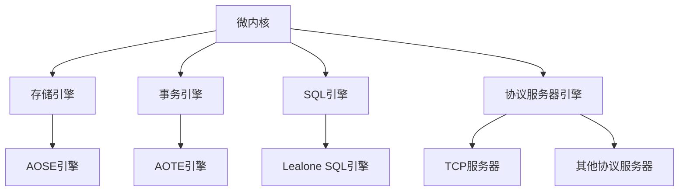
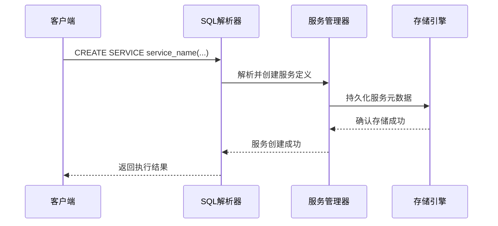
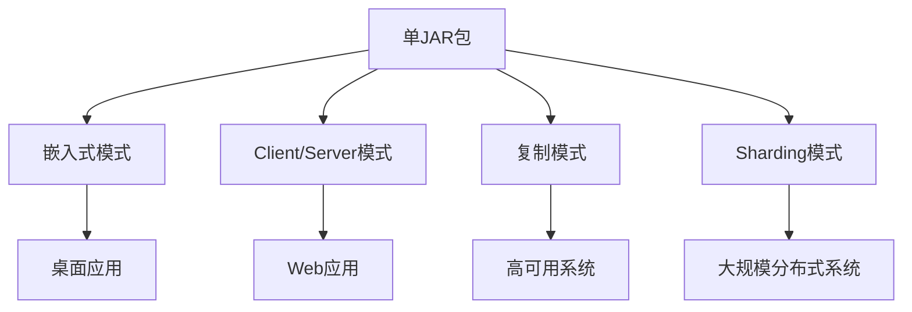

# 项目概述

<cite>
**本文档引用的文件**  
- [README.md](https://github.com/lealone/Lealone/blob/master/README.md)
- [Lealone.java](https://github.com/lealone/Lealone/blob/master/lealone-main/src/main/java/com/lealone/main/Lealone.java)
- [LealoneDatabase.java](https://github.com/lealone/Lealone/blob/master/lealone-db/src/main/java/com/lealone/db/LealoneDatabase.java)
- [PluggableEngine.java](https://github.com/lealone/Lealone/blob/master/lealone-sci/src/main/java/com/lealone/db/plugin/PluggableEngine.java)
- [SchedulerFactory.java](https://github.com/lealone/Lealone/blob/master/lealone-common/src/main/java/com/lealone/db/scheduler/SchedulerFactory.java)
- [RunMode.java](https://github.com/lealone/Lealone/blob/master/lealone-common/src/main/java/com/lealone/db/RunMode.java)
- [AOStorageEngine.java](https://github.com/lealone/Lealone/blob/master/lealone-aose/src/main/java/com/lealone/storage/aose/AOStorageEngine.java)
- [LealoneSQLEngine.java](https://github.com/lealone/Lealone/blob/master/lealone-sql/src/main/java/com/lealone/sql/LealoneSQLEngine.java)
- [TcpServerEngine.java](https://github.com/lealone/Lealone/blob/master/lealone-server/src/main/java/com/lealone/server/TcpServerEngine.java)
- [ProtocolServer.java](https://github.com/lealone/Lealone/blob/master/lealone-common/src/main/java/com/lealone/server/ProtocolServer.java)
- [SQLParserBase.java](https://github.com/lealone/Lealone/blob/master/lealone-sql/src/main/java/com/lealone/sql/SQLParserBase.java#L4195-L4541)
- [CreateService.java](https://github.com/lealone/Lealone/blob/master/lealone-sql/src/main/java/com/lealone/sql/ddl/CreateService.java)
- [DropService.java](https://github.com/lealone/Lealone/blob/master/lealone-sql/src/main/java/com/lealone/sql/ddl/DropService.java)
</cite>

## 目录
1. [简介](#简介)
2. [核心定位与特性](#核心定位与特性)
3. [微内核插件化架构](#微内核插件化架构)
4. [主要技术特性详解](#主要技术特性详解)
5. [轻量级部署与适用场景](#轻量级部署与适用场景)
6. [总结](#总结)

## 简介

Lealone数据库项目是一个创新的高性能数据库系统，旨在为现代应用提供统一的数据管理解决方案。该项目从H2数据库代码起步，经过多年演进，发展成为一个兼具关系型数据库和文档数据库特性的混合型数据库系统。Lealone的设计理念是“一个数据库，多种能力”，它不仅能够处理传统的OLTP（在线事务处理）工作负载，还兼容MongoDB的文档存储模型，同时高度兼容MySQL和PostgreSQL的协议与SQL语法。

本概述文档旨在为初学者提供Lealone项目的全景图，并为经验丰富的开发者揭示其技术创新点。通过分析项目的README文档和核心代码结构，我们将深入探讨Lealone的微内核插件化架构、全链路异步化处理、可暂停的渐进式SQL引擎等关键技术特性。文档还将介绍其轻量级部署模式和适用场景，帮助用户理解如何在实际项目中有效利用Lealone的强大功能。

**Section sources**
- [README.md](https://github.com/lealone/Lealone/blob/master/README.md)

## 核心定位与特性

Lealone数据库的核心定位是一个高性能的面向OLTP场景的关系数据库，同时也是一个兼容MongoDB的高性能文档数据库。这种双重定位使其能够适应多样化的应用场景，从传统的结构化数据管理到现代的半结构化数据处理。Lealone通过高度兼容MySQL和PostgreSQL的协议和SQL语法，降低了用户从现有数据库系统迁移的学习成本和技术障碍。

根据项目README文档，Lealone的主要特性可以分为高亮特性和普通特性两大类。高亮特性体现了Lealone的技术创新和性能优势，包括并发写性能极其出色、全链路异步化处理、可暂停的渐进式SQL引擎、基于SQL优先级的抢占式调度等。这些特性共同构成了Lealone高性能的基础。普通特性则涵盖了传统关系数据库的标准功能，如索引、视图、Join、子查询、触发器、自定义函数等，确保了Lealone在功能完整性方面的竞争力。

Lealone的另一个重要特点是其对多种数据库协议的兼容性。通过插件机制，Lealone支持兼容MongoDB、MySQL和PostgreSQL的插件，这使得它能够无缝集成到使用这些数据库的现有生态系统中。这种协议兼容性不仅体现在连接协议层面，还包括SQL语法的兼容，使得开发者可以使用熟悉的SQL语句与Lealone进行交互。

**Section sources**
- [README.md](https://github.com/lealone/Lealone/blob/master/README.md)

## 微内核插件化架构

Lealone采用微内核插件化架构设计，这是其灵活性和可扩展性的核心。微内核负责管理插件的生命周期和协调各组件之间的交互，而具体的功能实现则由独立的插件提供。这种架构设计使得Lealone能够轻松地扩展新功能，同时保持核心系统的稳定性和简洁性。

从代码结构可以看出，Lealone定义了四大核心引擎接口：存储引擎（StorageEngine）、事务引擎（TransactionEngine）、SQL引擎（SQLEngine）和协议服务器引擎（ProtocolServerEngine）。这些接口都继承自`PluggableEngine`接口，作为插件化架构的基础。在`Lealone.java`的启动流程中，系统会按照严格的顺序初始化这些引擎：存储 -> 事务 -> SQL -> 协议服务器。这种初始化顺序确保了系统组件之间的依赖关系得到正确处理。

**Diagram sources**
- [PluggableEngine.java](https://github.com/lealone/Lealone/blob/master/lealone-sci/src/main/java/com/lealone/db/plugin/PluggableEngine.java)
- [Lealone.java](https://github.com/lealone/Lealone/blob/master/lealone-main/src/main/java/com/lealone/main/Lealone.java#L254-L260)

微内核插件化架构的优势在于：
1. **模块化**：每个引擎都是独立的模块，可以独立开发、测试和部署。
2. **可替换性**：用户可以根据需求选择不同的引擎实现，例如使用不同的存储引擎来优化特定工作负载。
3. **易扩展性**：新的功能可以通过插件形式添加，无需修改核心代码。
4. **维护性**：核心系统保持简洁，复杂性被封装在插件中，降低了维护难度。

**Section sources**
- [PluggableEngine.java](https://github.com/lealone/Lealone/blob/master/lealone-sci/src/main/java/com/lealone/db/plugin/PluggableEngine.java)
- [Lealone.java](https://github.com/lealone/Lealone/blob/master/lealone-main/src/main/java/com/lealone/main/Lealone.java#L254-L260)

## 主要技术特性详解

### 全链路异步化处理

Lealone的全链路异步化处理是其高性能的关键。系统使用少量线程就能处理大量并发请求，这得益于其基于事件驱动的异步架构。在`Lealone.java`的启动流程中，系统会初始化一个全局调度器（GlobalScheduler），负责管理和调度所有的异步任务。这种设计避免了传统线程池模型中的线程上下文切换开销，显著提高了系统的并发处理能力。

全链路异步化体现在从网络I/O到磁盘I/O的整个数据处理链路上。网络层使用NIO（非阻塞I/O）技术处理客户端连接，避免了为每个连接创建独立线程的资源消耗。存储层的AOSE引擎采用异步化的B-Tree实现，确保磁盘I/O操作不会阻塞主线程。这种端到端的异步设计使得Lealone能够在高并发场景下保持稳定的性能表现。

### 可暂停的渐进式SQL引擎

Lealone的SQL引擎采用可暂停的渐进式执行模型，这是其区别于传统数据库的重要创新。传统的SQL引擎通常采用"全有或全无"的执行模式，即一旦开始执行一个查询，就必须持续占用资源直到完成。而Lealone的SQL引擎允许查询在执行过程中暂停，释放占用的CPU资源，从而避免慢查询长期霸占系统资源。

这种渐进式执行模型通过`Yieldable`系列类实现，如`YieldableBase`、`YieldableLocalQuery`等。当一个查询执行到一定阶段或检测到资源紧张时，它可以主动让出执行权，等待下一次调度。这种设计不仅提高了系统的资源利用率，还增强了系统的响应性，确保了关键查询能够及时获得执行机会。

### 基于优先级的抢占式调度

Lealone实现了基于SQL优先级的抢占式调度机制，进一步优化了资源分配策略。系统允许为不同的SQL语句设置优先级，高优先级的查询可以在资源紧张时抢占低优先级查询的执行权。这种抢占式调度与可暂停的SQL引擎相结合，形成了一个智能的资源管理框架。

调度器根据查询的优先级、执行时间和资源消耗等因素动态调整执行顺序，确保系统整体性能最优。例如，短小的OLTP事务可以被赋予高优先级，确保快速响应；而复杂的分析查询则被赋予较低优先级，在系统空闲时执行。这种精细化的调度策略使得Lealone能够同时满足不同类型的业务需求。

### 行列混合存储

Lealone支持Page级别的行列混合存储，这是其在存储效率方面的创新。对于包含大量字段的宽表，传统的行存储模式在只读取少量字段时会造成大量的内存浪费。Lealone的混合存储模式允许在Page级别选择最优的存储格式，当查询只涉及部分列时，系统可以只加载相关的列数据，大幅节约内存资源。

这种存储模式在`lealone-aose`模块的`page`包中有详细实现，如`ColumnPage`、`RowPage`等类。系统根据查询模式和数据特征自动选择最优的存储策略，无需用户手动干预。这种智能化的存储管理既提高了查询性能，又降低了内存消耗。

### 托管后端服务创建

Lealone支持通过`CREATE SERVICE`语句创建可托管的后端服务，这是其在应用集成方面的独特功能。开发者可以使用SQL语句定义和部署后端服务，这些服务由数据库系统托管和管理。从`SQLParserBase.java`的代码可以看出，`CREATE SERVICE`语法被明确支持，并有专门的`CreateService`类处理该语句。

**Diagram sources**
- [SQLParserBase.java](https://github.com/lealone/Lealone/blob/master/lealone-sql/src/main/java/com/lealone/sql/SQLParserBase.java#L4195-L4541)
- [CreateService.java](https://github.com/lealone/Lealone/blob/master/lealone-sql/src/main/java/com/lealone/sql/ddl/CreateService.java)

这种服务创建机制使得Lealone不仅仅是一个数据存储系统，更成为一个应用运行平台。开发者可以将业务逻辑直接部署在数据库中，减少应用层与数据库层之间的网络开销，提高整体系统性能。

**Section sources**
- [Lealone.java](https://github.com/lealone/Lealone/blob/master/lealone-main/src/main/java/com/lealone/main/Lealone.java#L163-L165)
- [SQLParserBase.java](https://github.com/lealone/Lealone/blob/master/lealone-sql/src/main/java/com/lealone/sql/SQLParserBase.java#L4195-L4541)
- [CreateService.java](https://github.com/lealone/Lealone/blob/master/lealone-sql/src/main/java/com/lealone/sql/ddl/CreateService.java)
- [DropService.java](https://github.com/lealone/Lealone/blob/master/lealone-sql/src/main/java/com/lealone/sql/ddl/DropService.java)

## 轻量级部署与适用场景

Lealone数据库的一个显著特点是其轻量级部署模式。项目只需要一个不到2MB的JAR包就能运行，无需复杂的安装过程。这种设计使得Lealone非常适合嵌入式应用和轻量级服务。从`Lealone.java`的`embed()`方法可以看出，系统提供了专门的嵌入式运行模式，允许将数据库直接集成到应用程序中。

**Diagram sources**
- [Lealone.java](https://github.com/lealone/Lealone/blob/master/lealone-main/src/main/java/com/lealone/main/Lealone.java#L67-L69)
- [RunMode.java](https://github.com/lealone/Lealone/blob/master/lealone-common/src/main/java/com/lealone/db/RunMode.java)

Lealone的适用场景主要包括：
1. **高并发写入场景**：得益于全链路异步化和高性能存储引擎，Lealone在高并发写入场景下表现出色。
2. **轻量级应用**：单JAR包的轻量级设计使其成为小型应用和微服务的理想选择。
3. **协议兼容迁移项目**：对MySQL和PostgreSQL的高度兼容性，使得现有应用可以平滑迁移到Lealone。
4. **混合工作负载系统**：同时支持关系型和文档型数据模型，适合处理多样化的工作负载。

**Section sources**
- [README.md](https://github.com/lealone/Lealone/blob/master/README.md)
- [Lealone.java](https://github.com/lealone/Lealone/blob/master/lealone-main/src/main/java/com/lealone/main/Lealone.java#L67-L69)
- [RunMode.java](https://github.com/lealone/Lealone/blob/master/lealone-common/src/main/java/com/lealone/db/RunMode.java)

## 总结

Lealone数据库项目通过创新的微内核插件化架构和一系列先进的技术特性，为现代应用提供了一个高性能、高兼容性的数据管理解决方案。其核心优势在于将关系型数据库的严谨性与文档数据库的灵活性相结合，同时通过全链路异步化、可暂停的SQL引擎和基于优先级的调度机制，实现了卓越的性能表现。

对于初学者而言，Lealone提供了一个清晰的学习路径：从轻量级的嵌入式部署开始，逐步探索其丰富的功能特性。对于经验丰富的开发者，Lealone的插件化架构和可扩展性提供了深入定制和优化的可能性。无论是高并发的OLTP系统，还是需要协议兼容的迁移项目，Lealone都展现出了强大的适应能力和技术优势。

随着项目不断发展，Lealone有望成为数据库领域的重要参与者，为开发者提供一个更加灵活、高效的数据管理平台。

**Section sources**
- [README.md](https://github.com/lealone/Lealone/blob/master/README.md)