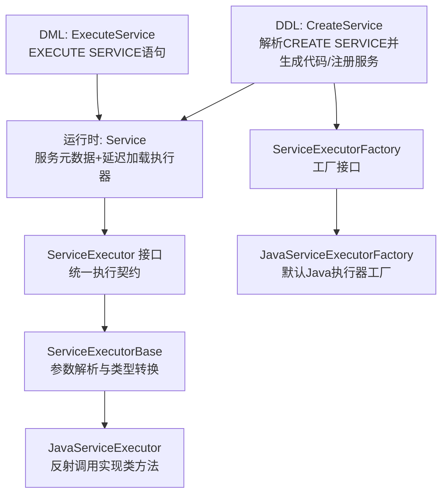
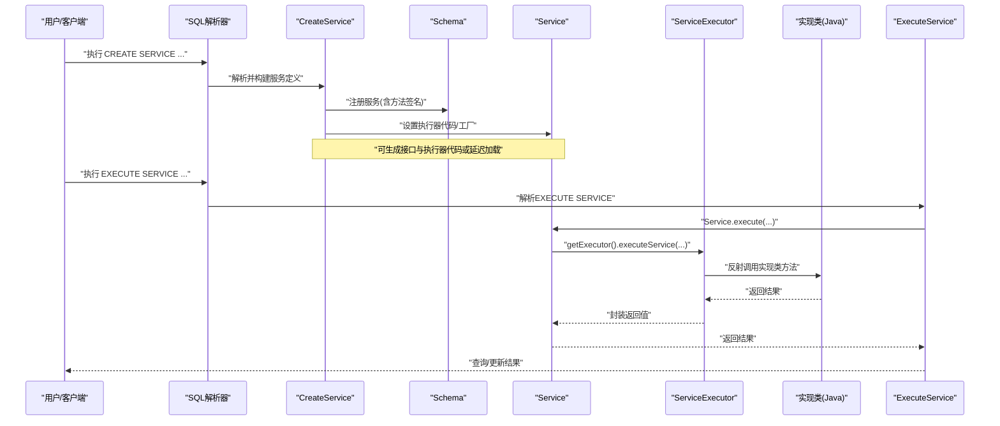
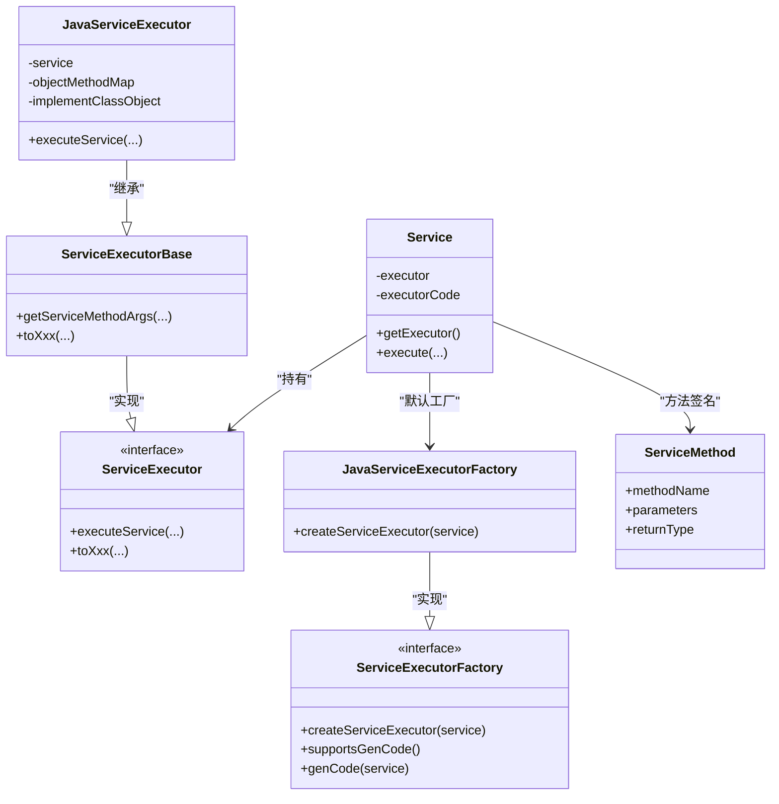

# 可托管服务

<cite>
**本文引用的文件列表**
- [CreateService.java](file://lealone-sql/src/main/java/com/lealone/sql/ddl/CreateService.java)
- [ExecuteService.java](file://lealone-sql/src/main/java/com/lealone/sql/dml/ExecuteService.java)
- [Service.java](file://lealone-db/src/main/java/com/lealone/db/service/Service.java)
- [ServiceExecutor.java](file://lealone-db/src/main/java/com/lealone/db/service/ServiceExecutor.java)
- [ServiceExecutorBase.java](file://lealone-db/src/main/java/com/lealone/db/service/ServiceExecutorBase.java)
- [JavaServiceExecutor.java](file://lealone-db/src/main/java/com/lealone/db/service/JavaServiceExecutor.java)
- [JavaServiceExecutorFactory.java](file://lealone-db/src/main/java/com/lealone/db/service/JavaServiceExecutorFactory.java)
- [ServiceExecutorFactory.java](file://lealone-db/src/main/java/com/lealone/db/service/ServiceExecutorFactory.java)
- [ServiceExecutorFactoryBase.java](file://lealone-db/src/main/java/com/lealone/db/service/ServiceExecutorFactoryBase.java)
- [ServiceMethod.java](file://lealone-db/src/main/java/com/lealone/db/service/ServiceMethod.java)
- [ServiceSetting.java](file://lealone-db/src/main/java/com/lealone/db/service/ServiceSetting.java)
- [ServiceTest.java](file://lealone-test/src/test/java/com/lealone/test/sql/service/ServiceTest.java)
</cite>

## 目录
1. [简介](#简介)
2. [项目结构与入口](#项目结构与入口)
3. [核心组件](#核心组件)
4. [架构总览](#架构总览)
5. [详细组件解析](#详细组件解析)
6. [依赖关系分析](#依赖关系分析)
7. [性能与资源管理](#性能与资源管理)
8. [故障排查指南](#故障排查指南)
9. [结论](#结论)
10. [附录：使用示例与最佳实践](#附录使用示例与最佳实践)

## 简介
本文件系统性阐述 Lealone 的“可托管服务”能力，围绕 CREATE SERVICE SQL 语句的创建流程、Service 接口与生命周期、ServiceExecutor 执行机制展开，提供 Java 服务实现的完整示例路径、隔离与权限控制、资源与错误处理策略，并讨论其在数据库内直接执行业务逻辑、降低网络往返、适配微服务架构的应用场景。

## 项目结构与入口
- DDL 层负责解析与生成服务定义及辅助代码：
  - CreateService：解析 CREATE SERVICE 语法，构建 Service 对象，注册到 Schema，按需生成接口与执行器代码或委托工厂生成执行器。
- DML 层负责服务调用：
  - ExecuteService：封装 EXECUTE SERVICE 语句，将参数转换为 Value[] 并调用 Service.execute。
- 运行时层负责服务对象与执行器：
  - Service：服务元数据与延迟加载执行器；提供多协议执行入口（Value[]、Map、JSON）。
  - ServiceExecutor 接口与 ServiceExecutorBase 抽象基类：统一参数解析与类型转换。
  - JavaServiceExecutor：基于反射调用实现类方法，支持 Value[]、Map、JSON 三种调用形式。
  - 工厂体系：ServiceExecutorFactory/FactoryBase/JavaServiceExecutorFactory，支持扩展其他语言执行器。

图表来源
- [CreateService.java](file://lealone-sql/src/main/java/com/lealone/sql/ddl/CreateService.java#L114-L202)
- [ExecuteService.java](file://lealone-sql/src/main/java/com/lealone/sql/dml/ExecuteService.java#L59-L78)
- [Service.java](file://lealone-db/src/main/java/com/lealone/db/service/Service.java#L91-L116)
- [ServiceExecutor.java](file://lealone-db/src/main/java/com/lealone/db/service/ServiceExecutor.java#L25-L40)
- [ServiceExecutorBase.java](file://lealone-db/src/main/java/com/lealone/db/service/ServiceExecutorBase.java#L19-L204)
- [JavaServiceExecutor.java](file://lealone-db/src/main/java/com/lealone/db/service/JavaServiceExecutor.java#L23-L135)
- [ServiceExecutorFactory.java](file://lealone-db/src/main/java/com/lealone/db/service/ServiceExecutorFactory.java#L8-L20)
- [JavaServiceExecutorFactory.java](file://lealone-db/src/main/java/com/lealone/db/service/JavaServiceExecutorFactory.java#L8-L18)

章节来源
- [CreateService.java](file://lealone-sql/src/main/java/com/lealone/sql/ddl/CreateService.java#L114-L202)
- [ExecuteService.java](file://lealone-sql/src/main/java/com/lealone/sql/dml/ExecuteService.java#L59-L78)
- [Service.java](file://lealone-db/src/main/java/com/lealone/db/service/Service.java#L91-L116)

## 核心组件
- Service：服务元数据与执行器持有者，支持延迟加载执行器实例，提供多种执行入口。
- ServiceExecutor：执行器接口，定义 Value[]、Map、JSON 三类执行方法与常用类型转换工具。
- ServiceExecutorBase：抽象基类，统一将 Value/Map/JSON 参数映射为实现类方法所需对象数组。
- JavaServiceExecutor：默认 Java 执行器，基于反射查找实现类方法并调用，支持三种调用形式。
- CreateService：解析 CREATE SERVICE 语法，构建 Service，必要时生成接口与执行器代码，或通过工厂生成执行器。
- ExecuteService：解析 EXECUTE SERVICE 语句，将表达式参数转为 Value[] 并调用 Service.execute。

章节来源
- [Service.java](file://lealone-db/src/main/java/com/lealone/db/service/Service.java#L25-L116)
- [ServiceExecutor.java](file://lealone-db/src/main/java/com/lealone/db/service/ServiceExecutor.java#L25-L180)
- [ServiceExecutorBase.java](file://lealone-db/src/main/java/com/lealone/db/service/ServiceExecutorBase.java#L19-L204)
- [JavaServiceExecutor.java](file://lealone-db/src/main/java/com/lealone/db/service/JavaServiceExecutor.java#L23-L135)
- [CreateService.java](file://lealone-sql/src/main/java/com/lealone/sql/ddl/CreateService.java#L114-L202)
- [ExecuteService.java](file://lealone-sql/src/main/java/com/lealone/sql/dml/ExecuteService.java#L59-L78)

## 架构总览
下图展示从 SQL 到执行器调用的端到端流程，包括创建与调用两条主线。

图表来源
- [CreateService.java](file://lealone-sql/src/main/java/com/lealone/sql/ddl/CreateService.java#L114-L202)
- [Service.java](file://lealone-db/src/main/java/com/lealone/db/service/Service.java#L91-L116)
- [ServiceExecutor.java](file://lealone-db/src/main/java/com/lealone/db/service/ServiceExecutor.java#L25-L40)
- [ServiceExecutorBase.java](file://lealone-db/src/main/java/com/lealone/db/service/ServiceExecutorBase.java#L19-L204)
- [JavaServiceExecutor.java](file://lealone-db/src/main/java/com/lealone/db/service/JavaServiceExecutor.java#L91-L135)
- [ExecuteService.java](file://lealone-sql/src/main/java/com/lealone/sql/dml/ExecuteService.java#L59-L78)

## 详细组件解析

### CreateService：CREATE SERVICE 语义与代码生成
- 解析与校验：检查管理员权限、服务是否已存在、构建 Service 对象。
- 方法签名提取：从每个方法定义的最后一列推断返回类型，其余列为参数。
- 语言与包名：支持 LANGUAGE、PACKAGE、IMPLEMENT BY、GENERATE CODE、CODE PATH、PARAMETERS 等子句。
- 启动期与非启动期差异：数据库启动阶段不自动生成代码；非启动期若实现类不存在则生成实现类骨架。
- 代码生成：
  - 生成服务接口与代理类（用于客户端直连嵌入模式）。
  - 生成执行器类（包含 Value[]、Map、JSON 三种 executeService 方法），内部通过 switch 分派到具体方法。
- 执行器选择：优先使用工厂生成的执行器；若未生成代码，则延迟创建 JavaServiceExecutor。

章节来源
- [CreateService.java](file://lealone-sql/src/main/java/com/lealone/sql/ddl/CreateService.java#L114-L202)
- [CreateService.java](file://lealone-sql/src/main/java/com/lealone/sql/ddl/CreateService.java#L254-L448)
- [CreateService.java](file://lealone-sql/src/main/java/com/lealone/sql/ddl/CreateService.java#L459-L533)
- [CreateService.java](file://lealone-sql/src/main/java/com/lealone/sql/ddl/CreateService.java#L711-L800)

### Service：服务元数据与执行入口
- 元数据：language、packageName、implementBy、serviceMethods、sql。
- 延迟加载执行器：首次调用 getExecutor() 时，若已有 executorCode 则编译生成实例，否则通过类名反射实例化。
- 多协议执行入口：
  - Value[]：面向 JDBC/内部调用。
  - Map<String,Object>：面向 HTTP/REST 场景。
  - JSON：面向无类型调用。
- 权限控制：执行前检查用户对服务的 EXECUTE 权限。

章节来源
- [Service.java](file://lealone-db/src/main/java/com/lealone/db/service/Service.java#L25-L116)
- [Service.java](file://lealone-db/src/main/java/com/lealone/db/service/Service.java#L118-L182)

### ServiceExecutor 接口与 ServiceExecutorBase
- 接口职责：定义三种 executeService 签名，默认返回占位符；提供常用类型转换工具（字符串、数值、日期时间、二进制、集合等）。
- 抽象基类职责：将 Value[]、Map、JSON 参数统一转换为实现类方法所需的对象数组；维护 ServiceMethod 映射以支持强类型约束。

章节来源
- [ServiceExecutor.java](file://lealone-db/src/main/java/com/lealone/db/service/ServiceExecutor.java#L25-L180)
- [ServiceExecutorBase.java](file://lealone-db/src/main/java/com/lealone/db/service/ServiceExecutorBase.java#L19-L204)

### JavaServiceExecutor：反射执行机制
- 初始化策略：首次调用时通过 Class.forName + newInstance 创建实现类实例；若未定义方法签名则扫描公共实例方法并建立方法映射。
- 调用流程：根据 methodName 查找实现类方法，将参数转换为对象数组后反射调用；返回值统一包装为字符串或空值。
- 错误处理：捕获反射异常并转换为数据库异常。

章节来源
- [JavaServiceExecutor.java](file://lealone-db/src/main/java/com/lealone/db/service/JavaServiceExecutor.java#L23-L135)

### 工厂体系：ServiceExecutorFactory 与 JavaServiceExecutorFactory
- ServiceExecutorFactory：插件接口，定义 createServiceExecutor 与可选的代码生成能力。
- ServiceExecutorFactoryBase：插件基类，指定插件类类型。
- JavaServiceExecutorFactory：默认工厂，返回 JavaServiceExecutor 实例。

章节来源
- [ServiceExecutorFactory.java](file://lealone-db/src/main/java/com/lealone/db/service/ServiceExecutorFactory.java#L8-L20)
- [ServiceExecutorFactoryBase.java](file://lealone-db/src/main/java/com/lealone/db/service/ServiceExecutorFactoryBase.java#L1-L22)
- [JavaServiceExecutorFactory.java](file://lealone-db/src/main/java/com/lealone/db/service/JavaServiceExecutorFactory.java#L8-L18)

### ExecuteService：EXECUTE SERVICE 语义
- 将表达式参数收集为 Value[]，调用 Service.execute。
- 支持查询与更新两种模式，查询时返回单行结果。

章节来源
- [ExecuteService.java](file://lealone-sql/src/main/java/com/lealone/sql/dml/ExecuteService.java#L59-L78)

### ServiceMethod 与 ServiceSetting
- ServiceMethod：封装方法名、参数列表与返回类型。
- ServiceSetting：服务参数键（如 CREATE_METHOD_NAME、GENERATE_MAP_EXECUTOR_METHOD、GENERATE_JSON_EXECUTOR_METHOD）。

章节来源
- [ServiceMethod.java](file://lealone-db/src/main/java/com/lealone/db/service/ServiceMethod.java#L1-L43)
- [ServiceSetting.java](file://lealone-db/src/main/java/com/lealone/db/service/ServiceSetting.java#L8-L15)

## 依赖关系分析

图表来源
- [Service.java](file://lealone-db/src/main/java/com/lealone/db/service/Service.java#L25-L116)
- [ServiceExecutor.java](file://lealone-db/src/main/java/com/lealone/db/service/ServiceExecutor.java#L25-L180)
- [ServiceExecutorBase.java](file://lealone-db/src/main/java/com/lealone/db/service/ServiceExecutorBase.java#L19-L204)
- [JavaServiceExecutor.java](file://lealone-db/src/main/java/com/lealone/db/service/JavaServiceExecutor.java#L23-L135)
- [ServiceExecutorFactory.java](file://lealone-db/src/main/java/com/lealone/db/service/ServiceExecutorFactory.java#L8-L20)
- [JavaServiceExecutorFactory.java](file://lealone-db/src/main/java/com/lealone/db/service/JavaServiceExecutorFactory.java#L8-L18)
- [ServiceMethod.java](file://lealone-db/src/main/java/com/lealone/db/service/ServiceMethod.java#L1-L43)

## 性能与资源管理
- 延迟初始化：Service.getExecutor() 在首次调用时才创建执行器实例，避免启动时不必要的反射与类加载开销。
- 反射缓存：JavaServiceExecutor 在初始化阶段缓存实现类方法映射，后续调用避免重复反射查找。
- 参数解析优化：ServiceExecutorBase 统一参数解析，减少重复类型判断与转换成本。
- 代码生成：CreateService 在非启动阶段可生成执行器代码，避免运行时反射带来的额外开销；同时支持禁用某些执行器方法以减少生成体积。
- 动态编译：当存在 executorCode 时，通过 SourceCompiler 编译生成执行器实例，提升性能并避免类加载问题。

章节来源
- [Service.java](file://lealone-db/src/main/java/com/lealone/db/service/Service.java#L91-L116)
- [JavaServiceExecutor.java](file://lealone-db/src/main/java/com/lealone/db/service/JavaServiceExecutor.java#L33-L89)
- [CreateService.java](file://lealone-sql/src/main/java/com/lealone/sql/ddl/CreateService.java#L180-L200)

## 故障排查指南
- 权限不足：执行服务需要 EXECUTE 权限，否则抛出权限错误。可通过 GRANT/REVOKE 管理。
- 方法不存在：JavaServiceExecutor 在初始化时会尝试定位实现类方法，找不到会抛出异常。
- 类加载失败：实现类名不正确或类路径缺失会导致类加载异常。
- 参数类型不匹配：ServiceExecutorBase 依据列定义进行类型转换，若传入类型与定义不符可能导致转换失败。
- 生成代码问题：若启用生成但路径不可写或命名冲突，生成过程会失败。

章节来源
- [ServiceTest.java](file://lealone-test/src/test/java/com/lealone/test/sql/service/ServiceTest.java#L19-L59)
- [Service.java](file://lealone-db/src/main/java/com/lealone/db/service/Service.java#L130-L182)
- [JavaServiceExecutor.java](file://lealone-db/src/main/java/com/lealone/db/service/JavaServiceExecutor.java#L33-L89)

## 结论
Lealone 的可托管服务通过“DDL 定义 + 运行时执行器”的解耦设计，实现了在数据库内直接执行业务逻辑的能力。它既支持强类型约束（通过方法签名与参数解析），也支持灵活调用（Value[]、Map、JSON）。配合延迟初始化、反射缓存与代码生成，可在保证易用性的同时兼顾性能。该特性特别适合需要减少网络往返、在数据库边界内完成复杂业务处理的场景，也可作为微服务架构中的“内核服务”模块，降低跨进程通信成本。

## 附录：使用示例与最佳实践

### 使用步骤（基于 CreateService 与 Service）
- 定义服务：使用 CREATE SERVICE 语句声明服务名、方法签名、语言、包名、实现类、参数等。
- 生成代码（可选）：若启用生成，DDL 会在指定路径生成服务接口与执行器类；否则运行时通过反射调用实现类。
- 部署与授权：将实现类部署到运行时类路径；授予用户 EXECUTE 权限。
- 调用方式：
  - JDBC/内部：通过 Value[] 形式调用。
  - HTTP/REST：通过 Map<String,Object> 或 JSON 形式调用。
- 生命周期管理：Service.getExecutor() 延迟创建执行器实例；首次调用时完成初始化与缓存。

章节来源
- [CreateService.java](file://lealone-sql/src/main/java/com/lealone/sql/ddl/CreateService.java#L114-L202)
- [Service.java](file://lealone-db/src/main/java/com/lealone/db/service/Service.java#L91-L116)
- [ExecuteService.java](file://lealone-sql/src/main/java/com/lealone/sql/dml/ExecuteService.java#L59-L78)

### Java 服务实现示例（路径参考）
- 服务接口与执行器代码生成位置（非启动阶段）：
  - 接口与代理类生成：[genServiceInterfaceCode](file://lealone-sql/src/main/java/com/lealone/sql/ddl/CreateService.java#L254-L448)
  - 实现类骨架生成：[genServiceImplementClassCode](file://lealone-sql/src/main/java/com/lealone/sql/ddl/CreateService.java#L459-L533)
  - 执行器类生成（Value[]/Map/JSON）：[genServiceExecutorCode](file://lealone-sql/src/main/java/com/lealone/sql/ddl/CreateService.java#L711-L800)
- 运行时反射调用实现类：
  - 初始化与方法映射：[init](file://lealone-db/src/main/java/com/lealone/db/service/JavaServiceExecutor.java#L33-L89)
  - Value[] 调用：[executeService(String, Value[])](file://lealone-db/src/main/java/com/lealone/db/service/JavaServiceExecutor.java#L91-L104)
  - Map 调用：[executeService(String, Map)](file://lealone-db/src/main/java/com/lealone/db/service/JavaServiceExecutor.java#L106-L119)
  - JSON 调用：[executeService(String, String)](file://lealone-db/src/main/java/com/lealone/db/service/JavaServiceExecutor.java#L121-L134)

### 隔离与权限控制
- 用户权限：执行服务前检查 EXECUTE 权限，未授权用户抛出权限错误。
- 数据库隔离：支持跨数据库访问，服务名可包含数据库名、模式名与服务名三段式标识。

章节来源
- [Service.java](file://lealone-db/src/main/java/com/lealone/db/service/Service.java#L130-L182)
- [ServiceTest.java](file://lealone-test/src/test/java/com/lealone/test/sql/service/ServiceTest.java#L19-L59)

### 错误处理策略
- 反射异常：统一转换为数据库异常，便于上层捕获与处理。
- 参数转换异常：依据列定义进行严格类型转换，避免隐式类型损失。
- 方法不存在：抛出明确的“无此方法”异常，提示调用方修正方法名。

章节来源
- [JavaServiceExecutor.java](file://lealone-db/src/main/java/com/lealone/db/service/JavaServiceExecutor.java#L91-L135)
- [ServiceExecutorBase.java](file://lealone-db/src/main/java/com/lealone/db/service/ServiceExecutorBase.java#L19-L204)

### 微服务架构中的应用建议
- 将高频、低延迟的业务逻辑下沉至数据库内执行，减少跨进程调用。
- 通过服务接口与执行器代码生成，快速暴露业务能力给前端或其他服务。
- 使用参数化方法签名与强类型转换，确保调用一致性与可维护性。
- 在 Spring Boot 集成场景中，可通过禁用动态编译参数，采用预编译执行器以规避类加载限制。

章节来源
- [CreateService.java](file://lealone-sql/src/main/java/com/lealone/sql/ddl/CreateService.java#L180-L200)
- [Service.java](file://lealone-db/src/main/java/com/lealone/db/service/Service.java#L96-L116)