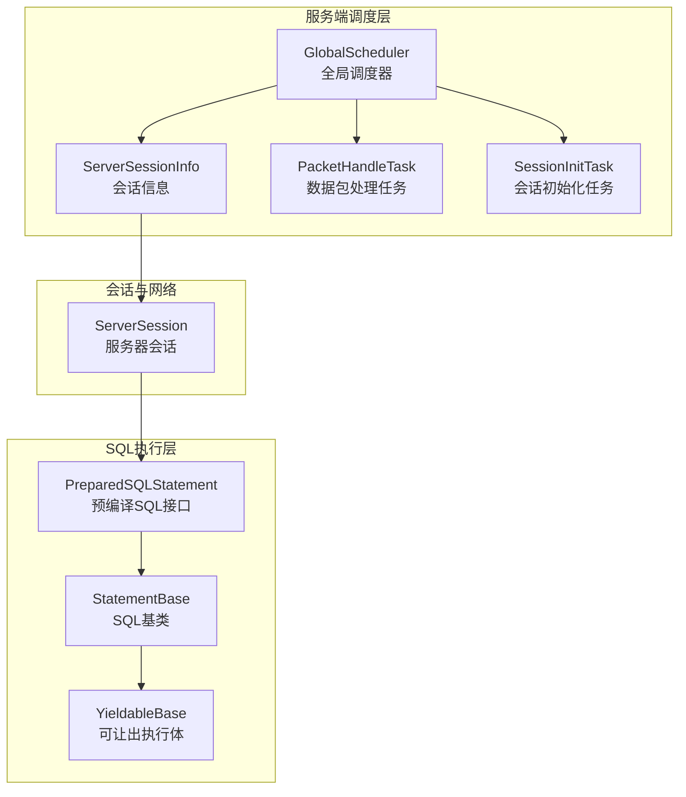
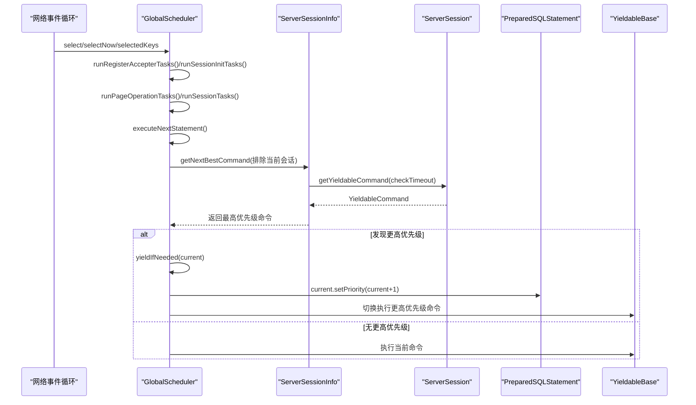
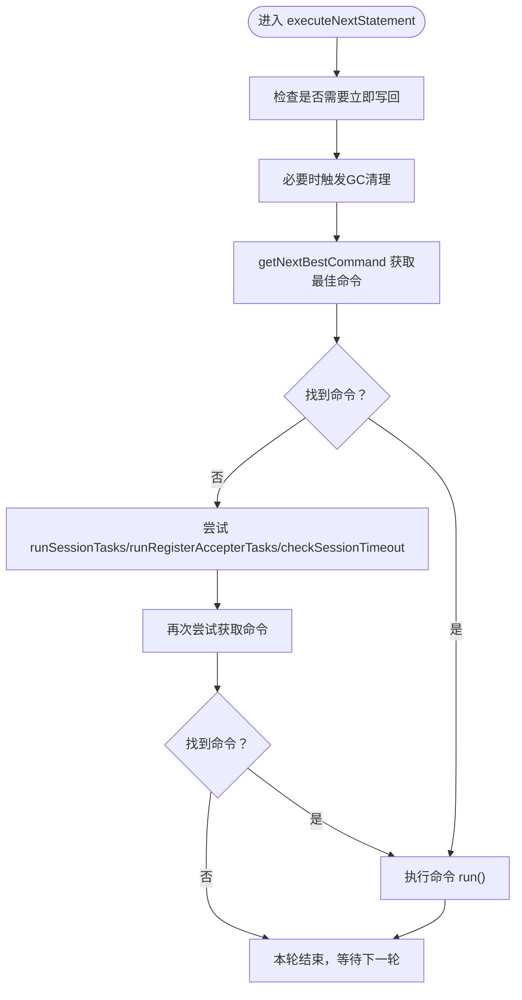
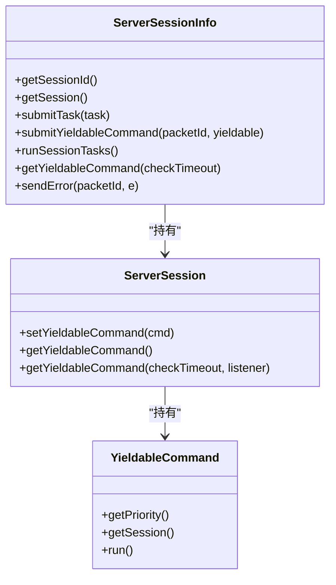
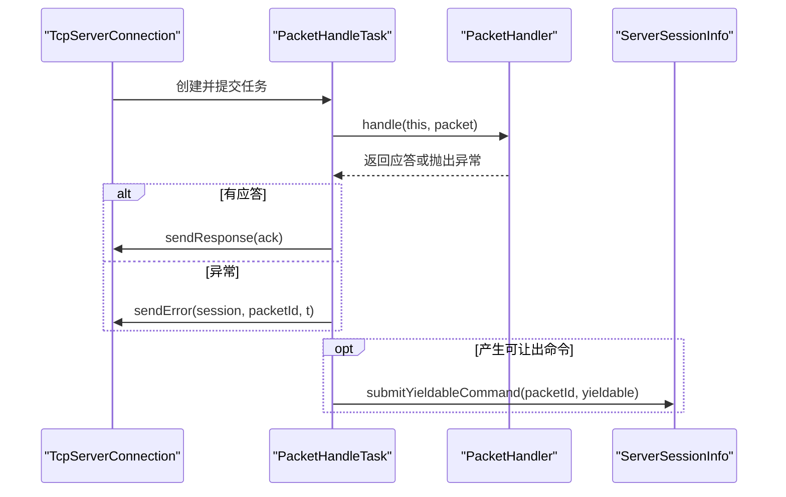
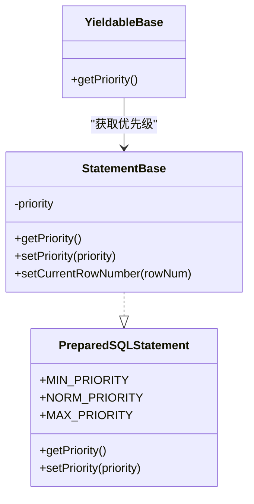
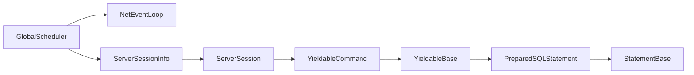
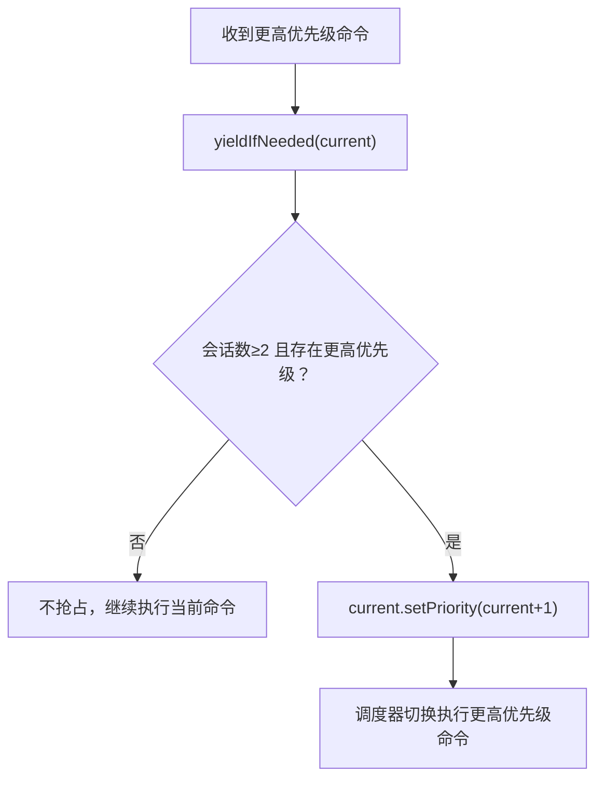

# 抢占式调度

**本文引用的文件列表**
- [GlobalScheduler.java](https://github.com/lealone/Lealone/blob/master/lealone-server/src/main/java/com/lealone/server/scheduler/GlobalScheduler.java)
- [PacketHandleTask.java](https://github.com/lealone/Lealone/blob/master/lealone-server/src/main/java/com/lealone/server/scheduler/PacketHandleTask.java)
- [SessionInitTask.java](https://github.com/lealone/Lealone/blob/master/lealone-server/src/main/java/com/lealone/server/scheduler/SessionInitTask.java)
- [ServerSessionInfo.java](https://github.com/lealone/Lealone/blob/master/lealone-server/src/main/java/com/lealone/server/scheduler/ServerSessionInfo.java)
- [PreparedSQLStatement.java](https://github.com/lealone/Lealone/blob/master/lealone-sci/src/main/java/com/lealone/sql/PreparedSQLStatement.java)
- [StatementBase.java](https://github.com/lealone/Lealone/blob/master/lealone-sql/src/main/java/com/lealone/sql/StatementBase.java)
- [YieldableBase.java](https://github.com/lealone/Lealone/blob/master/lealone-sql/src/main/java/com/lealone/sql/executor/YieldableBase.java)
- [ServerSession.java](https://github.com/lealone/Lealone/blob/master/lealone-db/src/main/java/com/lealone/db/session/ServerSession.java)
- [StatementPriorityTest.java](https://github.com/lealone/Lealone/blob/master/lealone-test/src/test/java/com/lealone/test/sql/priority/StatementPriorityTest.java)

## 目录
1. [简介](#简介)
2. [项目结构与定位](#项目结构与定位)
3. [核心组件](#核心组件)
4. [架构总览](#架构总览)
5. [详细组件分析](#详细组件分析)
6. [依赖关系分析](#依赖关系分析)
7. [性能考量与权衡](#性能考量与权衡)
8. [故障排查指南](#故障排查指南)
9. [结论](#结论)
10. [附录：配置与实践](#附录配置与实践)

## 简介
本文件围绕 Lealone 的抢占式调度系统展开，重点剖析 GlobalScheduler 的实现，解释其如何依据 SQL 语句优先级进行任务调度；详细说明 PacketHandleTask 与 SessionInitTask 在调度队列中的处理机制；阐述高优先级请求如何抢占低优先级任务的执行资源；给出配置示例以设置不同 SQL 的优先级；讨论该策略在实时性要求高的场景中的价值及潜在性能权衡；并提供性能测试思路与数据采集建议（以仓库现有测试为参考）。

## 项目结构与定位
- 调度器位于服务端模块，负责网络事件循环、会话管理、页面操作、SQL 命令调度等。
- SQL 层提供可抢占的 Yieldable 模型与优先级接口，驱动调度器的抢占逻辑。
- 测试模块包含优先级相关的示例，可用于验证调度效果。

图表来源
- [GlobalScheduler.java](https://github.com/lealone/Lealone/blob/master/lealone-server/src/main/java/com/lealone/server/scheduler/GlobalScheduler.java#L1-L120)
- [ServerSessionInfo.java](https://github.com/lealone/Lealone/blob/master/lealone-server/src/main/java/com/lealone/server/scheduler/ServerSessionInfo.java#L1-L120)
- [PacketHandleTask.java](https://github.com/lealone/Lealone/blob/master/lealone-server/src/main/java/com/lealone/server/scheduler/PacketHandleTask.java#L1-L78)
- [SessionInitTask.java](https://github.com/lealone/Lealone/blob/master/lealone-server/src/main/java/com/lealone/server/scheduler/SessionInitTask.java#L1-L35)
- [PreparedSQLStatement.java](https://github.com/lealone/Lealone/blob/master/lealone-sci/src/main/java/com/lealone/sql/PreparedSQLStatement.java#L1-L136)
- [StatementBase.java](https://github.com/lealone/Lealone/blob/master/lealone-sql/src/main/java/com/lealone/sql/StatementBase.java#L1-L120)
- [YieldableBase.java](https://github.com/lealone/Lealone/blob/master/lealone-sql/src/main/java/com/lealone/sql/executor/YieldableBase.java#L75-L123)
- [ServerSession.java](https://github.com/lealone/Lealone/blob/master/lealone-db/src/main/java/com/lealone/db/session/ServerSession.java#L1331-L1377)

章节来源
- [GlobalScheduler.java](https://github.com/lealone/Lealone/blob/master/lealone-server/src/main/java/com/lealone/server/scheduler/GlobalScheduler.java#L1-L120)
- [PreparedSQLStatement.java](https://github.com/lealone/Lealone/blob/master/lealone-sci/src/main/java/com/lealone/sql/PreparedSQLStatement.java#L1-L136)

## 核心组件
- 全局调度器 GlobalScheduler：负责运行注册接收器任务、会话初始化、杂项任务、页面操作、会话任务、事务、内存回收、网络事件循环、SQL 命令调度与抢占。
- 会话信息 ServerSessionInfo：封装单个会话的可让出命令队列、任务队列、超时检测与错误上报。
- 数据包处理任务 PacketHandleTask：将网络数据包转换为 SQL 命令并提交到会话的可让出命令队列。
- 会话初始化任务 SessionInitTask：负责首个连接的会话建立与初始化。
- SQL 接口 PreparedSQLStatement：定义优先级常量与 YieldableCommand 包装器。
- SQL 基类 StatementBase：提供优先级设置、行扫描进度与让出触发点。
- 可让出执行体 YieldableBase：实现优先级透传、异常处理与执行循环。
- 服务器会话 ServerSession：持有当前可让出命令，提供超时监听回调。

章节来源
- [GlobalScheduler.java](https://github.com/lealone/Lealone/blob/master/lealone-server/src/main/java/com/lealone/server/scheduler/GlobalScheduler.java#L120-L271)
- [ServerSessionInfo.java](https://github.com/lealone/Lealone/blob/master/lealone-server/src/main/java/com/lealone/server/scheduler/ServerSessionInfo.java#L1-L181)
- [PacketHandleTask.java](https://github.com/lealone/Lealone/blob/master/lealone-server/src/main/java/com/lealone/server/scheduler/PacketHandleTask.java#L1-L78)
- [SessionInitTask.java](https://github.com/lealone/Lealone/blob/master/lealone-server/src/main/java/com/lealone/server/scheduler/SessionInitTask.java#L1-L35)
- [PreparedSQLStatement.java](https://github.com/lealone/Lealone/blob/master/lealone-sci/src/main/java/com/lealone/sql/PreparedSQLStatement.java#L1-L136)
- [StatementBase.java](https://github.com/lealone/Lealone/blob/master/lealone-sql/src/main/java/com/lealone/sql/StatementBase.java#L120-L200)
- [YieldableBase.java](https://github.com/lealone/Lealone/blob/master/lealone-sql/src/main/java/com/lealone/sql/executor/YieldableBase.java#L75-L123)
- [ServerSession.java](https://github.com/lealone/Lealone/blob/master/lealone-db/src/main/java/com/lealone/db/session/ServerSession.java#L1331-L1377)

## 架构总览
抢占式调度的关键在于“可让出”的执行体与“优先级比较”。调度器在每次执行命令前后都会扫描所有活跃会话，寻找更高优先级的可让出命令，一旦发现则抢占当前执行命令的线程资源。

图表来源
- [GlobalScheduler.java](https://github.com/lealone/Lealone/blob/master/lealone-server/src/main/java/com/lealone/server/scheduler/GlobalScheduler.java#L218-L336)
- [ServerSessionInfo.java](https://github.com/lealone/Lealone/blob/master/lealone-server/src/main/java/com/lealone/server/scheduler/ServerSessionInfo.java#L120-L181)
- [ServerSession.java](https://github.com/lealone/Lealone/blob/master/lealone-db/src/main/java/com/lealone/db/session/ServerSession.java#L1360-L1377)
- [YieldableBase.java](https://github.com/lealone/Lealone/blob/master/lealone-sql/src/main/java/com/lealone/sql/executor/YieldableBase.java#L75-L123)

## 详细组件分析

### 全局调度器 GlobalScheduler
- 运行周期：每轮依次执行注册接收器任务、会话初始化、杂项任务、页面操作、会话任务、待处理事务、已完成任务回收、执行下一语句、周期性任务、网络事件循环。
- 抢占入口：
  - executeNextStatement：持续从各会话中挑选最高优先级的可让出命令执行。
  - yieldIfNeeded：当当前命令执行时，若存在更高优先级命令且至少两个会话，提升当前命令优先级并返回抢占信号，调度器切换到更高优先级命令。
- 命令选择：getNextBestCommand 遍历所有活跃会话，跳过当前会话与已标记关闭的会话，取其可让出命令中优先级最高的。
- 错误处理：执行命令异常时，定位对应会话并发送错误响应。

图表来源
- [GlobalScheduler.java](https://github.com/lealone/Lealone/blob/master/lealone-server/src/main/java/com/lealone/server/scheduler/GlobalScheduler.java#L218-L271)

章节来源
- [GlobalScheduler.java](https://github.com/lealone/Lealone/blob/master/lealone-server/src/main/java/com/lealone/server/scheduler/GlobalScheduler.java#L218-L336)

### 会话信息 ServerSessionInfo
- 任务队列：维护 LinkableList 的普通任务队列，按会话顺序串行执行。
- 可让出命令：通过 submitYieldableCommand 将 YieldableCommand 绑定到会话，供调度器扫描。
- 会话任务执行：在同一会话内，必须等待当前可让出命令完成，才会继续执行队列中的下一个任务。
- 超时与错误：支持超时检测与错误上报，确保异常及时反馈。

图表来源
- [ServerSessionInfo.java](https://github.com/lealone/Lealone/blob/master/lealone-server/src/main/java/com/lealone/server/scheduler/ServerSessionInfo.java#L1-L181)
- [ServerSession.java](https://github.com/lealone/Lealone/blob/master/lealone-db/src/main/java/com/lealone/db/session/ServerSession.java#L1360-L1377)
- [PreparedSQLStatement.java](https://github.com/lealone/Lealone/blob/master/lealone-sci/src/main/java/com/lealone/sql/PreparedSQLStatement.java#L85-L136)

章节来源
- [ServerSessionInfo.java](https://github.com/lealone/Lealone/blob/master/lealone-server/src/main/java/com/lealone/server/scheduler/ServerSessionInfo.java#L60-L181)
- [ServerSession.java](https://github.com/lealone/Lealone/blob/master/lealone-db/src/main/java/com/lealone/db/session/ServerSession.java#L1331-L1377)

### 数据包处理任务 PacketHandleTask
- 将网络数据包交由 PacketHandler 处理，生成应答或错误。
- 若产生可让出命令，通过 ServerSessionInfo.submitYieldableCommand 提交至会话。
- 异常时发送错误响应并关闭会话（如适用）。

图表来源
- [PacketHandleTask.java](https://github.com/lealone/Lealone/blob/master/lealone-server/src/main/java/com/lealone/server/scheduler/PacketHandleTask.java#L1-L78)
- [ServerSessionInfo.java](https://github.com/lealone/Lealone/blob/master/lealone-server/src/main/java/com/lealone/server/scheduler/ServerSessionInfo.java#L92-L100)

章节来源
- [PacketHandleTask.java](https://github.com/lealone/Lealone/blob/master/lealone-server/src/main/java/com/lealone/server/scheduler/PacketHandleTask.java#L1-L78)

### 会话初始化任务 SessionInitTask
- 负责首个连接的会话创建与初始化，失败时复制自身并延后重试，避免阻塞其他会话接入。
- 由 GlobalScheduler.runSessionInitTasks 控制节奏，遵循 SessionValidator 的节流策略。

章节来源
- [SessionInitTask.java](https://github.com/lealone/Lealone/blob/master/lealone-server/src/main/java/com/lealone/server/scheduler/SessionInitTask.java#L1-L35)
- [GlobalScheduler.java](https://github.com/lealone/Lealone/blob/master/lealone-server/src/main/java/com/lealone/server/scheduler/GlobalScheduler.java#L167-L195)

### SQL 优先级与可让出模型
- 优先级常量：MIN_PRIORITY、NORM_PRIORITY、MAX_PRIORITY 定义在 PreparedSQLStatement 接口中。
- 优先级设置：StatementBase 提供 setPriority/getPriority，允许在构建阶段或运行期调整。
- 让出触发：StatementBase.setCurrentRowNumber 在扫描进度达到阈值时调用 session.getScheduler().yieldIfNeeded(this)，从而触发抢占。
- 优先级透传：YieldableBase.getPriority 返回 statement.getPriority()，确保调度器比较的是语句实际优先级。

图表来源
- [PreparedSQLStatement.java](https://github.com/lealone/Lealone/blob/master/lealone-sci/src/main/java/com/lealone/sql/PreparedSQLStatement.java#L1-L136)
- [StatementBase.java](https://github.com/lealone/Lealone/blob/master/lealone-sql/src/main/java/com/lealone/sql/StatementBase.java#L120-L160)
- [YieldableBase.java](https://github.com/lealone/Lealone/blob/master/lealone-sql/src/main/java/com/lealone/sql/executor/YieldableBase.java#L75-L85)

章节来源
- [PreparedSQLStatement.java](https://github.com/lealone/Lealone/blob/master/lealone-sci/src/main/java/com/lealone/sql/PreparedSQLStatement.java#L1-L136)
- [StatementBase.java](https://github.com/lealone/Lealone/blob/master/lealone-sql/src/main/java/com/lealone/sql/StatementBase.java#L120-L200)
- [YieldableBase.java](https://github.com/lealone/Lealone/blob/master/lealone-sql/src/main/java/com/lealone/sql/executor/YieldableBase.java#L75-L123)

## 依赖关系分析
- 调度器依赖网络事件循环（NetEventLoop）进行 I/O 与唤醒。
- 调度器遍历 ServerSessionInfo 列表，通过 ServerSession 获取可让出命令。
- 可让出命令包装器 YieldableCommand 将 packetId、session 与 Yieldable 绑定，便于错误上报与优先级比较。
- 抢占条件：至少两个会话、更高优先级命令存在、当前命令允许让出。

图表来源
- [GlobalScheduler.java](https://github.com/lealone/Lealone/blob/master/lealone-server/src/main/java/com/lealone/server/scheduler/GlobalScheduler.java#L421-L455)
- [ServerSessionInfo.java](https://github.com/lealone/Lealone/blob/master/lealone-server/src/main/java/com/lealone/server/scheduler/ServerSessionInfo.java#L1-L181)
- [ServerSession.java](https://github.com/lealone/Lealone/blob/master/lealone-db/src/main/java/com/lealone/db/session/ServerSession.java#L1360-L1377)
- [PreparedSQLStatement.java](https://github.com/lealone/Lealone/blob/master/lealone-sci/src/main/java/com/lealone/sql/PreparedSQLStatement.java#L85-L136)
- [StatementBase.java](https://github.com/lealone/Lealone/blob/master/lealone-sql/src/main/java/com/lealone/sql/StatementBase.java#L120-L160)
- [YieldableBase.java](https://github.com/lealone/Lealone/blob/master/lealone-sql/src/main/java/com/lealone/sql/executor/YieldableBase.java#L75-L85)

章节来源
- [GlobalScheduler.java](https://github.com/lealone/Lealone/blob/master/lealone-server/src/main/java/com/lealone/server/scheduler/GlobalScheduler.java#L218-L336)
- [ServerSessionInfo.java](https://github.com/lealone/Lealone/blob/master/lealone-server/src/main/java/com/lealone/server/scheduler/ServerSessionInfo.java#L120-L181)

## 性能考量与权衡
- 抢占带来的收益
  - 实时性：高优先级查询（如 OLAP 短查询、管理命令）能快速打断长耗时任务，降低尾延迟。
  - 资源利用：在多会话并发下，调度器能动态平衡负载，避免低优先级任务长期占用 CPU。
- 潜在成本
  - 上下文切换：频繁抢占会增加调度开销与上下文切换次数。
  - 抖动风险：若高优先级命令过多或优先级差距不大，可能导致频繁让出，影响吞吐。
  - 一致性：在强一致事务中，需谨慎设置优先级，避免破坏事务边界。
- 优化建议
  - 合理划分优先级区间，避免过度细粒度的微小差异。
  - 对长事务或批量写入适当降低优先级，保障短查询响应。
  - 结合业务特征（读多写少、写多读少）调整默认优先级与阈值。

[本节为通用性能讨论，不直接分析具体文件]

## 故障排查指南
- 抢占未生效
  - 检查是否存在至少两个活跃会话；yieldIfNeeded 在会话数小于 2 时不触发抢占。
  - 确认更高优先级命令确实存在且可被调度器扫描到。
- 命令异常
  - 调度器在执行命令异常时会定位对应会话并发送错误响应；检查日志与 packetId。
- 会话超时
  - ServerSessionInfo 支持超时检测与关闭；确认会话空闲超时配置合理。
- 页面操作阻塞
  - PageOperation 采用锁等待策略，若全部被锁住会暂停尝试；检查锁竞争与事务隔离级别。

章节来源
- [GlobalScheduler.java](https://github.com/lealone/Lealone/blob/master/lealone-server/src/main/java/com/lealone/server/scheduler/GlobalScheduler.java#L293-L336)
- [ServerSessionInfo.java](https://github.com/lealone/Lealone/blob/master/lealone-server/src/main/java/com/lealone/server/scheduler/ServerSessionInfo.java#L100-L181)

## 结论
Lealone 的抢占式调度通过“可让出命令 + 优先级比较 + 动态抢占”实现了对高优先级请求的快速响应。在多会话并发场景下，该策略显著改善了实时性与交互体验。但需结合业务特征合理设置优先级与阈值，避免过度抢占导致的吞吐下降与抖动。

[本节为总结性内容，不直接分析具体文件]

## 附录：配置与实践

### 如何设置不同 SQL 的优先级
- 在 SQL 构建阶段设置优先级：通过 StatementBase.setPriority(...) 设置 MIN/NORM/MAX 或自定义值。
- 运行期让出触发：StatementBase.setCurrentRowNumber 在扫描进度达到阈值时自动触发 yieldIfNeeded，调度器据此判断是否抢占。

章节来源
- [StatementBase.java](https://github.com/lealone/Lealone/blob/master/lealone-sql/src/main/java/com/lealone/sql/StatementBase.java#L120-L200)
- [PreparedSQLStatement.java](https://github.com/lealone/Lealone/blob/master/lealone-sci/src/main/java/com/lealone/sql/PreparedSQLStatement.java#L1-L136)

### 抢占式调度流程示意

图表来源
- [GlobalScheduler.java](https://github.com/lealone/Lealone/blob/master/lealone-server/src/main/java/com/lealone/server/scheduler/GlobalScheduler.java#L293-L312)
- [StatementBase.java](https://github.com/lealone/Lealone/blob/master/lealone-sql/src/main/java/com/lealone/sql/StatementBase.java#L392-L401)

### 性能测试与数据采集建议
- 使用现有测试框架：仓库提供了优先级相关测试样例，可作为性能测试的基础。
- 关键指标
  - 高优先级短查询的 p50/p95 响应时间
  - 低优先级长查询的尾延迟变化
  - 抢占次数与上下文切换次数
  - 吞吐量与错误率
- 测试步骤建议
  - 准备混合负载：同时发起大量低优先级长查询与少量高优先级短查询。
  - 分别对比开启/关闭抢占策略下的指标差异。
  - 逐步调整优先级分布与阈值，观察对实时性的改善与对吞吐的影响。

章节来源
- [StatementPriorityTest.java](https://github.com/lealone/Lealone/blob/master/lealone-test/src/test/java/com/lealone/test/sql/priority/StatementPriorityTest.java#L1-L209)