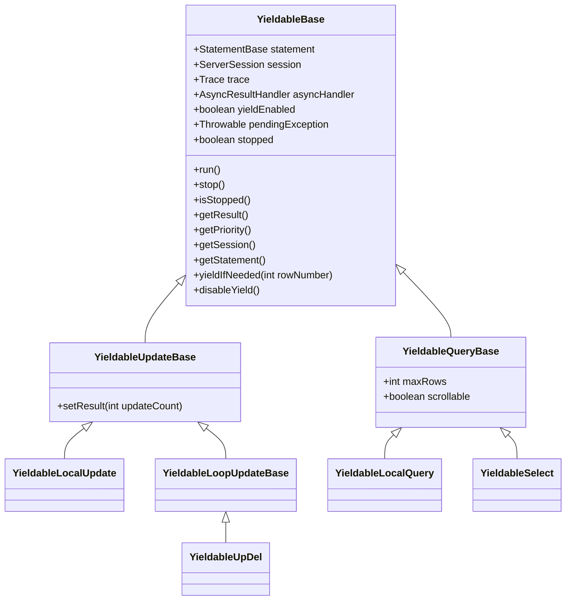
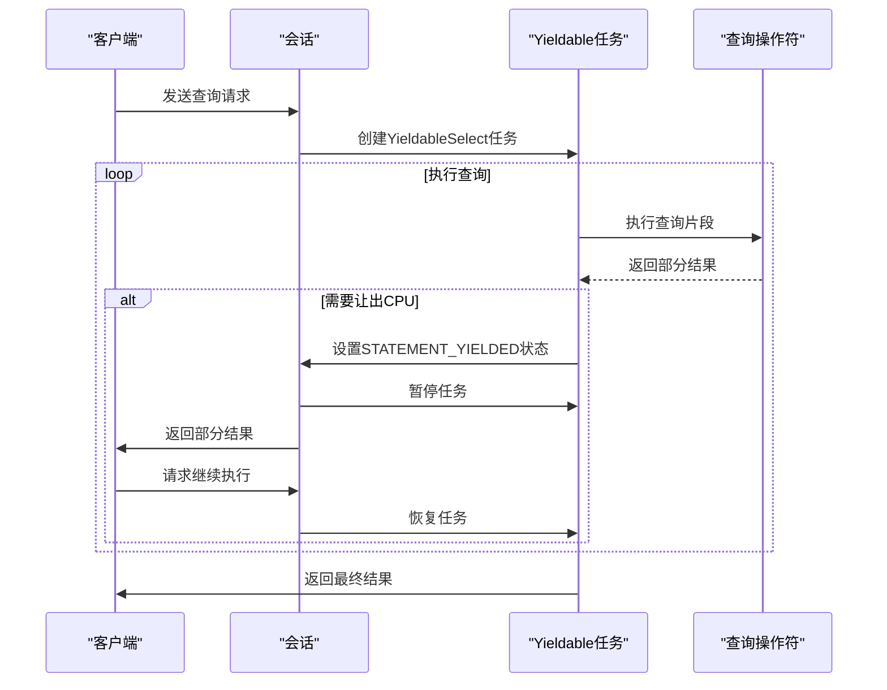
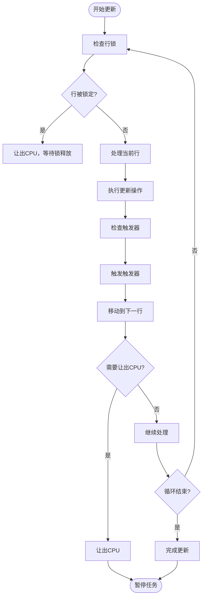
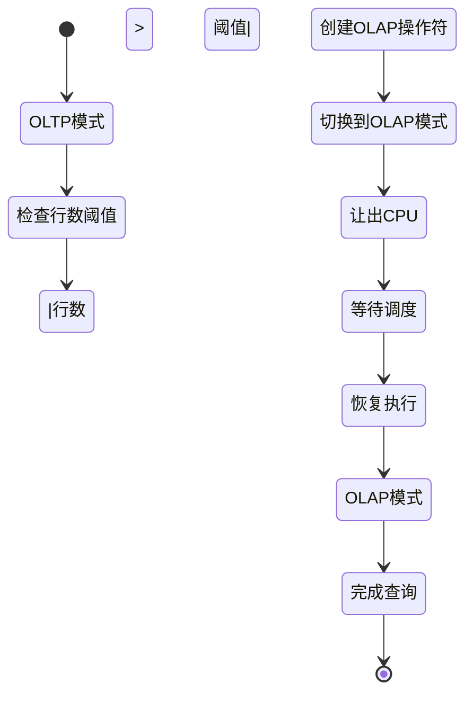

# 渐进式SQL引擎

<cite>
**本文档引用的文件**  
- [YieldableBase.java](file://lealone-sql/src/main/java/com/lealone/sql/executor/YieldableBase.java)
- [YieldableLocalQuery.java](file://lealone-sql/src/main/java/com/lealone/sql/query/YieldableLocalQuery.java)
- [YieldableUpdateBase.java](file://lealone-sql/src/main/java/com/lealone/sql/executor/YieldableUpdateBase.java)
- [YieldableLoopUpdateBase.java](file://lealone-sql/src/main/java/com/lealone/sql/executor/YieldableLoopUpdateBase.java)
- [YieldableSelect.java](file://lealone-sql/src/main/java/com/lealone/sql/query/YieldableSelect.java)
- [StatementBase.java](file://lealone-sql/src/main/java/com/lealone/sql/StatementBase.java)
- [SessionStatus.java](file://lealone-sci/src/main/java/com/lealone/db/session/SessionStatus.java)
- [UpDel.java](file://lealone-sql/src/main/java/com/lealone/sql/dml/UpDel.java)
- [ServerSession.java](file://lealone-db/src/main/java/com/lealone/db/session/ServerSession.java)
</cite>

## 目录
1. [引言](#引言)
2. [可暂停执行机制](#可暂停执行机制)
3. [YieldableBase核心设计](#yieldablebase核心设计)
4. [查询操作的渐进式执行](#查询操作的渐进式执行)
5. [更新操作的渐进式执行](#更新操作的渐进式执行)
6. [OLAP模式转换机制](#olap模式转换机制)
7. [高并发场景下的性能表现](#高并发场景下的性能表现)
8. [与传统SQL引擎的对比](#与传统sql引擎的对比)
9. [开发者优化建议](#开发者优化建议)
10. [总结](#总结)

## 引言

Lealone渐进式SQL引擎是一种创新的数据库执行架构，旨在解决传统SQL引擎在高并发场景下容易阻塞的问题。该引擎通过将SQL语句分解为可暂停的微任务单元，实现了在执行过程中主动让出CPU控制权的能力，从而确保系统在处理长时间运行的查询时仍能保持良好的响应性。这种设计特别适合OLTP工作负载，能够在保证事务处理性能的同时，支持复杂的分析查询。

**Section sources**
- [YieldableBase.java](file://lealone-sql/src/main/java/com/lealone/sql/executor/YieldableBase.java#L1-L193)

## 可暂停执行机制

Lealone渐进式SQL引擎的核心是可暂停执行机制，该机制允许SQL语句在执行过程中主动让出CPU，避免长时间运行的SQL阻塞其他请求。这种机制通过Yieldable接口实现，将SQL执行过程分解为一系列可中断的微任务单元。

当一个SQL语句开始执行时，它会被包装成一个Yieldable任务，该任务可以在执行过程中根据预设条件主动让出执行权。调度器在检测到任务让出后，会立即调度其他待处理的请求，从而实现多任务的公平调度。当系统资源空闲时，被暂停的任务会被重新调度执行，直到完成整个SQL操作。

这种设计的关键优势在于它打破了传统SQL引擎的"全有或全无"执行模式，将长时间的SQL执行分解为多个短时间的执行片段，确保了系统的整体响应性和吞吐量。

**Section sources**
- [YieldableBase.java](file://lealone-sql/src/main/java/com/lealone/sql/executor/YieldableBase.java#L26-L193)
- [SessionStatus.java](file://lealone-sci/src/main/java/com/lealone/db/session/SessionStatus.java#L1-L22)

## YieldableBase核心设计

YieldableBase是渐进式SQL引擎的基础抽象类，定义了可暂停执行的核心机制。该类实现了Yieldable接口，为所有SQL执行任务提供了统一的暂停和恢复能力。

**Diagram sources**
- [YieldableBase.java](file://lealone-sql/src/main/java/com/lealone/sql/executor/YieldableBase.java#L26-L193)
- [YieldableUpdateBase.java](file://lealone-sql/src/main/java/com/lealone/sql/executor/YieldableUpdateBase.java#L11-L20)
- [YieldableQueryBase.java](file://lealone-sql/src/main/java/com/lealone/sql/query/YieldableQueryBase.java#L13-L24)

YieldableBase的核心方法是yieldIfNeeded，该方法在执行过程中定期检查是否需要让出CPU。当满足预设条件（如处理的行数达到阈值）时，该方法会返回true，指示调度器暂停当前任务。这种设计确保了长时间运行的SQL不会独占CPU资源，从而保证了系统的响应性。

**Section sources**
- [YieldableBase.java](file://lealone-sql/src/main/java/com/lealone/sql/executor/YieldableBase.java#L26-L193)
- [StatementBase.java](file://lealone-sql/src/main/java/com/lealone/sql/StatementBase.java#L388-L400)

## 查询操作的渐进式执行

YieldableLocalQuery和YieldableSelect实现了查询操作的渐进式执行。YieldableLocalQuery是本地查询的基础实现，而YieldableSelect则提供了更复杂的查询执行能力。

**Diagram sources**
- [YieldableLocalQuery.java](file://lealone-sql/src/main/java/com/lealone/sql/query/YieldableLocalQuery.java#L13-L27)
- [YieldableSelect.java](file://lealone-sql/src/main/java/com/lealone/sql/query/YieldableSelect.java#L20-L213)

YieldableSelect的executeInternal方法采用循环执行模式，每次只处理一部分数据，然后检查是否需要让出CPU。如果需要让出，方法会立即返回，等待下一次调度。这种设计确保了即使在处理大量数据的查询时，系统也能及时响应其他请求。

**Section sources**
- [YieldableLocalQuery.java](file://lealone-sql/src/main/java/com/lealone/sql/query/YieldableLocalQuery.java#L13-L27)
- [YieldableSelect.java](file://lealone-sql/src/main/java/com/lealone/sql/query/YieldableSelect.java#L89-L117)

## 更新操作的渐进式执行

YieldableUpdateBase和YieldableLoopUpdateBase实现了更新操作的渐进式执行。与查询操作类似，更新操作也被分解为可暂停的微任务单元。

**Diagram sources**
- [YieldableUpdateBase.java](file://lealone-sql/src/main/java/com/lealone/sql/executor/YieldableUpdateBase.java#L11-L20)
- [YieldableLoopUpdateBase.java](file://lealone-sql/src/main/java/com/lealone/sql/executor/YieldableLoopUpdateBase.java#L15-L87)
- [UpDel.java](file://lealone-sql/src/main/java/com/lealone/sql/dml/UpDel.java#L81-L183)

YieldableLoopUpdateBase的executeInternal方法采用while循环模式，每次迭代处理一行数据，然后检查是否需要让出CPU。如果需要让出，方法会立即返回，等待下一次调度。这种设计确保了大规模更新操作不会阻塞其他事务。

**Section sources**
- [YieldableUpdateBase.java](file://lealone-sql/src/main/java/com/lealone/sql/executor/YieldableUpdateBase.java#L11-L20)
- [YieldableLoopUpdateBase.java](file://lealone-sql/src/main/java/com/lealone/sql/executor/YieldableLoopUpdateBase.java#L27-L37)
- [UpDel.java](file://lealone-sql/src/main/java/com/lealone/sql/dml/UpDel.java#L159-L181)

## OLAP模式转换机制

Lealone引擎还实现了智能的OLAP模式转换机制，当查询处理的行数超过预设阈值时，会自动从OLTP模式切换到OLAP模式。这一机制通过YieldableSelect的yieldIfNeeded方法实现。

**Diagram sources**
- [YieldableSelect.java](file://lealone-sql/src/main/java/com/lealone/sql/query/YieldableSelect.java#L37-L48)
- [ServerSession.java](file://lealone-db/src/main/java/com/lealone/db/session/ServerSession.java#L1592-L1600)

当查询处理的行数超过会话设置的olapThreshold时，系统会创建一个专门的OLAP操作符来处理剩余的数据。这种设计既保证了小查询的快速响应，又支持大规模数据分析的高效处理。

**Section sources**
- [YieldableSelect.java](file://lealone-sql/src/main/java/com/lealone/sql/query/YieldableSelect.java#L37-L48)
- [ServerSession.java](file://lealone-db/src/main/java/com/lealone/db/session/ServerSession.java#L1592-L1600)

## 高并发场景下的性能表现

在高并发场景下，渐进式SQL引擎表现出显著的优势。通过将SQL执行分解为可暂停的微任务，系统能够公平地调度多个并发请求，避免了传统引擎中"长查询阻塞短查询"的问题。

当多个查询同时执行时，每个查询只占用少量CPU时间片，然后主动让出CPU给其他查询。这种轮转调度机制确保了所有查询都能得到及时处理，即使存在长时间运行的分析查询，也不会影响短事务的响应速度。

此外，引擎还支持异步回调机制，允许客户端在查询暂停时进行其他操作，进一步提高了系统的整体吞吐量和响应性。

**Section sources**
- [YieldableBase.java](file://lealone-sql/src/main/java/com/lealone/sql/executor/YieldableBase.java#L94-L115)
- [YieldableLoopUpdateBase.java](file://lealone-sql/src/main/java/com/lealone/sql/executor/YieldableLoopUpdateBase.java#L27-L37)

## 与传统SQL引擎的对比

与传统SQL引擎相比，Lealone渐进式SQL引擎具有以下显著优势：

| 特性 | 传统SQL引擎 | Lealone渐进式引擎 |
|------|------------|------------------|
| 执行模式 | 全有或全无 | 渐进式、可暂停 |
| 并发性能 | 长查询阻塞短查询 | 公平调度，避免阻塞 |
| 响应性 | 高负载下响应延迟增加 | 保持稳定响应时间 |
| 资源利用率 | CPU可能被长查询独占 | CPU资源公平分配 |
| OLAP支持 | 通常需要专用系统 | 内置OLAP模式转换 |
| 错误恢复 | 失败需重试整个查询 | 可从断点恢复 |

**Diagram sources**
- [YieldableBase.java](file://lealone-sql/src/main/java/com/lealone/sql/executor/YieldableBase.java#L26-L193)
- [YieldableSelect.java](file://lealone-sql/src/main/java/com/lealone/sql/query/YieldableSelect.java#L20-L213)

在极端负载下，传统引擎的性能会急剧下降，而渐进式引擎通过合理的任务调度和资源分配，能够保持相对稳定的性能表现。

**Section sources**
- [YieldableBase.java](file://lealone-sql/src/main/java/com/lealone/sql/executor/YieldableBase.java#L26-L193)
- [YieldableSelect.java](file://lealone-sql/src/main/java/com/lealone/sql/query/YieldableSelect.java#L89-L117)

## 开发者优化建议

为了充分利用渐进式SQL引擎的优势，开发者可以采取以下优化策略：

1. **合理设置OLAP阈值**：根据应用场景调整olapThreshold参数，平衡OLTP和OLAP性能
2. **优化查询语句**：尽量使用索引，减少全表扫描，降低单次执行的CPU消耗
3. **控制事务大小**：避免过大的事务，减少锁竞争和回滚开销
4. **利用异步API**：使用异步回调机制，提高应用程序的并发处理能力
5. **监控执行性能**：关注慢查询日志，及时优化性能瓶颈

通过这些优化策略，开发者可以充分发挥渐进式SQL引擎的优势，在保证系统响应性的同时，支持复杂的业务场景。

**Section sources**
- [ServerSession.java](file://lealone-db/src/main/java/com/lealone/db/session/ServerSession.java#L1592-L1600)
- [YieldableBase.java](file://lealone-sql/src/main/java/com/lealone/sql/executor/YieldableBase.java#L167-L172)

## 总结

Lealone渐进式SQL引擎通过创新的可暂停执行机制，成功解决了传统数据库在高并发场景下的性能瓶颈。该引擎将SQL执行分解为可管理的微任务单元，实现了在执行过程中主动让出CPU的能力，确保了系统在处理复杂查询时仍能保持良好的响应性。

这种设计特别适合现代OLTP工作负载，能够在保证事务处理性能的同时，支持复杂的分析查询。通过智能的OLAP模式转换机制，系统能够根据查询规模自动调整执行策略，实现了OLTP和OLAP工作负载的无缝融合。

未来，随着硬件性能的不断提升和应用场景的日益复杂，渐进式执行模式将成为数据库系统的重要发展方向，为构建高性能、高可用的数据服务提供坚实的基础。

**Section sources**
- [YieldableBase.java](file://lealone-sql/src/main/java/com/lealone/sql/executor/YieldableBase.java#L1-L193)
- [YieldableSelect.java](file://lealone-sql/src/main/java/com/lealone/sql/query/YieldableSelect.java#L20-L213)