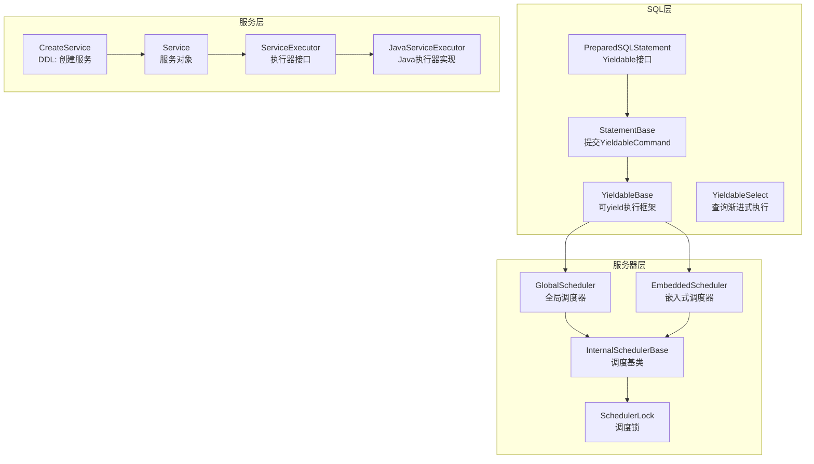
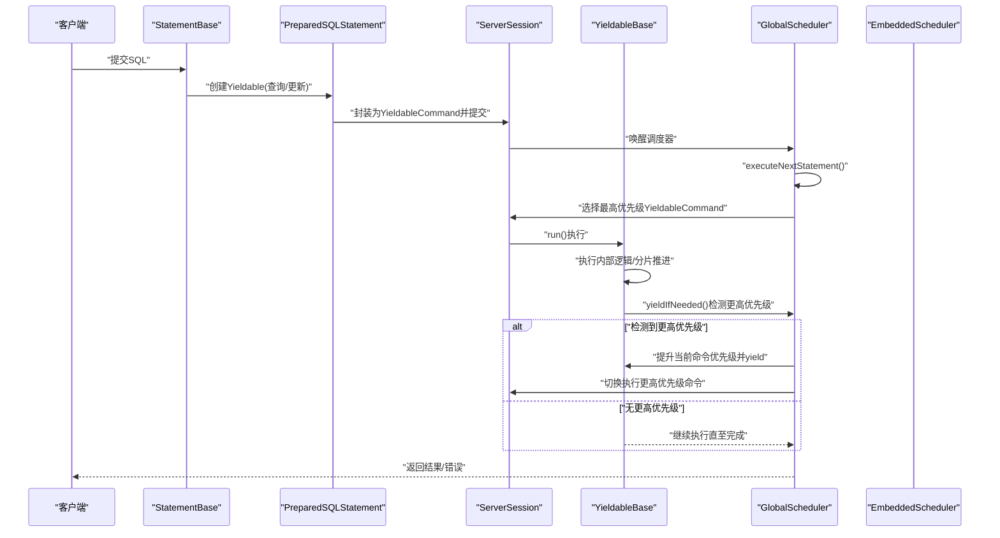
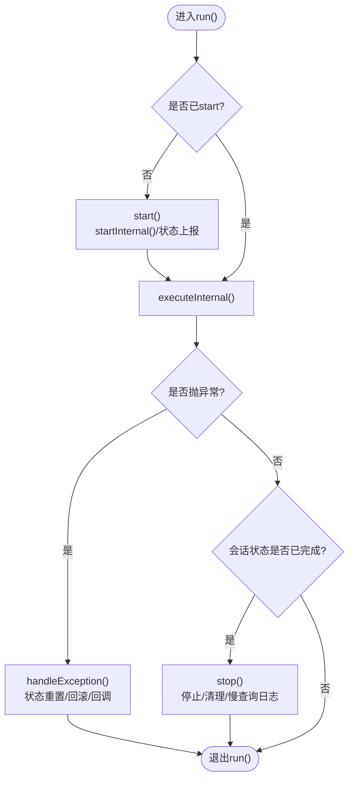
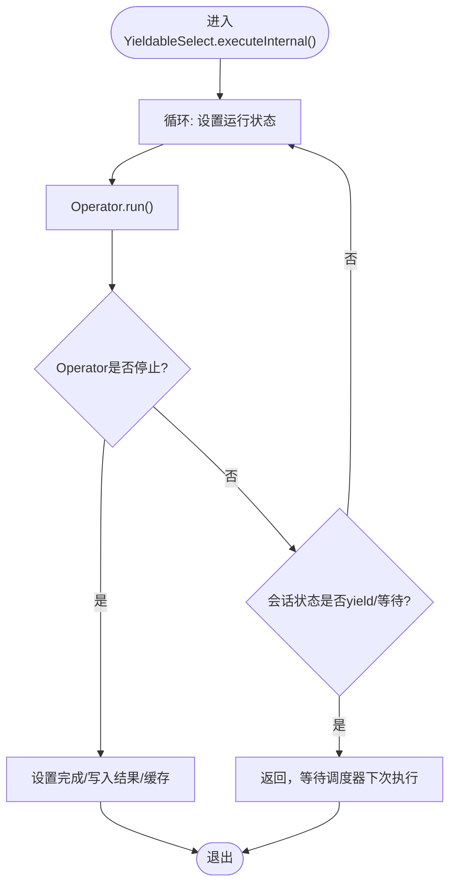
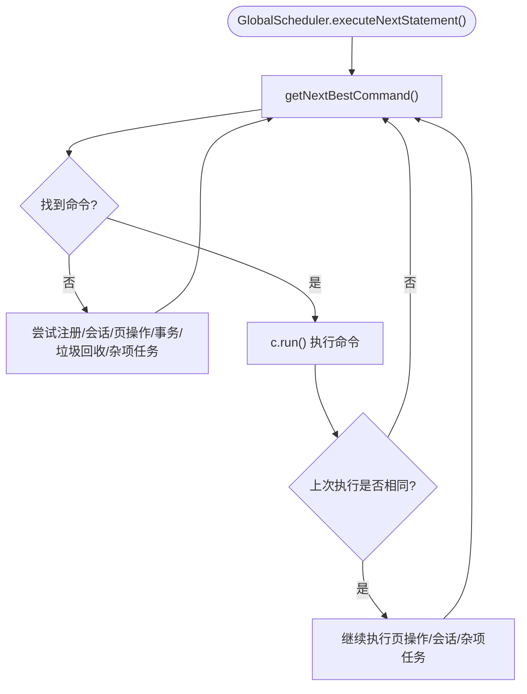
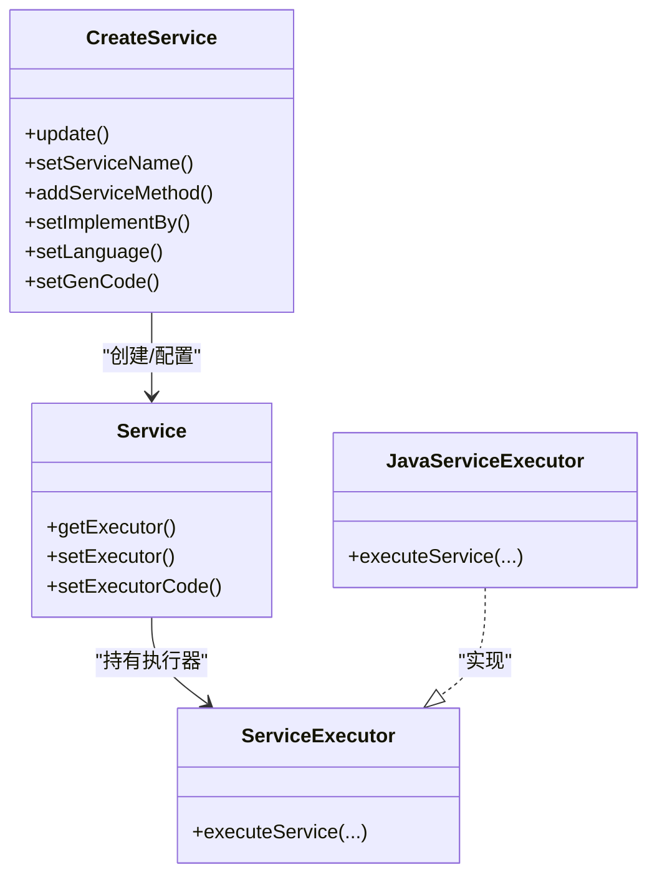
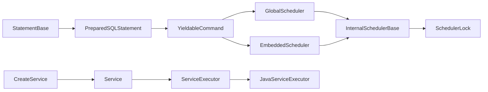

# 高级特性

<cite>
**本文引用的文件列表**
- [YieldableBase.java](file://lealone-sql/src/main/java/com/lealone/sql/executor/YieldableBase.java)
- [YieldableSelect.java](file://lealone-sql/src/main/java/com/lealone/sql/query/YieldableSelect.java)
- [GlobalScheduler.java](file://lealone-server/src/main/java/com/lealone/server/scheduler/GlobalScheduler.java)
- [CreateService.java](file://lealone-sql/src/main/java/com/lealone/sql/ddl/CreateService.java)
- [ServiceExecutor.java](file://lealone-db/src/main/java/com/lealone/db/service/ServiceExecutor.java)
- [JavaServiceExecutor.java](file://lealone-db/src/main/java/com/lealone/db/service/JavaServiceExecutor.java)
- [Service.java](file://lealone-db/src/main/java/com/lealone/db/service/Service.java)
- [PreparedSQLStatement.java](file://lealone-sql/src/main/java/com/lealone/sql/PreparedSQLStatement.java)
- [StatementBase.java](file://lealone-sql/src/main/java/com/lealone/sql/StatementBase.java)
- [EmbeddedScheduler.java](file://lealone-sci/src/main/java/com/lealone/db/scheduler/EmbeddedScheduler.java)
- [InternalSchedulerBase.java](file://lealone-sci/src/main/java/com/lealone/db/scheduler/InternalSchedulerBase.java)
- [SchedulerLock.java](file://lealone-sci/src/main/java/com/lealone/db/scheduler/SchedulerLock.java)
</cite>

## 目录
1. [简介](#简介)
2. [项目结构与定位](#项目结构与定位)
3. [核心组件](#核心组件)
4. [架构总览](#架构总览)
5. [详细组件解析](#详细组件解析)
6. [依赖关系分析](#依赖关系分析)
7. [性能考量](#性能考量)
8. [故障排查指南](#故障排查指南)
9. [结论](#结论)

## 简介
本文件聚焦Lealone的高级特性，系统性阐述其“可暂停的渐进式SQL引擎”与“基于优先级的抢占式调度”。通过YieldableBase.java展示SQL语句如何被拆解为可yield的任务，避免长时间查询阻塞；通过GlobalScheduler.java说明系统如何依据SQL语句优先级进行任务调度，确保高优先级请求得到及时响应；并通过CREATE SERVICE语句与Service执行器体系，介绍可托管后端服务的创建、管理和扩展能力。本文旨在帮助追求极致性能与高级功能的用户，全面理解Lealone的深层能力与实现机制。

## 项目结构与定位
Lealone采用分层与模块化设计：
- SQL层：负责解析、计划与执行（含Yieldable执行框架）
- 服务器层：网络事件循环与全局调度器
- 服务层：可托管后端服务的定义、生成与执行
- 调度与会话：内部调度器基类、嵌入式调度器与锁机制

图表来源
- [PreparedSQLStatement.java](file://lealone-sql/src/main/java/com/lealone/sql/PreparedSQLStatement.java#L57-L111)
- [StatementBase.java](file://lealone-sql/src/main/java/com/lealone/sql/StatementBase.java#L511-L582)
- [YieldableBase.java](file://lealone-sql/src/main/java/com/lealone/sql/executor/YieldableBase.java#L1-L193)
- [YieldableSelect.java](file://lealone-sql/src/main/java/com/lealone/sql/query/YieldableSelect.java#L1-L213)
- [GlobalScheduler.java](file://lealone-server/src/main/java/com/lealone/server/scheduler/GlobalScheduler.java#L1-L455)
- [EmbeddedScheduler.java](file://lealone-sci/src/main/java/com/lealone/db/scheduler/EmbeddedScheduler.java#L272-L325)
- [InternalSchedulerBase.java](file://lealone-sci/src/main/java/com/lealone/db/scheduler/InternalSchedulerBase.java#L80-L124)
- [SchedulerLock.java](file://lealone-sci/src/main/java/com/lealone/db/scheduler/SchedulerLock.java#L34-L55)
- [CreateService.java](file://lealone-sql/src/main/java/com/lealone/sql/ddl/CreateService.java#L1-L202)
- [Service.java](file://lealone-db/src/main/java/com/lealone/db/service/Service.java#L92-L126)
- [ServiceExecutor.java](file://lealone-db/src/main/java/com/lealone/db/service/ServiceExecutor.java#L1-L180)
- [JavaServiceExecutor.java](file://lealone-db/src/main/java/com/lealone/db/service/JavaServiceExecutor.java#L1-L136)

章节来源
- [PreparedSQLStatement.java](file://lealone-sql/src/main/java/com/lealone/sql/PreparedSQLStatement.java#L57-L111)
- [StatementBase.java](file://lealone-sql/src/main/java/com/lealone/sql/StatementBase.java#L511-L582)
- [GlobalScheduler.java](file://lealone-server/src/main/java/com/lealone/server/scheduler/GlobalScheduler.java#L1-L455)
- [CreateService.java](file://lealone-sql/src/main/java/com/lealone/sql/ddl/CreateService.java#L1-L202)

## 核心组件
- 可yield的SQL执行框架：YieldableBase提供统一的start/stop/异常处理/进度上报与yield控制，使长查询可分片推进并在合适时机让出CPU。
- 渐进式查询执行：YieldableSelect在查询过程中根据行数阈值或OLAP开关触发yield，必要时切换到OLAP算子，兼顾吞吐与延迟。
- 基于优先级的抢占式调度：GlobalScheduler按会话队列选择最高优先级的YieldableCommand执行；当检测到更高优先级命令时，当前命令提升优先级并主动yield，确保高优先级请求快速响应。
- 可托管后端服务：CreateService支持以DDL方式创建服务，自动推断方法签名、生成接口与执行器代码，或由JavaServiceExecutor反射调用实现类方法。

章节来源
- [YieldableBase.java](file://lealone-sql/src/main/java/com/lealone/sql/executor/YieldableBase.java#L1-L193)
- [YieldableSelect.java](file://lealone-sql/src/main/java/com/lealone/sql/query/YieldableSelect.java#L1-L213)
- [GlobalScheduler.java](file://lealone-server/src/main/java/com/lealone/server/scheduler/GlobalScheduler.java#L218-L363)
- [CreateService.java](file://lealone-sql/src/main/java/com/lealone/sql/ddl/CreateService.java#L114-L202)

## 架构总览
下面的序列图展示了SQL语句从提交到执行的关键流程，以及可yield与优先级抢占的核心交互。

图表来源
- [StatementBase.java](file://lealone-sql/src/main/java/com/lealone/sql/StatementBase.java#L511-L582)
- [PreparedSQLStatement.java](file://lealone-sql/src/main/java/com/lealone/sql/PreparedSQLStatement.java#L57-L111)
- [GlobalScheduler.java](file://lealone-server/src/main/java/com/lealone/server/scheduler/GlobalScheduler.java#L218-L363)
- [EmbeddedScheduler.java](file://lealone-sci/src/main/java/com/lealone/db/scheduler/EmbeddedScheduler.java#L272-L325)

## 详细组件解析

### 可yield的SQL执行框架（YieldableBase）
- 设计要点
  - 统一生命周期：startInternal/executeInternal/stopInternal，配合start/stop与异常处理，确保资源正确释放与状态上报。
  - 进度与统计：通过数据库事件监听器上报STATEMENT_START/END与慢查询追踪。
  - yield控制：提供disableYield与yieldIfNeeded(rowNumber)，允许在扫描/聚合等场景按行号触发让出。
  - 会话状态：与ServerSession协作，维护当前命令状态与异常回滚策略。
- 关键路径
  - run()：驱动startInternal/executeInternal，捕获异常并交由handleException处理；完成后stop()。
  - yieldIfNeeded(rowNumber)：根据rowNumber与yieldEnabled决定是否yield，并设置SessionStatus.STATEMENT_YIELDED。
  - getPriority()：委托StatementBase获取优先级，供调度器选择最佳命令。

图表来源
- [YieldableBase.java](file://lealone-sql/src/main/java/com/lealone/sql/executor/YieldableBase.java#L93-L174)
- [YieldableBase.java](file://lealone-sql/src/main/java/com/lealone/sql/executor/YieldableBase.java#L181-L191)

章节来源
- [YieldableBase.java](file://lealone-sql/src/main/java/com/lealone/sql/executor/YieldableBase.java#L1-L193)

### 渐进式查询执行（YieldableSelect）
- 设计要点
  - OLTP/OLAP混合：在行数超过阈值时尝试切换到OLAP算子，提高吞吐；可通过disableOlap禁用。
  - 分段执行：在Operator.run()循环中推进，遇到异常或yield/等待状态则返回，交由调度器继续。
  - 结果缓存：优先命中查询结果缓存，减少重复计算。
- 关键路径
  - yieldIfNeeded(rowNumber)：超过阈值时尝试创建OLAP算子并让出。
  - executeInternal()：循环运行Operator，处理停止/完成/异常分支。

图表来源
- [YieldableSelect.java](file://lealone-sql/src/main/java/com/lealone/sql/query/YieldableSelect.java#L88-L118)
- [YieldableSelect.java](file://lealone-sql/src/main/java/com/lealone/sql/query/YieldableSelect.java#L36-L50)

章节来源
- [YieldableSelect.java](file://lealone-sql/src/main/java/com/lealone/sql/query/YieldableSelect.java#L1-L213)

### 基于优先级的抢占式调度（GlobalScheduler）
- 设计要点
  - 命令选择：遍历所有会话，选取最高优先级的YieldableCommand；若当前无命令，持续尝试直到找到。
  - 抢占逻辑：yieldIfNeeded(current)检测是否存在更高优先级命令，若有则提升当前命令优先级并返回true，促使当前命令主动yield。
  - 事件循环：结合网络事件循环与会话任务，保证I/O与调度协同。
- 关键路径
  - executeNextStatement()：主调度循环，持续选择并执行命令。
  - yieldIfNeeded(current)：检测更高优先级命令并触发抢占。
  - getNextBestCommand()：在会话集合中按优先级挑选最佳命令。

图表来源
- [GlobalScheduler.java](file://lealone-server/src/main/java/com/lealone/server/scheduler/GlobalScheduler.java#L218-L271)
- [GlobalScheduler.java](file://lealone-server/src/main/java/com/lealone/server/scheduler/GlobalScheduler.java#L273-L312)
- [GlobalScheduler.java](file://lealone-server/src/main/java/com/lealone/server/scheduler/GlobalScheduler.java#L314-L336)

章节来源
- [GlobalScheduler.java](file://lealone-server/src/main/java/com/lealone/server/scheduler/GlobalScheduler.java#L218-L363)
- [EmbeddedScheduler.java](file://lealone-sci/src/main/java/com/lealone/db/scheduler/EmbeddedScheduler.java#L272-L325)
- [InternalSchedulerBase.java](file://lealone-sci/src/main/java/com/lealone/db/scheduler/InternalSchedulerBase.java#L80-L124)
- [SchedulerLock.java](file://lealone-sci/src/main/java/com/lealone/db/scheduler/SchedulerLock.java#L34-L55)

### 可托管后端服务（CREATE SERVICE）
- 设计要点
  - DDL定义：CreateService解析服务名称、语言、实现类、方法签名与参数，支持IF NOT EXISTS与注释。
  - 代码生成：支持生成服务接口与执行器代码，或在非启动阶段自动生成实现类骨架。
  - 执行器选择：优先使用插件工厂（如JavaServiceExecutorFactory），否则使用JavaServiceExecutor反射调用实现类方法。
  - 运行时绑定：Service持有executor或动态编译生成的执行器实例，提供统一的executeService入口。
- 关键路径
  - update()：校验权限、锁定模式、构建Service对象、生成代码并创建执行器。
  - JavaServiceExecutor：按方法名反射调用实现类方法，支持Value[]、Map与JSON三种调用形式。

图表来源
- [CreateService.java](file://lealone-sql/src/main/java/com/lealone/sql/ddl/CreateService.java#L114-L202)
- [Service.java](file://lealone-db/src/main/java/com/lealone/db/service/Service.java#L92-L126)
- [ServiceExecutor.java](file://lealone-db/src/main/java/com/lealone/db/service/ServiceExecutor.java#L1-L180)
- [JavaServiceExecutor.java](file://lealone-db/src/main/java/com/lealone/db/service/JavaServiceExecutor.java#L1-L136)

章节来源
- [CreateService.java](file://lealone-sql/src/main/java/com/lealone/sql/ddl/CreateService.java#L1-L202)
- [Service.java](file://lealone-db/src/main/java/com/lealone/db/service/Service.java#L92-L126)
- [ServiceExecutor.java](file://lealone-db/src/main/java/com/lealone/db/service/ServiceExecutor.java#L1-L180)
- [JavaServiceExecutor.java](file://lealone-db/src/main/java/com/lealone/db/service/JavaServiceExecutor.java#L1-L136)

## 依赖关系分析
- SQL执行链路
  - StatementBase将Yieldable封装为YieldableCommand并提交至会话，随后唤醒调度器。
  - 调度器从各会话中选择最高优先级命令执行；YieldableBase在执行过程中根据行数触发yield。
- 调度器层次
  - GlobalScheduler负责网络事件循环与会话管理，EmbeddedScheduler用于嵌入式场景；两者均继承自InternalSchedulerBase。
  - SchedulerLock用于跨调度器的锁与唤醒协调。
- 服务执行链路
  - CreateService生成接口与执行器代码，Service持有执行器；JavaServiceExecutor通过反射调用实现类方法。

图表来源
- [StatementBase.java](file://lealone-sql/src/main/java/com/lealone/sql/StatementBase.java#L511-L582)
- [PreparedSQLStatement.java](file://lealone-sql/src/main/java/com/lealone/sql/PreparedSQLStatement.java#L57-L111)
- [GlobalScheduler.java](file://lealone-server/src/main/java/com/lealone/server/scheduler/GlobalScheduler.java#L1-L455)
- [EmbeddedScheduler.java](file://lealone-sci/src/main/java/com/lealone/db/scheduler/EmbeddedScheduler.java#L272-L325)
- [InternalSchedulerBase.java](file://lealone-sci/src/main/java/com/lealone/db/scheduler/InternalSchedulerBase.java#L80-L124)
- [SchedulerLock.java](file://lealone-sci/src/main/java/com/lealone/db/scheduler/SchedulerLock.java#L34-L55)
- [CreateService.java](file://lealone-sql/src/main/java/com/lealone/sql/ddl/CreateService.java#L114-L202)
- [Service.java](file://lealone-db/src/main/java/com/lealone/db/service/Service.java#L92-L126)
- [ServiceExecutor.java](file://lealone-db/src/main/java/com/lealone/db/service/ServiceExecutor.java#L1-L180)
- [JavaServiceExecutor.java](file://lealone-db/src/main/java/com/lealone/db/service/JavaServiceExecutor.java#L1-L136)

章节来源
- [StatementBase.java](file://lealone-sql/src/main/java/com/lealone/sql/StatementBase.java#L511-L582)
- [GlobalScheduler.java](file://lealone-server/src/main/java/com/lealone/server/scheduler/GlobalScheduler.java#L218-L363)
- [EmbeddedScheduler.java](file://lealone-sci/src/main/java/com/lealone/db/scheduler/EmbeddedScheduler.java#L272-L325)
- [CreateService.java](file://lealone-sql/src/main/java/com/lealone/sql/ddl/CreateService.java#L114-L202)

## 性能考量
- 渐进式执行
  - 通过YieldableBase/yieldIfNeeded与YieldableSelect的行数阈值，避免单次执行占用过多CPU时间，提升并发响应能力。
  - 在OLAP场景下，适时切换到专用算子，平衡吞吐与延迟。
- 优先级抢占
  - GlobalScheduler在yieldIfNeeded中检测更高优先级命令，主动提升当前命令优先级并yield，防止低优先级长时间占用CPU。
  - 通过Network EventLoop与会话任务的穿插执行，减少空转与阻塞。
- 服务执行
  - JavaServiceExecutor按需初始化实现类，避免启动时的额外开销；同时支持多种参数绑定形式，便于客户端调用。

[本节为通用性能讨论，不直接分析具体文件]

## 故障排查指南
- 异常处理与回滚
  - YieldableBase.handleException：根据异常类型决定回滚策略（死锁/当前命令/整条命令），并向会话回调异步结果或抛出异常。
- 慢查询追踪
  - YieldableBase.stop：记录慢查询日志，辅助定位热点SQL。
- 调度器问题
  - 若出现命令无法被调度，检查GlobalScheduler.executeNextStatement循环是否被阻塞；确认会话队列与网络事件循环正常。
  - 使用yieldIfNeeded返回true但未见切换，检查是否有更高优先级命令或调度器负载过高。
- 服务执行失败
  - 检查CreateService生成的执行器代码是否正确；确认Service.getExecutor()返回的实例类型与期望一致。
  - JavaServiceExecutor反射调用失败时，核对实现类方法签名与参数类型匹配。

章节来源
- [YieldableBase.java](file://lealone-sql/src/main/java/com/lealone/sql/executor/YieldableBase.java#L131-L174)
- [GlobalScheduler.java](file://lealone-server/src/main/java/com/lealone/server/scheduler/GlobalScheduler.java#L218-L363)
- [Service.java](file://lealone-db/src/main/java/com/lealone/db/service/Service.java#L92-L126)
- [JavaServiceExecutor.java](file://lealone-db/src/main/java/com/lealone/db/service/JavaServiceExecutor.java#L91-L135)

## 结论
Lealone通过可yield的SQL执行框架与基于优先级的抢占式调度，实现了在高并发与长查询场景下的稳定与高效；通过CREATE SERVICE与Service执行器体系，提供了可托管后端服务的完整生命周期管理。这些特性共同构成了Lealone面向极致性能与高级功能的底层能力，既适合在线事务处理，也能胜任复杂分析场景。